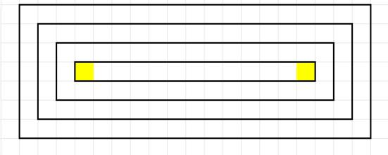
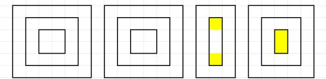
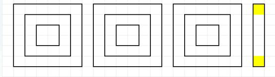

## 2026 牛客 暑期多校训练营 1

小羊肖恩 (Little\_Sheep\_Yawn)

## 概况

\- 入门：M、N
- 简单：B、L、G、H
- 中等：A、E、F、K
- 神秘：C
- 较难：D、I、J

## M - Maybe Connected

## 题目大意

一个大小为 $n$ 的无向图，添加 $m$ 条边，求连通但不相连的点对的个数的最大值。不允许添加重边或自环。

$$
1 \leq n \leq 1 0 ^ {5}, 0 \leq m \leq \min \left(1 0 ^ {9}, \frac {n (n - 1)}{2}\right)
$$

## 题解

相连的点有 $m$ 对，所以只需最大化连通点对个数。

设总共有 k 个连通块（不考虑需要的边数），且大小分别为 $c_{1}, c_{2}, \ldots, c_{k}$ （均为正整数），则我们要在 $\sum c_{i} = n$ 的情况下最大化 $\sum \frac{c_{i}(c_{i}-1)}{2}$ 。

■ 如果有 $c_{i} > 1, c_{j} > 1$ ，则将 $(c_{i}, c_{j})$ 替换为 $(c_{i} + c_{j} - 1, 1)$ 显然更优。

■ 所以取最值时，一定除了某一项剩余全都是 1 ，不然结果还可以更大，因此答案是 $\frac{(n-k+1)(n-k)}{2}$ 。

■ 发现 $k$ 越小越好。而 $k$ 最小值是 $\max(1, n - m)$ ，代入即可。具体构造可以先连 $(1, 2), (2, 3), \ldots$ 这类边，最后再连剩余边，上述不等关系均可以取到等号。

时间复杂度为 $\mathcal{O}(1)$ 。

## N - Narrow to Median

## 题目大意

■ 有一个长度为 $n$ 的数组，现对其操作恰一次，每次操作长度为 $k$ 的子序列全部替换为这个子序列的中位数，求数组最后的和的最大值。

$$
1 \leq k \leq n, \sum n \leq 2 \times 1 0 ^ {5}, 1 \leq a _ {i} \leq 1 0 ^ {9}
$$

## 题解

将数组排序不影响答案。因此先排序。

当 $k$ 为奇数时，中位数是最中间的那个数。对于比它小的元素应该取得尽可能小，比它大的元素也是。

因此，设 $k = 2m + 1$ ，且中位数是原数组的第 idx 个，那么，被替换的是 $a_{1}, a_{2}, \ldots, a_{m}, a_{idx}, a_{idx+1}, \ldots, a_{idx+m}$ 。这个子序列替换前的和可以用前缀和计算，替换后的和是 $a_{idx} \times k$ ，因此我们可以计算该变量的最大值，加上初始值就是答案。

## 题解 (cont'd)

当 k 为偶数时，中位数是中间两个数的均值。设 k = 2m 。

此时，比中间两数更小的应该取得越小越好。比中间两数更大的应该取得越小越好。

设中间的两数取的是 $a_{i}, a_{j} (ij)$ ，则整体应该选的元素是

$$
a _ {1}, a _ {2}, \dots , a _ {m - 1}, a _ {i}, a _ {j}, a _ {j + 1}, a _ {j + 2}, \dots , a _ {j + m - 1} \circ
$$

此时，操作后数组和的变化量是

$$
\begin{array}{l} {m (a _ {i} + a _ {j}) - \sum_ {k = 1} ^ {m - 1} a _ {k} - a _ {i} - a _ {j} - \sum_ {k = 1} ^ {m - 1} a _ {j + k} = (m - 1) (a _ {i} + a _ {j}) - \sum_ {k = 1} ^ {m - 1} a _ {k} - \sum_ {k = 1} ^ {m - 1} a _ {j + k}} \\ {\text {。于是} a _ {i} \text {越大越好，最大能取到} a _ {j - 1} \text {。}} \end{array}
$$

■ 于是枚举 j，变化前的数值和仍然能用前缀和快速计算。

时间复杂度为 $\mathcal{O}(n\log n)$ 。 N-Narrow to Median AC.NOWCODER.COM

小羊肖恩 (Little\_Sheep\_Yawn)

## B - Bitwise Maximization

## 题目大意

将一个长度为 $n$ 的序列 $A$ 拆分为两个集合，使得两个集合的异或和之和最大，输出这个结果。

■ $\sum n \leq 5 \times 10^{5}, 0 \leq A_{i} < 2^{30}$

## 题解

■ 两个集合的异或和的异或和显然是整个数组的异或和。

考虑整个数组的异或和结果，对于这个结果中那些是 1 的位，无论我们怎么分集合，一定都是一个集合是 0 ，另一个集合是 1 ，不受影响。

而对于剩下的位，我们应该从高到低让每一位尽可能为1。

这些位形成的 $msk$ 是我们唯一关心的，所以我们只需考虑数组中的元素关于 $msk$ 取与运算的结果，看这些数能形成的最大异或和如何计算。

■ 这件事可以用异或线性基快速解决。时间复杂度为 $\mathcal{O}(n\log M)$ 。

## L - Lazy Shuffling

## 题目大意

对于一个长度为 $n$ 的排列 $A = [A_{1}, A_{2}, \ldots, A_{n}]$ ，用另一个长度为 $n$ 的排列 $p = [p_{1}, p_{2}, \ldots, p_{n}]$ 打乱成 $[A_{p_{1}}, A_{p_{2}}, \ldots, A_{p_{n}}]$ 。问有多少个 $A$ 能最大化打乱前后逆序对之差的绝对值？结果关于998244353取模。

$n\leq 22$

## 题解

对于一组 $1 \leq i < j \leq n$ ，考虑一组 $A_{p_i}, A_{p_j}$ 是如何影响打乱后的逆序对数量的。

如果 $p_i < p_j$ ，则打乱前后这两者要么都形成逆序对，要么都不形成逆序对，所以不影响前后逆序对之差。

■ 如果 $p_i > p_j$ ，则如果 $A_{p_i} > A_{p_j}$ ，则对打乱后逆序对变化的贡献是 +1，因为一开始是逆序对，后来不是了；否则对打乱后逆序对变化的贡献是 -1。

■ 所以只需考虑 $p$ 的逆序对，打乱前后逆序对的差的绝对值就是这些贡献和的绝对值。

## 题解 (cont'd)

因为这些贡献绝对值都是 1，能否让这些逆序对对结果的贡献都是同方向的，即都是 +1 或 -1，让整体变动的绝对值最大化呢？

答案是肯定的， $A = [1, 2, \ldots, n]$ 正是这样的一个排列。

■ 所以我们要求的就是对于 p 中所有的逆序对 $(i,j)$ ( $1 \leq i < j \leq n$ )，要么都有 $A_{i} < A_{j}$ ，要么都有 $A_{i} > A_{j}$ 的排列 A 的个数。

根据这些大小关系，可以建立一个从小的数指向大的数的一个有向图，我们相当于要求其拓扑序个数。

## 题解 (cont'd)

考虑一个还没确定拓扑序的子集 S 对应的答案是 dp[S]，我们可以任意去除一个子集中对它没有入边的点 u，则我们可以将 dp[S - {u}] 转移到 dp[S] 中去。

■ 这里可以直接枚举 $u$ ，而由于 $n$ 数据范围很小，可以用 $[0, 2^n)$ 的一个数表示一个点的入边情况是否有入边，将其和 $S$ 进行与运算看结果是否为 0 即可 $\mathcal{O}(1)$ 快速判断。

## 题解 (cont'd)

注意到 $A_{i} < A_{j}$ 和 $A_{i} > A_{j}$ 对应的图恰好相反，因此一个图的拓扑序反过来就是另一个图的拓扑序，因此有一一对应关系，只需求其中一个图就行。

有重复计算吗？如果存在逆序对，则两个条件都满足就直接成环了。所以只有没有逆序对的时候会重复计算。没有逆序对时，A 数组永不改变，因此每个排列都满足要求，直接输出 n!。

时间复杂度为 $\mathcal{O}(n2^n)$ 。

## G - GCD Graph

## 题目大意

对于一个由所有正整数构成的图，对于 u < v ，u 到 v 的边权为 $\gcd(u, v)$ 。对于 u < v ，记 u 到 v 的最短路为 $dis(u, v)$ ，求 $\sum_{r} dis(i, n)$ 。

$1 \leq l \leq r < n \leq 10^{7}$

## 题解

如果存在一个质数 $p$ 在 $u, v (u < v)$ 之间，则 $\text{dis}(u, v)$ 不超过 $u \to p$ 的边权加上 $p \to v$ 的边权，因此答案不超过2。

在 $10^{7}$ 的范围内，质数分布是密集的，其中最远的距离是 150，所以我们可以先找到 $r$ 小的最大的质数 $p$ 。

对于 $[l, r]$ 中小于 $p$ 的部分， $dis(x, n)$ 不超过 2，而 $dis(x, n)$ 等于 1 当且仅当 $x$ 和 $n$ 互质，所以我们只需求出这个范围内和 $n$ 互质的数的个数即可。可以枚举 $n$ 的因子进行容斥。

## 题解 (cont'd)

而对于剩余的部分，由于长度很小，我们直接使用 DP 。记 dp[x] 为从 x 出发到 n 的最短路长度。我们从大到小从 n 遍历到不超过 n 的最大质数，转移方程 dp[u] = $\min_{i=u+1}^{n}(dp[i]+\gcd(i,u))$ ，边界 dp[n] = 0 。

时间复杂度为 $\mathcal{O}(2^{prime\_factor\_count(n)} + prime\_gap^2\log n)$ ，其中 $prime\_factor\_count(n)$ 是 $n$ 的质因子个数， $prime\_gap$ 表示 $r$ 到小于它的最大质数的距离。

## H - Hyperspace Pairing

## 题目大意

在 $0 \sim 2^{n} - 1$ 的基础上删去两个数 $a, b$ ，问是否两两配对，使得配对的两个数的二进制表示恰有两个位不同？如果存在，给出构造。

$n \leq 2, \sum 2^n \leq 2^{22}, 0 \leq a, b < 2^n, a \neq b$

## 题解

$0 \sim 2^{n} - 1$ 中的数中，二进制表示中有奇数个1的数有偶数个，偶数个1的数也有偶数个。

而配对的两个数满足二进制表示中1的个数的奇偶性相同，因此选取的 $a, b$ 的二进制表示中1的个数的奇偶性也相同，否则无法构造。

对于奇偶性相同的情况，如何构造呢？

有很多办法，这里给出一个比较不需要动脑的。首先，我可以将所有配对的数都异或上一个 $a$ ，这不影响配对关系。同时，我们可以将二进制不同的位进行重新映射，把所有 $b$ 当前是1的位全部都挪到最低的位上去。

## 题解 (cont'd)

■ 也就是，可以将题目转化为删去 $0, 2^{2k} - 1$ 的情况。

对于 $2^{2k} \sim 2^n - 1$ 的数，可以将每个数和它异或3的结果匹配。

$k = 1$ 的方案是显然的。

■ 我们可以在删去 $0, 2^{2k} - 1$ 的对应方案的基础上，构造删去 $0, 2^{2(k + 1)} - 1$ 的方案。

设 $V = 2^{2k} - 1$ ，则将 $(V,2V)$ 和 $(2V\oplus 3,4V)$ 匹配即可，这样相当于拆掉了原有的 $(2V,2V\oplus 3)$ 和 $(4V,4V\oplus 3)$ 而重新构造了两对，同时也让没有匹配的数从 $V$ 变成了 $4V + 3$ 。

时间复杂度为 $\mathcal{O}(2^n)$ 。

## A - Annoying Traffic

## 题目大意

一个 $2n \times 2m$ 的网格图，要从 $(2n, 2m)$ 走到 $(1, 1)$ 。对于 $1 \leq i \leq n, 1 \leq j \leq m$ ， $(2i, 2j)$ 有一个控制点，控制 $(2i - 1, 2j - 1), (2i - 1, 2j), (2i, 2j - 1), (2i, 2j)$ 间的四条边。其触发时，有 $\frac{p}{q}$ 的概率让 $x$ 轴方向的边能直接通行， $y$ 方向不能；其余情况则反之。每单位时间这个通行关系反转。而每单位时间可以走一条边。问最优策略下的期望时间如何计算？每个结点触发的概率相互独立。

$T \leq 100, 1 \leq n, m \leq 10^{6}, 1 \leq p, q < 998244353$

## 题解

■ 我们先去掉走一条边不得不花的时间，接下来就只需最小化期望等待时间，最后加上 $2n + 2m - 2$ 即可。

首先，你到达路口的时候只能选择到达其控制点。

■ 而你从 $(2i, 2j)$ 出发，如果还准备走到控制点，那下一个控制点只有几种选择：

■ 走到 $(2i-2,2j)$ 。有 $1-\frac{p}{q}$ 的概率需要等 1 单位时间。

■ 走到 $(2i, 2j - 2)$ 。有 $\frac{p}{q}$ 的概率需要等 1 单位时间。

■ 走到 $(2i-2,2j-2)$ 。无论如何不可能需要等，因为总能先走一个方向，再走另一个方向。

## 题解 (cont'd)

于是，设 $(2i, 2j)$ 处需要浪费的时间是 $dp[i][j]$ ，则 $dp[i][j] = \min(dp[i - 1][j - 1], dp[i - 1][j] + (1 - \frac{p}{q}), dp[i][j - 1] + \frac{p}{q})$ 。

■ 也就可以发现， $dp[x][x]$ 的数值总是为0。

$x > y, x < y$ 的情况是对称的，我们只讨论一侧。

当 $x > y$ 的情况下，直观上来讲，在经过控制点时，如果能往 $(x - 1, y)$ 走，就直接转移过去，因为这样能更接近 $dp[x][x] = 0$ 这条线；否则，如果走到 $(x, y - 1)$ 就离 $dp[x][x] = 0$ 那条线更远了，不如走到 $dp[x - 1][y - 1]$ 。

■ 这种推断下 $dp[x][y] = \frac{p}{q} \times dp[x - 1][y] + (1 - \frac{p}{q}) \times dp[x - 1][y - 1]$ 。

## 题解 (cont'd)

这里走的方向是斜着的，我们不妨将 $(x, y)$ 重新映射到 $(x - y, y)$ ，这样走的两个方向就都是沿着 $x$ 轴或 $y$ 轴方向的了。

而此时的边界就变成了 $dp[x][0] = 0, dp[1][y] = y \times (1 - \frac{p}{q})$ 。

考虑将 $dp[x][y]$ 用这些元素表示。

■ 我们考虑 $(x', y')$ 状态第一次撞到这些状态之一，算出其对应的概率，最后乘以对应的数值即可。

■ 我们实际只在乎到 dp[1][y] 的概率，因为只有这些状态数值非 0 。此前一步只能是 dp[2][y] ，所以整体 x 轴方向走 $x' - 2$ 步，y 轴方向走 $y - y'$ 步，概率就是 $C_{x'-2+y-y'}^{x'-2} \times (1 - \frac{p}{q})^{x'-2} \times (\frac{p}{q})^{y-y'}$ 。

## 题解 (cont'd)

## 当然，上面的推导都基于

$dp[x][y]=\frac{p}{q}\times dp[x-1][y]+(1-\frac{p}{q})\times dp[x-1][y-1]$ 的假设。我们可以将这里推导的结果重新回推到最开始的 DP 式子，重新确认这步猜测的正确性。

时间复杂度为 $\mathcal{O}(n + m)$ 。

## É - Easy Puzzle

## 题目大意

■ 给一个 $n \times m$ 表格对应的网格图，对网格图上的一些边进行染色，使得每个点出发只有 0 或 2 条边被染色，且至多只有 5 个单元格不满足单元格上有 2 条染色边。如果无法构造，输出 $-1$ 。

■ $\sum nm\leq 5\times 10^{5}$

## 题解

考虑基础情况。如果 $\min(n, m)$ 是奇数，则我们从外层一步步往里画矩形就已经满足条件了，最多只有 2 个单元格不满足条件。如下图：

## 题解 (cont'd)

■ 接下来，考虑 $\min(n, m)$ 是偶数的情况。此时我们发现如果是一个正方形，我们用前面的方式可以保证每个单元格都满足条件。所以我们可以用并排的正方形来让长方形的长短边变得更加接近。

■ 我们不妨设 $n \leq m$ ，且通过上述转化，可以使得 m 不断减少 $n + 1$ ，进而 $m \leq 2n$ 。

■ 如果 n = m ，直接用前面提到的正方形构造即可。

## 题解 (cont'd)

如果 $m - n$ 是奇数，则存在两个正奇数 $m_{1}, m_{2}$ 满足 $m_{1} + m_{2} + 1 = m$ 且 $m_{1} < n, m_{2} < n$ 。此时只需各画一个 $n \times m_{1}$ 和 $n \times m_{2}$ 的矩形就行。此时画了两个最短边是奇数的矩形，其余格子都满足要求，因此最多有4个单元格不满足要求。

■ 如果 $m - n$ 是正偶数，则 $m = n + (m - n - 1) + 1$ ，可以发现 $m - n + 1$ 是奇数。此时只需各画一个 $n \times n$ 和 $n \times (m - n + 1)$ 的矩形就行。此时画了一个最短边是奇数的矩形，其余格子都满足要求，因此最多有2个单元格不满足要求。

## 题解 (cont'd)

## 时间复杂度为 $\mathcal{O}(nm)$ 。

## F - Fabulous Tree

## 题目大意

给定一棵大小为 $n$ 的树及所有边的边权，考虑其每棵子树，对子树中的点赋点权，使得 $u, v$ 之间的边权等于点权差的绝对值。对每棵子树，求子树内点权极差的最小值。

■ $\sum n \leq \min\left(\frac{3 \times 10^{7}}{W}, 10^{5}\right)$

## 题解

首先，如果对于一棵树，其最大边权为 W，则该树最大极差的最小值不超过 2W-1。

证明：直接对根节点赋值 $X$ ，接下来从根节点出发进行搜索，每个新搜索到的点一定能在 $[X - W, X + W)$ 区间内找到一个可行的权值。

■ 而我们这题显然需要使用 DP。如何设计呢？

考虑用 $dp[u][i]$ 表示 $u$ 结点对应的子树，设根节点点权为 $V$ ，子树最小值不小于 $V - i$ 时，子树最大值减去 $V$ 的最小值。则 $u$ 结点对应的答案是 $\min_{i}(dp[u][i] + i)$ 。这里 $i \leq 2W - 1$ 即可。

## 题解 (cont'd)

■ 状态转移：考虑枚举 u 的子结点 v，且两者之间边权为 w。v 对应的子树会给 dp[u] 一些新的更新，我们记为 tmp。

对于 $v$ 的 $i$ 状态：

如果 $v$ 的点权比 $u$ 小 $w$ ，则 $v$ 子树的最小值比 $u$ 的点权小 $i + w$ ，所以对于 $i' \in [i + w, 2W - 1]$ 的位置，可以用 $\max(0, dp[v][i] - w)$ 更新 $\text{tmp}[i']$ 。

如果 $v$ 的点权比 $u$ 大 $w$ ，则 $v$ 子树的最小值比 $u$ 的点权小 $i - w$ ，所以对于 $i' \in [\max(0, i - w), 2W - 1]$ 的位置，可以用 $dp[v][i] + w$ 更新 $tmp[i']$ 。

## 题解 (cont'd)

这里没必要使用带 $\log$ 的数据结构，因为更新的位置都是后缀。我们只需记录每个位置作为左端点更新的数值的最小值，再对这个数取前缀最大值，即可得到最终的 $tmp$ ，最后再用 $tmp$ 更新 $dp[u]$ 即可，即 $dp[u][i] = \max (dp[u][i], tmp[i])$ 。

■ 也可以利用 dp[u] 数组关于 i 的单调性，对于 dp[u][i]，枚举 v，找到两种情况的最优的转移的初始位置，提取对应的转移结果取最大值。

时间复杂度为 $\mathcal{O}(nW)$ 。

## K - Kindergarten

## 题目大意

一个 $n$ 点 $m$ 边的无向连通图，图上除了 $k$ 条边边权都是 $T$ ， $k$ 条边的边权给定，且之后会发生修改。每次修改后，查询 $L$ 组 $a_{i}$ 到 $b_{i}$ 的最短路长度。

$$
3 \leq n \leq 2 \times 1 0 ^ {3}, n - 1 \leq m \leq 1 0 ^ {5}, 1 \leq k \leq 5 0, \sum L \leq 2 \times 1 0 ^ {4}
$$

## 题解

■ 发现改变的边的数量是很少的，由此入手。我们称这 k 条边为特殊边。

如果从一个点 $x$ 出发到另一个点 $y$ 的路径需要经过的第一条边是 $(u, v)$ 且从 $u$ 走到 $v$ ，则 $x$ 到 $u$ 的路径完全由不含特殊边的图确定。

■ 而如果我们预处理在不含特殊边的图中任意两点 $u, v$ 的距离，这一步就可以很快完成很多条边的通过过程，因此很有利。所以我们直接从 $1, 2, \ldots, n$ 结点出发进行 BFS 预处理这件事，这个图中的 $u, v$ 距离记为 $dis(u, v)$ 。

## 题解 (cont'd)

■ 接下来考虑查询 $a_{i}$ 到 $b_{i}$ 的最短路。

我们实际需要考虑的结点只有 $k$ 条边的端点以及 $a_{i}, b_{i}$ ，中间其他节点经过与否都可以用前面的不含特殊边的图的预处理直接跳过。

■ 而这 $\mathcal{O}(k)$ 个结点，我们考虑构造一个新图，在新图中求最短路。

新图中首先需要包含所有的特殊边。

而如果不走特殊边，其任意两点 u, v 之间的距离我们之前已经预处理过了，是 $dis(u, v)$ ，这些边也应该加上。

由此我们得到了一个求 $a_{i}, b_{i}$ 最短路需要考虑的一个新的规模更小的图。

## 题解 (cont'd)

■ 在这个共有 $\mathcal{O}(k)$ 个结点的稠密图中，我们要求解 $a_{i}$ 到 $b_{i}$ 的最短路。（不需要真的建图，只要你能提取到边和边权信息就行）

■ 可以使用 Dijkstra 最短路算法，但请不要使用堆优化。每次暴力遍历所有 $\mathcal{O}(k)$ 个结点，找到当前应当拓展的最短路结点，再基于它拓展。这样总共进行 $\mathcal{O}(k)$ 轮，且每一轮遍历 $\mathcal{O}(k)$ 个结点来寻找需要拓展的结点，并基于它往外走 $\mathcal{O}(k)$ 条需要考虑的边，复杂度就是 $\mathcal{O}(k^{2})$ 。

时间复杂度为 $\mathcal{O}(nm + k^2\sum L)$ 。

## C - Competition: Winning Streaks

## 题目大意

■ 羽毛球比赛，要求一方达到 $k$ 分且领先至少 2 分时立即停止。

开始分数为 $(x_{1}, y_{1})$ ，后来分数为 $(x_{2}, y_{2})$ ，求这段时间内第一个人最长连续得分的最大与最小长度。开始的时候比赛没结束，后来比赛可能结束了。

$1 \leq k, x_{1}, y_{1}, x_{2}, y_{2} \leq 10^{9}$

## 题解

先考虑简单的情况。假设双方分数从来没有到达过 $k$ ，设两人分别的得分是 $dx, dy$ 。则最长连续得分的最大值是 $dx$ ，最长连续得分的最小值是相当于用了 $dy$ 个隔板隔开了前面的 $dx$ 个得分， $dy$ 个隔板会形成 $dy + 1$ 段，因此最长连续得分的最小值是 $\left[\frac{dx}{dy + 1}\right]$ 。

■ 另外，如果一开始就已经进入了超分区，即 $\min(x_{1}, y_{1})$ 已经不小于 k 。此时讨论如下：

■ 如果第二个人没得分，显然已经完全确定答案。

■ 否则，如果开始时，第二个人的分数严格小于第一个人的分数，此时第一分只能第二个人拿，直接将 $y_1$ 赋值为 $\max(x_1, y_1)$ 。接下来基于此。

## 题解 (cont'd)

考虑最大值。此时除非最后第一个人赢了，不然就不可能连续拿 3 分，最多只能连续拿 2 分。同时其分数也受到总得分的限制。这两者取最小值即可。

考虑最小值。此时如果第一个人得分比第二个人更多，则最小值为 2 。否则最小值为 1 。

■ 剩余情况呢？先考虑从两者分数都不超过 $k - 1$ 到最终超分的那些情况。此时中间一定经历过 $(k - 1, k - 1)$ 的时刻。考虑 $(k - 1, k - 1)$ 之后的两个得分，只有可能是 $(k - 1, k - 1) \rightarrow (k, k - 1) \rightarrow (k, k)$ 或者 $(k - 1, k - 1) \rightarrow (k - 1, k) \rightarrow (k, k)$ 。考虑用其中第二个人得分的那一次，将整个序列分为超分前和超分后，两部分分别计算即可。

## 题解 (cont'd)

■ 上面的情况前面部分有到达 $(k, k-1)$ 或 $(k-1, k)$ 的情况，这是没有讨论过的。

■ 除此之外，没讨论过的情况是：

两人最后得分有一个刚好是 $k$ 。此时另一个人的得分小于 $k - 1$ ，否则对应于前面的超分的情况了。这个拿 $k$ 分的人一定是拿到最后一分，跟第一种情况的差异主要在此。

■ 两人最后得分是 $(x, k + 1)$ 或 $(k + 1, x)$ ，其中 $x < k$ ，否则也是超分的情形了。此时需要注意，最后的 $k + 1 - x$ 的这部分的分需要是最终获胜的那个人拿到的。

## 题解 (cont'd)

这题要能够完全凭思维讨论清楚所有情况是比较困难的，可以在上述分段思想的基础上构建一个代码。接下来打表，先固定一个 $k = 10$ 进行搜索，得到一系列 $(x_{1}, y_{1})$ 到 $(x_{2}, y_{2})$ 的答案，接下来针对错误的样例找到原因。

当然，也可以尝试在 $k$ 附近进行搜索预处理，再枚举某次第二个人的得分，因为这样才能让前后两侧是独立的问题。而在枚举中转比分后将整体得分序列分为前后两段，只需将两段答案整合即可。最后取整合结果的最值。

时间复杂度为 $\mathcal{O}(1)$ 。

## D - Delivering Newspapers

## 题目大意

给定整数 $n, P$ 和一个质数 mod，对于所有 $i = 1,2,\ldots,n-1$ ，考虑 $dis(1,2) = i$ 的大小为 $n$ 的树，考虑数组 $B = [P^{dis(1,3)+dis(2,3)},\ldots,P^{dis(1,n)+dis(2,n)}]$ ，求 $\sum_{x=0}^{2n}[(freq(P^x,B)\oplus P)\bmod P] \times P^x$ 的均值，其中 $freq(P^x,B)$ 表示 $P^x$ 在 $B$ 中出现的次数， $x \oplus y$ 为 $x$ 与 $y$ 的按位异或。这里， $dis(u,v)$ 表示 $u,v$ 的树上距离。

$3 \leq n \leq 500, 9.9 \times 10^{8} < mod < 1.01 \times 10^{9}$ 。

## 题解

容易发现 $dis(1, x) + dis(2, x)$ 本质上等于 $dis(1, 2)$ 加上 $x$ 到 1, 2 所在的路径的距离的两倍。所以可以考虑从 1 到 2 上的路径的点出发，进行多源 BFS 过程中的 DP。

注意这里，前面的 $dis(1,2)$ 部分是常数，而一个序列同时加上一个常数后的结果非常容易维护，只需乘以 $P^{dis(1,2)}$ 即可，因此我们这里先不考虑，之后补上就行。

■ 因此，可以将问题视为在 $1 \rightarrow 2$ 的链上挂若干个树。

■ 设有 $x$ 棵树，且树上总结点数量为 $y$ （分别标号为 $1,2,\ldots ,y$ ）的情况有 $dp_0[x][y]$ 种方案，其答案的和为 $dp_{1}[x][y]$ 。

## 题解 (cont'd)

怎么状态转移呢？

考虑这 x 棵树去掉根后会形成多少棵树，设有 $x'$ 棵，那么这 $x'$ 棵树的总结点数是 y - x 。所以考虑从 $(x', y - x)$ 到 $(x, y)$ 的状态转移。

■ 方案数：新的一层需要多选 $x$ 个点，这 $x$ 个点的选择方案数是 $C_{x + y}^{x}$ ，因为要对原有的结点重新标号。而原有的每个树根都可以选择其父结点，因此这步连边的方案数是 $x'^{x}$ 。

\- 答案数值由两部分构成。

## 题解 (cont'd)

首先是原有结点的答案，在一次转移后，相当于距离增加 1 ，而根据初始的式子，到 1,2 路径的距离加一，数组中对应元素的次数加 2 ，因此对应的答案需要乘以 $P^{2}$ 。同时，这一部分还会计入 $C_{x+y}^{x} \times x'^{x}$ 种不同的方案中，得加上这部分。

还要考虑新的一层的结点对应的答案。先根据题目的式子，算出这部分结点的权值，其对应的不同的方案是 $dp_0[x'][y - x]$ ，两者相乘再加总。

## 题解 (cont'd)

■ 最后，你需要利用这些 DP 结果得到答案。对于总大小为 X 的树， $dis(1,2)=Y$ ，则我们要将 X-Y-1 个点连进来。

■ 枚举其构成的树的个数 $k = 1,2,\dots ,X - Y - 1$ ，连进来要考虑选标记和选父亲两步的方案。转移后注意最浅的一层需要考虑的元素个数是 $Y - 1$ ，把最浅一层部分的答案再加总进来即可。

时间复杂度为 $\mathcal{O}(n^{3})$ 。

## - Imperfect Dot Sums and Cross Sums

## 题目大意

对于一个三维向量数组 $V$ ，查询 $q$ 次整数 $l, r$ 和三维向量 $T$ ，使得 $\sum_{i=l}^{r}\left(|V_i \cdot T| + \|V_i \times T\|\right)$ ，要求相对误差不超过 0.1。保证每次 $T$ 的三个维度都是等概率从 $[-10^6, 10^6]$ 中选取的。

$n\leq 10^{5},q\leq 10^{5}$

## 题解

■ 考虑 $V_{i}$ 和 T 的夹角 $\theta_{i}$ ，则

$$
\sum_ {i = l} ^ {r} \left(| V _ {i} \cdot T | + \| V _ {i} \times T \|\right) = \sum_ {i = l} ^ {r} | V _ {i} | | T | (| \sin \theta_ {i} | + | \cos \theta_ {i} |)
$$

因此，只要 $\theta$ 的偏差不要太大，则上述求和的偏差也不会太大。

而为此，我们可以随机在三维空间中选取若干个向量，使得任何一个向量 T 都跟其中一个的夹角不超过 $\epsilon$ ，在这种情况下，我们只需用这个向量对应的 $\sum_{i=l}^{r}\left(|V_{i}\cdot T'| + \|V_{i}\times T'\|\right)$ 求和结果来估计真实的结果即可。

■ 而这件事就可以用前缀和来做了。但浮点数前缀和作差的精度不好分析，可以乘以一个大整数后用整数的差来替代。

## 题解 (cont'd)

而输入的向量本身就是随机的，所以可以用这一点。先选取还没解答的一个查询，找到跟它足够相似的查询（用上述夹角是否足够接近）。对于这些查询，统一处理前缀和进行解决。

■ 期望需要通过 $\mathcal{O}(\log^2\epsilon)$ 轮，因此复杂度是 $\mathcal{O}((n + q)\log^2\epsilon)$ 。

## - Just Round It

## 题目大意

给定一个不包含数码 9 的数字 V，对其进行 k 次操作。如果操作时 V=0，则 V 不变；否则，随机选择 V 的某一位，关于该位进行四舍五入。问最后数字 V 的期望如何。结果关于 998 244 353 取模。

■ $\sum (\lfloor \log V \rfloor + 1) \leq 10^{6}, k \leq 10^{9}$

## 题解

先不考虑对最高位进行操作的那些情况。

考虑操作过的最高位。假设其是从低往高的第 $i$ 位，则方案数有 $i^k - (i - 1)^k$ 种，对应概率是 $\frac{i^k - (i - 1)^k}{n^k}$ 。

如果这一位小于等于 3，则无论如何操作，结果都是去掉这一位及后面的全部数字。只需维护下前缀表示的数字的取模结果和后缀 $10^{i}$ 的取模结果即可。

如果这一位大于等于 5，则无论如何操作，四舍五入的结果都是这一位往更高一位进一。需要维护的东西跟前一种完全一致。

如果这一位是4，且后面连续的一段4后数值小于等于3或者来到了最低位，则跟第一种情况也完全一致；否则情况比较麻烦，后面再说。

## 题解 (cont'd)

如果算上了最高位呢？考虑 $V$ 当前的最高位被操作的情况。

如果最高位被操作了，且 V 初始最高位的数值小于等于 3，则一旦被操作了，就会变成 0，也就对期望没有新增的数值。

如果最高位被操作了，且 V 初始最高位的数值大于等于 5，则操作后无论如何都会向前进一位。此后，为了保留这个 1 只能选择 $n+1$ 位中的 n 个来操作。所以最后结果是 $10^{n}$ 的概率是 $\sum_{i=0}^{k-1}\left(\frac{n-1}{n}\right)^{i} \times \frac{1}{n} \times \left(\frac{n}{n+1}\right)^{k-1-i}$ ，这是个等比数列求和，是容易的。剩余情况变为 0，无需计算。

如果最高位被操作了，且 $V$ 初始最高位的数值等于4，且后面连续的一段4后数值小于等于3或者来到了最低位，则跟第一种情况一致；否则情况比较麻烦，后面再说。

## 题解 (cont'd)

■ 真正棘手的部分来了：处理形如 44…4[5…9] 的情况。这些还可能出现在数字的开头。

先考虑不在开头的情况。

考虑最低的第 $i$ 个位置开始的后缀，且这个后缀开始是若干个连续的4加上一个大于等于5的数，这个大于等于5的数在第 $j$ 个位置。我们只需求其进位和不进位的概率。

则这个第 $i$ 位如果要进位，需要从 $j$ 位开始，一位位往前进位；否则就一定是被舍去。这样总共进行 $i - j + 1$ 次进位。

## 题解 (cont'd)

■ 记从低往高的第 $v (j \leq v \leq i)$ 个位置进位前，在前一次进位后进行的操作次数是 $t_{v}$ 次，并记最后一次进位后操作 $t_{i+1}$ 次，则发生进位的概率是：

$$
\sum_ {t _ {j} + t _ {j + 1} + \dots + t _ {i + 1} = k - (i - j + 1)} \left(\frac {1}{n}\right) ^ {i - j + 1} \prod_ {v = j} ^ {i + 1} \left(\frac {v - 1}{n}\right) ^ {t _ {v}}
$$

■ 乘法的第一部分表示 $i - j + 1$ 次进位时选择对应位置的概率，第二部分表示进位之间不受其他操作影响的概率。

## 题解 (cont'd)

整体有个 $\frac{1}{n^i}$ 是可以提出来的，所以我们只需求

$$
\sum_ {t _ {j} + t _ {j + 1} + \dots + t _ {i + 1} = k - (i - j + 1)} \prod_ {v = j} ^ {i + 1} (v - 1) ^ {t _ {v}}
$$

也就是说，我们要求：

$$
[ x ^ {k - (i - j + 1)} ] \prod_ {v = j} ^ {i + 1} (1 + (v - 1) x + (v - 1) ^ {2} x ^ {2} + \ldots) = [ x ^ {k - (i - j + 1)} ] \prod_ {v = j} ^ {i + 1} \frac {1}{1 - (v - 1) x}
$$

## 题解 (cont'd)

而 $\prod_{v=j}^{i+1}\frac{1}{1-(v-1)x}$ 可以分解为 $\frac{1}{1-(j-1)x},\frac{1}{1-jx},\ldots,\frac{1}{1-ix}$ 的线性组合，即：（其中 $A_{v}$ 为待定系数）

$$
\prod_ {v = j} ^ {i + 1} \frac {1}{1 - (v - 1) x} = \sum_ {v = j} ^ {i + 1} A _ {v} \times \frac {1}{1 - (v - 1) x}
$$

■ 怎么求 $A_{v}$ 呢？等式两侧同时乘以 $1 - (v - 1)x$ ，再代入 $x = \frac{1}{v - 1}$ 即可。

## 题解 (cont'd)

具体地，有：

$$
A _ {v} = \prod_ {j \leq v ^ {\prime} \leq i + 1, v ^ {\prime} \neq v} \frac {1}{1 - \frac {v ^ {\prime} - 1}{v - 1}} = (v - 1) ^ {i - j + 1} \frac {(- 1) ^ {i + 1 - v}}{(i + 1 - v) ! (v - j) !}
$$

■ 所以，考虑 $x^{k - (i - j + 1)}$ 的次数，就是

$$
\sum_ {v = j} ^ {i + 1} (v - 1) ^ {i - j + 1} \frac {(- 1) ^ {i + 1 - v}}{(i + 1 - v) ! (v - j) !} \times (v - 1) ^ {k - (i - j + 1)} = \sum_ {v = j} ^ {i + 1} (v - 1) ^ {k} \frac {(- 1) ^ {i + 1 - v}}{(i + 1 - v) ! (v - j) !} \circ
$$

## 题解 (cont'd)

■ 表面上看，每个 $i$ 似乎都需要 $\mathcal{O}(j - i)$ 的复杂度才能求出结果，这样就完不成任务了。

但注意到，可以把求和式理解为 $\sum_{v = j}^{i + 1}\frac{(v - 1)^k}{(v - j)!}\times \frac{(-1)^{i + 1 - v}}{(i + 1 - v)!}$ 的形式。由于同一段的4对应的 $j$ 是相等的，因此可以将 $j$ 视为常数。

这样，我们令 $t = v - j$ ，则求的就是 $\sum_{t=0}^{i-j+1} \frac{(t+j-1)^k}{t!} \times \frac{(-1)^{i-j+1-t}}{(i-j+1-t)!}$ ，这样就可以用 $\frac{(x+j-1)^k}{x!}$ 和 $\frac{(-1)^x}{x!}$ 进行 NTT，就可以求得同一组 $j$ 对应的各个 $i$ 的结果。得到进位部分的概率后，用 1 减去进位后概率就是不进位的概率，两种情况都计入期望即可。

## 题解 (cont'd)

■ 这样就解决了 44...4[5...9] 不在开头的部分的问题。最后唯一剩下的就是开头的一个 4，且一段连续的 4 后会来到一个不小于 5 的数。我们仍记 j 为此后第一个不小于 5 的位置。

■ 记从低往高的第 $v (j \leq v \leq x)$ 个位置进位前，在前一次进位后进行的操作次数是 $t_v$ 次，并记最后一次进位后操作 $t_{n+1}$ 次，则发生进位的概率，即变成 $10^n$ 的概率：（否则变成 0）

$$
\sum_ {t _ {j} + t _ {j + 1} + \dots + t _ {n + 1} = k - (n - j + 1)} \left(\frac {1}{n}\right) ^ {n - j + 1} \left(\frac {n}{n + 1}\right) ^ {t _ {n + 1}} \prod_ {v = j} ^ {n} \left(\frac {v - 1}{n}\right) ^ {t _ {v}}
$$

## 题解 (cont'd)

■ 我们将上述的式子，改成跟之前类似的形式：

$$
\left(\frac {1}{n}\right) ^ {n} \sum_ {t _ {j} + t _ {j + 1} + \dots + t _ {n + 1} = k - (n - j + 1)} \left(\frac {n ^ {2}}{n + 1}\right) ^ {t _ {n + 1}} \prod_ {v = j} ^ {n} (v - 1) ^ {t _ {v}}
$$

## 所以要求的又转化为

$$
[ x ^ {k - (n - j + 1)} ] \frac {1}{1 - \frac {n ^ {2}}{n + 1} x} \prod_ {v = j} ^ {n} \frac {1}{1 - (v - 1) x}
$$

## 题解 (cont'd)

那么我们能否用之前的待定系数法，再使用 $\frac{1}{1 - tx}$ 的 $x^{k - (n - j + 1)}$ 的系数乘待定系数求和，来直接解决这个问题呢？如果 $\frac{n^2}{n + 1}$ 不等于所有的 $v - 1$ 的话，其实就跟之前的问题求解是同样的形式。如果存在某个 $v$ ，使得 $\frac{n^2}{n + 1} = v$ 呢？

如果不仔细思考的话可能会这里出问题。表面上，一个整数一个分数不会相等，但这里相等判断的是取模意义下的，所以可能出现重根的问题，那前面推的式子就不能直接用了。

## 题解 (cont'd)

此时我们要求的东西就变成了 $\frac{1}{1 - kx}\prod_{v = j}^{n}\frac{1}{1 - (v - 1)x}$ ，其中 $k_0\in \{j - 1,j - 2,\dots ,n - 1\}$ 。

此时乘积可以表示为 $\frac{1}{1 - (j - 1)x}, \frac{1}{1 - jx}, \ldots, \frac{1}{1 - (n - 1)x}$ 与 $\frac{1}{(1 - k_0x)^2}$ 的线性组合，即：（其中 $B_v, C$ 为待定系数）

$$
\prod_ {v = j} ^ {i + 1} \frac {1}{1 - (v - 1) x} = \sum_ {v = j} ^ {n} B _ {v} \times \frac {1}{1 - (v - 1) x} + C \times \frac {1}{(1 - k _ {0} x) ^ {2}}
$$

## 题解 (cont'd)

对于不等于 $k_{0}+1$ 的 v， $B_{v}$ 求法跟之前是一样的，直接两侧乘以 $1-(v-1)x$ 后代入 $x=\frac{1}{v-1}$ 即可。

■ 怎么求 $B_{k_0 + 1}, C$ 呢？将等式两侧同时乘以 $(1 - k_0x)^2$ ，再将左侧关于 $x = \frac{1}{k_0}$ 进行一阶泰勒展开即可。

■ 接下来只需算展开的每一项对应的 $x^{k - (n - j + 1)}$ 的系数加总即可。一次项展开之前出现过了。二次项的 $\frac{1}{(1 - k_0x)^2}$ 的 $x^k$ 的系数是 $(k + 1) \times k_0^k$ 。

总时间复杂度为 $\mathcal{O}(n\log n + n\log M)$ 。

## THANKS!

AC.NOWCODER.COM