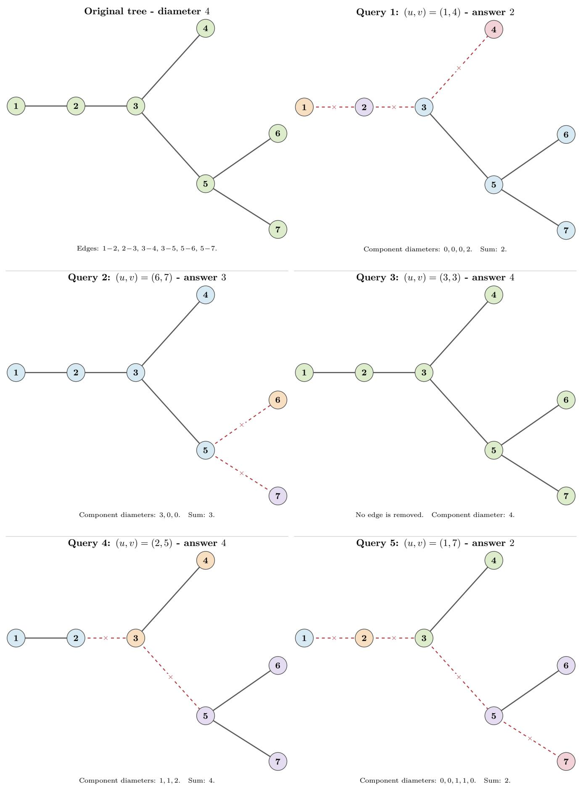
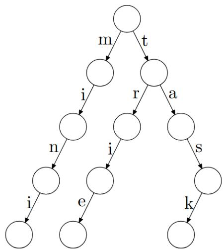
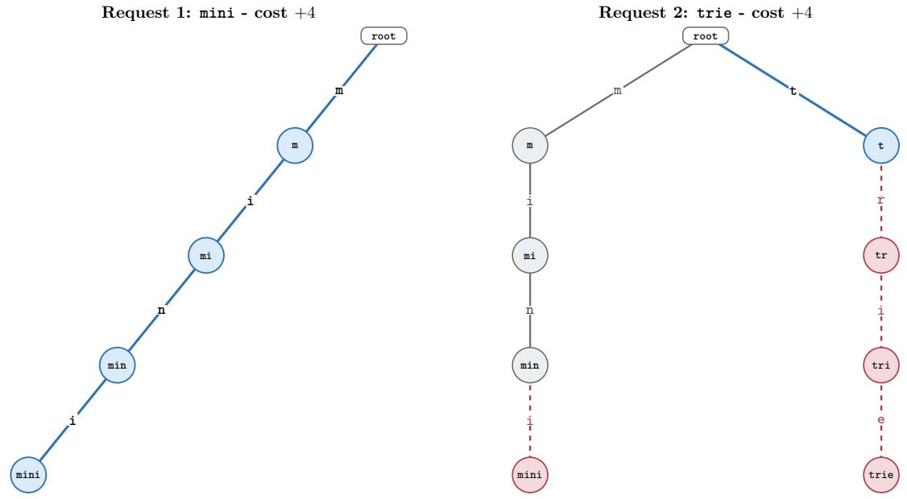
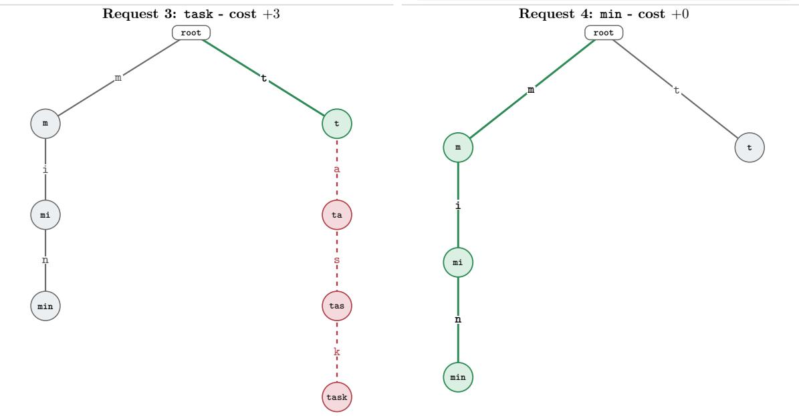

# 2026 牛客暑期多校训练营 #8

# N 牛客竞赛 AC.NOWCODER.COM

题目列表

A 14 Minesweeper Variants B Deep Finesse C Fraction on a Ring D Sea, you & copriMe II E Prefix Codes F Tree Shifts Here G Multiplication H It’s Magic, Not a Trick! I Bridge VI J Oni’s Ring K Al Fine II L Shattered Minimum M KV Cache

本试题册应包含 13 道题，共 28 个编号页。如果试题册不完整，请立即告知工作人员。

2026 年 8 月 12 日


## 承办方

## 命题方


## Problem A. 14 Minesweeper Variants

Input file: standard input Output file: standard output Time limit: 2 seconds Memory limit: 1024 megabytes

银狼在执行星核猎手任务的间隙找到了一款新游戏可玩：14 Minesweeper Variants。

自然而然地，她在完成教程之前就入侵了游戏。现在她拿到了内部关卡文件，其中包括每颗雷的确切位置。这本应让游戏变得轻而易举。

不幸的是，她选择了专家模式。

在专家模式中，知道一个格子安全还不够。每次点击之前，都必须仅根据一名诚实玩家当前可见的信息证明该格子安全。只根据被入侵后得到的雷区进行点击是不合法的。在令人尴尬地长时间毫无进展后，银狼决定采取合理的做法：编写一个程序，生成一套完整且合法的点击序列。

给定一份被入侵后得到的棋盘内部描述。它包含真实的雷区，以及每个安全格在未来被点击后的行为：

• # 表示一颗雷。

• O 表示一个已经打开的普通安全格。它显示其周围八个格子中的雷数。

• Q 表示一个已经打开的安全格，但它显示 ? 而非数字。

• . 表示一个未打开的安全格。点击它时，它会显示通常的相邻雷数，即其周围八个格子中的雷数总和。

• ? 表示一个未打开的安全格。点击它时，它会显示 ?，且不给出任何数字线索。

如果两个格子有公共边或公共角，则称它们相邻。

雷的数量等于文件中 # 字符的数量，且从一开始便已知。

该文件包含的信息多于一名诚实玩家能够看到的信息。特别地，所有未打开的 #、. 和 ? 格子在被点击之前看起来完全相同。文件中的符号可以用来模拟一次点击后实际会发生什么，但不能用来证明这次点击合法。

在任意时刻，考虑所有满足以下条件的候选布雷方案：

1. 它恰好包含已知总数的雷。

2. 每个当前已打开的格子都是安全格。

3. 每条当前可见的数字线索，其相邻雷数都恰好等于该数字。

一个已打开的 Q 或 ? 格子只会告诉玩家该格子安全；它不会对相邻格子施加任何限制。

如果一个未打开的格子在任何候选布雷方案中都不是雷，则称它必定安全。你只能点击当前必定安全的格子。

一次合法点击后，实际的关卡文件决定所显示的内容：

• 点击一个 . 会将其相邻雷数加入可见信息；

• 点击一个 ? 只会揭示该格子是安全的，并显示 ?。

你的目标是打开每个安全格。标记为 O 或 Q 的格子已经打开，不得出现在输出中。

如果存在多套完整的合法顺序，输出任意一套。如果无法通过合法点击打开每个安全格，输出 −1。

## Input

每个测试包含多组测试用例。第一行包含测试用例的数量 $t ~ \left( 1 \leq t \leq 1 0 \right)$ ）。接下来是各测试用例的描述。每个测试用例的第一行包含两个整数 n 和 $m \ ( 1 \leq n , m \leq 6 )$ ”— 分别表示行数和列数。

每个测试用例接下来的 n 行各包含一个长度为 m 的字符串，字符串仅由字符 #、O、Q、. 和 ? 组成。

## Output

对于每个测试用例，输出一个答案。

如果不存在完整的合法序列，输出一个整数 −1。

否则，先输出一个整数 k，随后输出 k 行。其中第 i 行包含两个整数 $r _ { i }$ 和 $c _ { i }$ ，表示第 i 个要点击的格子的行号和列号，二者均从 1 开始编号。可能有 k = 0。

## Example

<table><tr><td>standard input</td><td>standard output</td></tr><tr><td>4</td><td>1</td></tr><tr><td>1 3</td><td>1 2</td></tr><tr><td>0.#</td><td>-1</td></tr><tr><td>1 3</td><td>1</td></tr><tr><td>Q.#</td><td>1 2</td></tr><tr><td>1 3</td><td>11</td></tr><tr><td>O?#</td><td>3 4</td></tr><tr><td>5 5</td><td>3 5</td></tr><tr><td>###O#</td><td>3 3</td></tr><tr><td>Q. # ?O</td><td>4 3</td></tr><tr><td>? . . .</td><td>2 2</td></tr><tr><td># . . ##</td><td>2 4</td></tr><tr><td>.Q##?</td><td>3 2</td></tr><tr><td></td><td>4 2</td></tr><tr><td></td><td>5 1</td></tr><tr><td></td><td>3 1</td></tr><tr><td></td><td>5 5</td></tr></table>

## Note

在第一个测试用例中，已打开的普通格显示 0，因此格子 (1,2) 必定安全。

在第二个测试用例中，Q 不提供任何数字线索。棋盘上有一颗雷，而两个未打开的格子都有可能包含它，因此没有可进行的合法点击。

在第三个测试用例中，已打开的普通格再次证明格子 (1,2) 安全。点击它会显示 ?，但这足以完成目标，因为此时每个安全格都已打开。

本题几乎每个测试用例都来自 14 Minesweeper Variants 中的真实关卡。因此，如果这场比赛开始令您坐牢，你不妨先花一点钱购买游戏，通关相关关卡，然后把所有答案硬编码进去。

## Problem B. Deep Finesse

Input file: standard input Output file: standard output Time limit: 2 seconds Memory limit: 1024 megabytes

汐与风子在一个浩瀚的数字宇宙中展开了一场智力对决：这个宇宙包含从 1 到 10<sup>100</sup> 的所有整数。对决开始时，汐从中精心选择恰好 个互不相同的数字；其余所有数字都归风子所有。接下来的 轮中，两人逐一亮出自己选择的数字。每一轮都由风子先手，她从自己庞大的数字集合中亮出一个数字，汐必须立即用一个自己尚未打出的数字回应。这里有一条危险的规则：如果风子的数字严格小于汐回应的数字，风子就会立刻获胜。只有当汐的数字小于或等于风子的数字时，这一轮才能安全度过 — 两个数字都被丢弃，游戏继续。要赢得对决，汐必须撑过全部 n 轮，且风子打出的数字绝不能小于汐回应的数字。

更糟的是，在游戏开始前，风子还施加了额外的限制。她交给汐一个包含 m 个指定数字的集合，并宣布汐的初始手牌必须包含其中每一个数字。汐开始思考自己的胜算：在所有大小为 n 且包含这 m 个指定数字的手牌中，有多少副能够保证她拥有必胜策略，无论风子如何巧妙地选择出牌？答案可能大得惊人，因此她请你计算答案对 998244353 取模后的结果。

## Input

每个测试包含多组测试用例。第一行包含测试用例的数量 $t ~ \left( 1 \leq t \leq 1 0 0 0 \right)$ ）。接下来是各测试用例的描述。

每个测试用例的第一行包含两个整数 n 和 $m \ ( 1 \leq m \leq n \leq 5 0 0 0 )$

每个测试用例的第二行包含 m 个整数 $a _ { 1 } , a _ { 2 } , . . . , a _ { m } \ ( 1 \leq a _ { i } \leq 1 0 ^ { 9 } )$ ）”— 汐的手牌中必须包含的指定数字。保证 a 中没有重复元素。

保证所有测试用例的 n 之和不超过 5000。

## Output

对于每个测试用例，输出一个整数”— 能够保证汐拥有必胜策略的初始手牌数量对 998244353 取模后的结果。

## Example

<table><tr><td>standard input</td><td>standard output</td></tr><tr><td>3</td><td>0</td></tr><tr><td>1 1</td><td>1</td></tr><tr><td>2</td><td>34</td></tr><tr><td>2 1</td><td></td></tr><tr><td>2</td><td></td></tr><tr><td>6 3</td><td></td></tr><tr><td>1 4 5</td><td></td></tr></table>

## Note

在第一个测试用例中，汐的手牌固定为 {2}。如果风子打出 1，汐必须用 2 回应；由于 1 < 2，风子立即获胜。因此，答案为 0。

在第二个测试用例中，要保证获胜，汐的手牌必须为 {1,2}。因此答案为 1。

This page is intentionally left blank.

## Problem C. Fraction on a Ring

Input file: standard input Output file: standard output Time limit: 3 seconds Memory limit: 1024 megabytes


就在大豆敲下聊天记录中的最后一句话时，一个念头突然击中了他：模质数 P 的每个剩余类在 [0,P) 中都有唯一的整数代表元；将这个代表元除以 P，便得到一个位于 [0,1) 中的数，因而可以将它视作概率。于是，分数 <sup>a</sup> 也有了一个奇特的模意义下的对应物： $\frac { a b ^ { - 1 } { \bmod { P } } } { P }$ 。大豆随即好奇，在多少种情况下，原分数会大于这个 “概率”？

给定一个整数 n 和一个质数 $P _ { \circ }$

求满足下列条件的不同整数对 (a,b) 的数量：

1. $1 \leq a < b \leq n ;$

$$
2. \frac {a}{b} > \frac {a b ^ {- 1} \bmod P}{P} 。
$$

由于答案可能十分巨大，请将其对 998244353 取模后输出。

## Input

每个测试包含多组测试用例。第一行包含测试用例的数量 $t ~ \left( 1 \leq t \leq 1 0 0 \right)$ ）。接下来是各测试用例的描述。每个测试用例仅有一行，包含两个整数 n 和 $P ~ ( 2 \leq n < P \leq 1 0 ^ { 1 8 }$ ，P 是质数）。

## Output

对于每个测试用例，输出一个整数”— 满足条件的整数对数量对 998244353 取模后的结果。

## Example

<table><tr><td>standard input</td><td>standard output</td></tr><tr><td>3</td><td>1</td></tr><tr><td>4 5</td><td>932</td></tr><tr><td>64 97</td><td>782525253</td></tr><tr><td>998244353 1000000007</td><td></td></tr></table>

## Note

在第一个测试用例中，所有可能的数对如下表所示。

<table><tr><td>a/b</td><td></td><td>X/P</td></tr><tr><td>1/2</td><td>&lt;</td><td>3/5</td></tr><tr><td>1/3</td><td>&lt;</td><td>2/5</td></tr><tr><td>1/4</td><td>&lt;</td><td>4/5</td></tr><tr><td>2/3</td><td>&lt;</td><td>4/5</td></tr><tr><td>2/4</td><td>&lt;</td><td>3/5</td></tr><tr><td>3/4</td><td>&gt;</td><td>2/5</td></tr></table>

## Problem D. Sea, you & copriMe II

```txt
Input file: standard input
Output file: standard output
Time limit: 3 seconds
Memory limit: 1024 megabytes
```

给定一个整数数组 a，其长度为 n。定义 f(l, r) 如下：

$$
f (l, r) = \left\{ \begin{array}{l l} 1 & \exists p, q, s, t \in \{l, l + 1,..., r \}: \\ & | \{p, q, s, t \} | = 4, \quad \operatorname * {g c d} (a _ {p}, a _ {q}) = \operatorname * {g c d} (a _ {s}, a _ {t}) = 1 \\ 0 & \text {否则}. \end{array} \right.
$$

换言之， $f ( l , r ) ~ = ~ 1$ 当且仅当存在四个互不相同的下标 $p , q , s , t ,$ ，满足 $l ~ \leq ~ p , q , s , t ~ \leq ~ r$ 且 $\operatorname* { g c d } ( a _ { p } , a _ { q } ) = \operatorname* { g c d } ( a _ { s } , a _ { t } ) = 1$ 0

给定 q 次询问。每次询问包含一个区间 [l,r]，你需要计算：

$$
\sum_ {i = l} ^ {r} \sum_ {j = i} ^ {r} f (i, j).
$$

## Input

每个测试的第一行包含两个整数 n 和 $q ~ ( 1 \leq n , q \leq 5 \cdot 1 0 ^ { 5 } ) \phantom { } _ { \mathrm { { } } }$

每个测试的第二行包含 n 个整数 $a _ { 1 } , a _ { 2 } , . . . , a _ { n } \ ( 1 \leq a _ { i } \leq 1 0 ^ { 6 } )$

每个测试接下来的 q 行各包含两个整数 l 和 $r ~ \left( 1 \leq l \leq r \leq n \right)$

## Output

对于每次询问，输出一个整数”— 该询问的答案。

## Example

<table><tr><td>standard input</td><td>standard output</td></tr><tr><td>8 6</td><td>0</td></tr><tr><td>6 10 15 7 14 21 35 11</td><td>2</td></tr><tr><td>1 4</td><td>2</td></tr><tr><td>1 5</td><td>5</td></tr><tr><td>2 6</td><td>1</td></tr><tr><td>2 8</td><td>9</td></tr><tr><td>3 8</td><td></td></tr><tr><td>1 8</td><td></td></tr></table>

This page is intentionally left blank.

## Problem E. Prefix Codes

Input file: standard input Output file: standard output Time limit: 2 seconds Memory limit: 1024 megabytes

在本题中，码字指一个非空字符串，而 码本指一个由互不相同的码字组成的非空集合。

如果对于码本中任意两个不同的码字都满足以下条件，则称该码本为 前缀码：设这两个码字为 x 和 y，x不是 y 的前缀，且 y 也不是 x 的前缀。

大豆得到了两个非空字符串 s 和 p。大豆想要构造一个以 s 的子串作为码字的前缀码。不过，大豆不希望任何码字中出现 p。

更形式化地，如果字符串 x 满足以下全部条件，则称其为一个 候选码字：

• x 非空；

• x 是 s 的子串；

• p 不是 x 的子串。

子串仅根据其内容区分。如果同一个字符串在 s 的多个位置出现，它仍然只会被视为一个候选码字。

一个 合法码本是完全由候选码字组成的前缀码。换言之，它是一个由候选码字组成的非空集合 C，且对于任意两个不同的字符串 $x , y \in C$ ，其中任一字符串都不是另一个的前缀。

如果一个合法码本中存在一个另一个合法码本不含的码字，则认为二者不同。

求大豆能够构造的不同合法码本的数量。由于答案可能很大，请输出其对 998244353 取模的结果。

## Input

每个测试的第一行包含一个字符串 $s ~ \left( 1 \leq | s | \leq 5 \cdot 1 0 ^ { 5 } \right)$

每个测试的第二行包含一个字符串 $p \ ( 1 \leq | p | \leq 5 \cdot 1 0 ^ { 5 } )$

保证两个字符串均仅由小写拉丁字母组成。

## Output

输出一个整数”— 不同合法码本的数量对 998244353 取模的结果。

## Example

<table><tr><td>standard input</td><td>standard output</td></tr><tr><td>aba</td><td>5</td></tr><tr><td>ba</td><td></td></tr></table>

## Note

在样例中，合法码本为：{a}、{b}、{ab}、{a, b} 和 {b, ab}。

This page is intentionally left blank.

## Problem F. Tree Shifts Here

```txt
Input file: standard input
Output file: standard output
Time limit: 4 seconds
Memory limit: 1024 megabytes
```

在月球上，篝将时间花在研究数之不尽的可能性上。她用一种极度压缩的语言解释自己的发现：寥寥数语就可能包含足以让普通人的大脑不堪重负的信息。

瑚太朗不愿认输，不断用自己的改写能力加速思考，以跟上她的讲解。这样的尝试已多次以惨痛结果告终，于是篝决定，在进一步告诉他任何事情之前，先测试他的反应速度。自然，简化自己的语言从不在她考虑的选项之中。

在这项挑战中，篝使用了一棵有 n 个顶点的世界树，顶点编号从 1 到 n。这棵树是无向且无权的。

每次询问由两个顶点 u 和 v 描述。篝会暂时删除从 u 到 v 的唯一简单路径上的每一条边。世界树随之变成一片由若干连通分量组成的森林。

一个连通分量的 直径是其中任意两个顶点间距离的最大值，距离以二者路径上的边数衡量。特别地，只含一个顶点的连通分量的直径为 0。

对于每次询问，瑚太朗必须求出所得所有连通分量的直径之和。

各次询问彼此 独立。每次询问结束后，所有被删除的边都会在下一次询问开始前恢复。如果 u = v，路径上不含任何边，因此世界树不会发生变化。

## Input

每个测试的第一行包含两个整数 n 和 $q ~ ( 1 \leq n , q \leq 2 \cdot 1 0 ^ { 5 } )$

接下来的 n−1 行描述 n−1 条边。第 i 行包含两个整数 $a _ { i }$ 和 $b _ { i } ~ ( 1 \leq a _ { i } , b _ { i } \leq n )$ ），表示顶点 $a _ { i }$ 和 $b _ { i }$ 之间的一条无向边。保证这些边构成一棵树。

接下来的 q 行描述 q 次询问。第 i 行包含两个整数 $u _ { i }$ 和 $v _ { i } ~ \left( 1 \leq u _ { i } , v _ { i } \leq n \right)$

## Output

对于每次询问，输出一个整数，表示删除对应边后所得所有连通分量的直径之和。

## Example

<table><tr><td>standard input</td><td>standard output</td></tr><tr><td>7 5</td><td>2</td></tr><tr><td>1 2</td><td>3</td></tr><tr><td>2 3</td><td>4</td></tr><tr><td>3 4</td><td>4</td></tr><tr><td>3 5</td><td>2</td></tr><tr><td>5 6</td><td></td></tr><tr><td>5 7</td><td></td></tr><tr><td>1 4</td><td></td></tr><tr><td>6 7</td><td></td></tr><tr><td>3 3</td><td></td></tr><tr><td>2 5</td><td></td></tr><tr><td>1 7</td><td></td></tr></table>

## Note

样例的解释如下。



## Problem G. Multiplication

```txt
Input file: standard input
Output file: standard output
Time limit: 1 second
Memory limit: 1024 megabytes
```

在名为马苏里拉的魔法国度中，一场召唤仪式出了灾难性的岔子。布劳尼本想让传说中的魔法师加莱特完整现身，结果具现化的却只有她的头。漂浮的头毫不在意地宣告：“只要一颗头就够了！我会证明，单凭我的头脑就能胜过你们的身体。”

为了展示自己的才智，加莱特大胆断言：

“任取两个正整数。只要告诉我其中一个数的前 a 位和另一个数的前 b 位，我便能准确无误地确定它们乘积的前 c 位！那些看不见的低位，就像身体之于天才一样无关紧要。”

学院中最敏锐的数学家奥兰杰特立即察觉了漏洞。但仅仅指出谬误还不够。加莱特要求她给出具体反例：“既然你如此聪明，就找出两对不同的数，让它们的高位部分分别相同，乘积的高位部分却不同！”

奥兰杰特一时难以构造出这样的例子，于是她现在向你求助。

形式化地说，给定三个正整数 a、b 和 c。请构造两对正整数 $( x _ { 1 } , y _ { 1 } )$ 和 $( x _ { 2 } , y _ { 2 } )$ ，满足以下性质：

• 在通常的十进制表示法（无前导零）中， $x _ { 1 }$ 和 $x _ { 2 }$ 均至少有 a 位，且二者的前 a 位相同。

• 同样地，y 和 $y _ { 2 }$ 均至少有 b 位，且二者的前 b 位相同。

• 乘积 $x _ { 1 } \cdot y _ { 1 }$ 和 $x _ { 2 } \cdot y _ { 2 }$ 均至少有 c 位，但二者的前 c 位不同。

## Input

每个测试仅有一行，包含三个整数 a、b 和 $c \ ( 1 \leq a , b \leq 1 0 ^ { 5 } , \ 1 \leq c < a + b - 1 )$

## Output

输出四个满足要求的整数 x 、y 、x 和 $y _ { 2 } ~ ( 1 0 ^ { a - 1 } \leq x _ { 1 } , x _ { 2 } < 1 0 ^ { 5 \cdot 1 0 ^ { 5 } } , ~ 1 0 ^ { b - 1 } \leq y _ { 1 } , y _ { 2 } < 1 0 ^ { 5 \cdot 1 0 ^ { 5 } }$ ）。这些整数均不能有前导零。可以证明，在给定限制下答案总是存在。

## Example

<table><tr><td>standard input</td><td>standard output</td></tr><tr><td>2 2 2</td><td>1704 1313 1789 1346</td></tr></table>

## Note

第一个乘积的前 2 位可由 $1 7 0 4 \times 1 3 1 3 = 2 2 3 7 3 5 2$ 给出，是 22。第二个乘积的前 2 位可由$1 7 8 9 \times 1 3 4 6 = 2 4 0 7 9 9 4$ 给出，是 24。因此，这是一组合法的构造。

This page is intentionally left blank.

## Problem H. It’s Magic, Not a Trick!

Input file: standard input Output file: standard output Time limit: 2 seconds Memory limit: 1024 megabytes

嗯啊……真是麻烦，不过真正的魔法师绝不会放弃。

自称” 超高校级的魔法师” 的梦野秘密子将 n 张魔法符咒在自己面前排成一列。第 i 张符咒最初拥有 $a _ { i }$ 单位魔法能量，且每个 $a _ { i }$ 都是正整数。最近，她一直在研究一本尘封的古老魔法书，并从中解读出一种以极其特殊的方式操纵能量的奇妙魔法。

每施放一次魔法，她都必须严格按顺序执行以下两个步骤：

1. 灌注：她选择任意一张符咒，将自身恰好 1 单位的能量注入其中，使这张符咒的能量增加 1。

2. 释放：她选择任意一张在灌注后拥有至少 x 单位能量的符咒，随即引发一次绚烂的爆发，恰好消耗这张符咒的 x 单位能量，使其能量减少 x。两个步骤中可以选择同一张符咒，也可以选择不同的符咒；在这一点上，魔法相当灵活。

然而，还有一项关键限制：如果灌注后没有任何符咒拥有至少 x 单位能量，就无法执行释放。在这种情况下，整个魔法会施放失败，什么也不会发生，她试图灌注的那张符咒的能量也保持不变。

秘密子可以施放任意多次魔法，前提是每次施法均成功，且所有符咒的能量始终非负。她想知道这门技艺的极限：通过在每次施法时选择灌注和释放的对象，所有符咒剩余能量之和最小可以是多少？她宁愿打个盹也不想亲自计算，于是向身为可靠助手的你求助。由于答案可能很大，你只需输出其对 998244353取模的结果。

## Input

每个测试包含多组测试用例。第一行包含测试用例的数量 $t ~ \left( 1 \leq t \leq 1 0 ^ { 4 } \right)$ ）。接下来是各测试用例的描述。每个测试用例的第一行包含两个整数 n 和 $x ~ \left( 1 \leq n \leq 2 \cdot 1 0 ^ { 5 } , ~ 1 \leq x \leq 1 0 ^ { 9 } \right)$ 。

每个测试用例的第二行包含 n 个整数 $a _ { 1 } , a _ { 2 } , \ldots , a _ { n } \ ( 1 \leq a _ { i } \leq 1 0 ^ { 1 8 } )$

保证所有测试用例的 n 之和不超过 $2 \cdot 1 0 ^ { 5 }$

## Output

对于每个测试用例，输出一个整数”— 所有符咒的剩余能量之和的最小值对 998244353 取模的结果。

## Example

<table><tr><td>standard input</td><td>standard output</td></tr><tr><td>3</td><td>3</td></tr><tr><td>3 3</td><td>0</td></tr><tr><td>1 1 1</td><td>6</td></tr><tr><td>1 4</td><td></td></tr><tr><td>3</td><td></td></tr><tr><td>4 10</td><td></td></tr><tr><td>30 8 7 6</td><td></td></tr></table>

## Note

在第一个测试用例中，秘密子无法施放任何魔法。

在第二个测试用例中，秘密子可以将灌注和释放均作用于符咒 1，使其能量变为 0。

## Problem I. Bridge VI

```txt
Input file: standard input
Output file: standard output
Time limit: 1 second
Memory limit: 1024 megabytes
```

大豆参加了一场有 2n 名参赛者的比赛，目前比赛已经进入决赛轮。参赛者的编号从 1 到 $2 n .$ 。在决赛轮中，对于每个 i = 1,2,...,n，参赛者 2i−1 与参赛者 2i 进行比赛。在每场比赛中，m 分可以以任意方式分配给两名参赛者，但每人获得的分数必须是一个非负实数。

决赛轮开始前，参赛者 i 的初始分数为 $a _ { i \circ }$ 一名参赛者的最终分数等于其初始分数加上其在本轮中获得的分数。

大豆是参赛者 1。他想知道自己最好和最差的最终排名。具体而言，考虑每组中 m 分的所有合法分配方式，他想知道：

• 最少可能有多少名参赛者的最终分数严格大于他的最终分数，

• 最多可能有多少名参赛者的最终分数严格大于他的最终分数。

## Input

每个测试包含多组测试用例。第一行包含测试用例的数量 $t ~ \left( 1 \leq t \leq 1 0 ^ { 4 } \right)$ ）。接下来是各测试用例的描述。每个测试用例的第一行包含两个整数 n 和 $m ~ \left( 1 \leq n \leq 2 \cdot 1 0 ^ { 5 } , ~ 1 \leq m \leq 1 0 ^ { 9 } \right)$ ）。

每个测试用例的第二行包含 2n 个整数 $a _ { 1 } , a _ { 2 } , . . . , a _ { 2 n } \ ( 1 \leq a _ { i } \leq 1 0 ^ { 9 } )$

保证所有测试用例的 n 之和不超过 2·10<sup>5</sup>。

## Output

对于每个测试用例，输出两个整数”— 最少和最多可能有多少名参赛者的最终分数严格大于大豆的最终分数。

## Example

<table><tr><td>standard input</td><td>standard output</td></tr><tr><td>3</td><td>1 3</td></tr><tr><td>2 3</td><td>0 3</td></tr><tr><td>4 5 6 7</td><td>0 5</td></tr><tr><td>2 1</td><td></td></tr><tr><td>6 6 6 6</td><td></td></tr><tr><td>6 6</td><td></td></tr><tr><td>9 9 8 2 4 4 3 5 3 3 1 4</td><td></td></tr></table>

This page is intentionally left blank.

## Problem J. Oni’s Ring

Input file: standard input Output file: standard output Time limit: 2 seconds Memory limit: 1024 megabytes

神山识正在调查一个古老的传说：一只鬼将自己的记忆封存在一个由黑白两色石子串成的环中。

识用 0 表示每颗黑色石子，用 1 表示每颗白色石子。因此，这个环构成了一个环形二进制字符串 s。

为了研究这个环，识选择一个起始位置 i，并从该处开始沿顺时针方向连续读取 k 个字符，每当抵达字符串末尾时就绕回开头。对于二进制字符串 x（长度为 k），如果从位置 i 读出的字符串等于 x，我们就称 x 在位置 i 处出现于 s 中。

x 在 s 中的出现次数，是 x 出现的不同起始位置的数量。例如，10 在环形二进制字符串 00110011 中恰好出现两次。

不幸的是，识还没来得及完成调查，鬼的圆环就消失了。如今只剩下她的笔记本，其中记录了 2<sup>k</sup> 个非负整数 $c _ { 0 } , c _ { 1 } , \dotsc , c _ { 2 ^ { k } - 1 }$ 0

对于每个整数 x，若其满足 $0 < x < 2 ^ { k }$ ，则将 x 写成长度恰好为 k 的二进制字符串，必要时在前面补零。识的笔记称，这个二进制字符串在失踪的圆环中恰好出现了 $c _ { x }$ 次。

圆环没有指定的起点。因此，如果一个环形二进制字符串可以通过旋转得到另一个，那么它们会被视为相同。例如，1010 和 0101 表示同一个环形二进制字符串。

请帮助识重建鬼遗失的封印，求出与她笔记本中所有出现次数均相符的不同环形二进制字符串的数量。

由于答案可能很大，请输出其对 998244353 取模后的结果。

## Input

每个测试的第一行包含一个整数 $k \ ( 1 \leq k \leq 9 )$

每个测试用例的第二行包含 $2 ^ { k }$ 个非负整数 $c _ { 0 } , c _ { 1 } , \dotsc , c _ { 2 ^ { k } - 1 } .$

保证 $c _ { i }$ 的总和至少为 1 且不超过 $2 \cdot 1 0 ^ { 5 }$ 。

## Output

输出一个整数”— 不同的合法环形二进制字符串的数量对 998244353 取模后的结果。

## Examples

<table><tr><td>standard input</td><td>standard output</td></tr><tr><td>12 2</td><td>2</td></tr><tr><td>21 1 1 1</td><td>1</td></tr><tr><td>20 1 0 0</td><td>0</td></tr></table>

## Note

在第一个样例测试中，合法的环形二进制字符串为 0011 和 0101。

在第二个样例测试中，唯一合法的环形二进制字符串为 0011。

This page is intentionally left blank.

## Problem K. Al Fine II

```txt
Input file: standard input
Output file: standard output
Time limit: 2 seconds
Memory limit: 1024 megabytes
```

圣诞节时，双胞胎姐妹朵鲁蒂尼妲和雅琍耶妲各自收到了一棵圣诞树。她们想从 n 个备选装饰品中选择一些来装饰她们的树。

朵鲁蒂尼妲的树有 a 个结点，雅琍耶妲的树有 b 个结点。两棵树都以结点 1 为根。

对于每个装饰品，姐妹俩已经分别决定了将它挂在两棵树的什么位置。装饰品 i 将挂在朵鲁蒂尼妲的树的结点 $x _ { i }$ 上，以及雅琍耶妲的树的结点 y 上。姐妹俩必须选择同一组装饰品：每个装饰品要么同时放在两棵树上，要么两棵树上都不放。

圣诞树的树枝承载能力有限。两棵树的每个结点都有一个承重上限：挂在该结点或其子树中已选装饰品的数量不能超过此上限。

每个装饰品还有一个美丽值。姐妹俩希望在满足两棵树上每个承重上限的同时，恰好选择 k 个不同的装饰品。求美丽值总和的最大可能值。

## Input

每个测试包含多组测试用例。第一行包含测试用例的数量 $t ~ \left( 1 \leq t \leq 2 0 \right)$ ）。接下来是各测试用例的描述。每个测试用例的第一行包含三个正整数 n、a、b 和一个非负整数 $k ~ \left( 0 \leq k \leq n \right)$

每个测试用例接下来的 a 行描述朵鲁蒂尼妲的树。第 i 行包含两个整数 $p _ { i } , c _ { i } ~ \left( 0 \leq c _ { i } \leq n \right)$ ”— 分别表示结点 i 的父结点和承重上限。保证 $p _ { 1 } = 0$ 。对于每个 i > 1，保证 $1 \leq p _ { i } < i _ { \circ }$

每个测试用例接下来的 b 行以相同格式描述雅琍耶妲的树。

每个测试用例接下来的 n 行描述装饰品。第 i 行包含三个整数 $x _ { i } , y _ { i } , w _ { i } \ ( 1 \leq x _ { i } \leq a , \ 1 \leq y _ { i } \leq b $ $0 \le w _ { i } \le 1 0 ^ { 9 } )$ ）”— 分别表示它在朵鲁蒂尼妲的树上的位置、它在雅琍耶妲的树上的位置和它的美丽值。

保证所有测试用例的 $n + a + b$ 之和不超过 3000。

## Output

对于每个测试用例，输出美丽值总和的最大可能值。如果无法恰好选择 k 个装饰品，输出 −1。

Example

<table><tr><td>standard input</td><td>standard output</td></tr><tr><td>2</td><td>18</td></tr><tr><td>5 3 3 3</td><td>-1</td></tr><tr><td>0 3</td><td></td></tr><tr><td>1 1</td><td></td></tr><tr><td>1 2</td><td></td></tr><tr><td>0 3</td><td></td></tr><tr><td>1 2</td><td></td></tr><tr><td>1 1</td><td></td></tr><tr><td>2 2 8</td><td></td></tr><tr><td>2 3 7</td><td></td></tr><tr><td>3 2 6</td><td></td></tr><tr><td>3 2 5</td><td></td></tr><tr><td>3 3 4</td><td></td></tr><tr><td>2 1 2 2</td><td></td></tr><tr><td>0 2</td><td></td></tr><tr><td>0 1</td><td></td></tr><tr><td>1 2</td><td></td></tr><tr><td>1 2 10</td><td></td></tr><tr><td>1 2 9</td><td></td></tr></table>

## Note

在第一个测试用例中，选择装饰品 1,3,5 可使美丽值总和为 8+6+4 = 18。朵鲁蒂尼妲的树的结点 3 的子树中有两个已选装饰品，雅琍耶妲的树的结点 2 的子树中也有两个已选装饰品。对应的两个承重上限均恰好取到，所有其他上限也都得到满足。

在第二个测试用例中，雅琍耶妲的树的根结点承重上限为 1，因此无法选择两个装饰品。

## Problem L. Shattered Minimum

```txt
Input file: standard input
Output file: standard output
Time limit: 2 seconds
Memory limit: 1024 megabytes
```

千户和尤莉在一座废弃设施中休息时，发现了一台仍在工作的终端。千户还在仔细检查终端，尤莉却已经按下了按钮。随后，n 个方块在屏幕上排成一列，它们的编号构成一个排列 p，其长度为 n。尤莉对这台终端非常感兴趣，于是二人决定按照终端手册玩一个游戏。

终端可以复制任意区间 [l,r] 所对应的 p 的子段，形成一个独立的段。初始时有 m 个段。游戏轮流进行，由千户先手。在每一轮中，当前玩家必须：

1. 选择一个段，终端将移除编号最小的方块。随后，这个线段被分为两个段。

2. 选择以下操作之一：

• 保留左侧段，丢弃右侧段。

• 保留右侧段，丢弃左侧段。

• 同时保留两段。

每轮结束后，所有空段都会被丢弃。两名玩家在第 2 步中都可以选择保留空段，从而丢弃整段。

最先无法操作的玩家输掉游戏。假设千户和尤莉都采取最优策略，请判断谁会获胜。

## Input

每个测试包含多组测试用例。第一行包含测试用例的数量 $t ~ \left( 1 \leq t \leq 2 \cdot 1 0 ^ { 4 } \right)$ ）。接下来是各测试用例的描述。

每个测试用例的第一行包含两个整数 n 和 $m \ ( 1 \leq n , m \leq 2 \cdot 1 0 ^ { 5 } )$ ）。

每个测试用例的第二行包含 n 个整数 $p _ { 1 } , p _ { 2 } , . . . , p _ { n } ~ ( 1 \leq p _ { i } \leq n , ~ p _ { i } \neq p _ { j } ) { _ { } }$

每个测试用例接下来的 m 行各包含两个整数 l 和 $r ~ \left( 1 \leq l \leq r \leq n \right)$

保证所有测试用例的 n 之和不超过 $2 \cdot 1 0 ^ { 5 }$ 0

保证所有测试用例的 m 之和不超过 $2 \cdot 1 0 ^ { 5 }$

## Output

对于每个测试用例，如果千户获胜，则输出字符串 Chito，否则输出 Yuuri。

## 2026 牛客暑期多校训练营 #8

Example

<table><tr><td>standard input</td><td>standard output</td></tr><tr><td>4</td><td>Chito</td></tr><tr><td>1 1</td><td>Yuuri</td></tr><tr><td>1</td><td>Yuuri</td></tr><tr><td>1 1</td><td>Chito</td></tr><tr><td>1 2</td><td></td></tr><tr><td>1</td><td></td></tr><tr><td>1 1</td><td></td></tr><tr><td>1 1</td><td></td></tr><tr><td>4 1</td><td></td></tr><tr><td>2 1 3 4</td><td></td></tr><tr><td>1 4</td><td></td></tr><tr><td>3 2</td><td></td></tr><tr><td>2 1 3</td><td></td></tr><tr><td>1 3</td><td></td></tr><tr><td>1 1</td><td></td></tr></table>

## Problem M. KV Cache

Input file:

standard input

Output file:

Time limit:

standard output

2 seconds

Memory limit:

1024 megabytes

大豆正在运营一项大语言模型服务。为了避免为不同请求重复计算相同的前缀，该服务维护了一个持久化 KV 缓存。

每个请求均由一个小写拉丁字母串表示，其中每个字母代表一个词元。具有公共前缀的请求可以共享 KV缓存项。我们将缓存中的当前内容建模为一棵字典树。

最初，字典树中只有根节点，没有任何边。

处理请求字符串 s 时，会依次执行以下操作：

1. 大豆从字典树的根节点开始，自左向右处理整个字符串。

2. 如果对应于下一个词元的边已经存在，则可以零代价复用其缓存结果。

3. 否则，大豆必须计算对应的 KV 状态。这会消耗 1 单位计算量，同时字典树中会加入缺失的边。

在移除任何缓存项之前，会先处理完整个请求。特别地，请求中所有缺失的边都会先被加入，即使这会使字典树中的边数暂时超过 m。

处理完整个请求后，大豆会应用持久化缓存的容量限制。如果字典树中的边数超过 m，他必须反复删除一个叶节点以及连接该节点与其父节点的边，直到恰好剩下 m 条边。叶节点是当前字典树中没有子节点的节点。处理当前请求时加入的边也可能在此步骤中被删除。

大豆预先知道由全部 n 个请求构成的序列。每次进行删减时，他都可以自行选择要删除哪些与叶节点相连的边。

请确定处理所有 n 个请求所需的最小总计算代价。

字典树是一种以有根树形式存储字符串集合的数据结构。这棵树具有如下结构：树的每条边都标有一个字母，从同一节点出发的任意两条边所标的字母均不相同。沿着从根节点到某个节点的一条路径行走，即可读出一个字符串。

例如，我们可以为字符串 “min”、“trie”、“task” 和 “mini” 建立一棵字典树，如下所示：



## Input

每个测试的第一行包含两个整数 n 和 $m ~ ( 1 \leq n \leq 1 0 ^ { 6 } , ~ 1 \leq m \leq 1 0 ^ { 9 } )$

每个测试接下来的各行依次编号；其中第 i 行（共 n 行）包含一个字符串 $s _ { i }$ ”— 第 i 个请求中的词元序列。保证 $s _ { i }$ 仅由小写拉丁字母组成。保证所有 $| s _ { i } |$ 之和不超过 $1 0 ^ { 6 }$

## Output

输出一个整数”— 处理所有 n 个请求所需的最小总计算代价。

## Example

<table><tr><td>standard input</td><td>standard output</td></tr><tr><td>4 4</td><td>11</td></tr><tr><td>mini</td><td></td></tr><tr><td>trie</td><td></td></tr><tr><td>task</td><td></td></tr><tr><td>min</td><td></td></tr></table>

## Note

Blue: newly computed and kept Green: reused on this request Gray: cached after pruning Red dashed: removed after this request

Request 1: mini - cost +4

Request 2: trie - cost +4



All four edges are computed, and no pruning is needed. Cache after pruning (4/4): m, mi, min, mini. Cumulative cost: 4.

Request 3: task - cost +3

All four request edges are computed; the dashed edges are then removed.

Cache after pruning (4/4): m, mi, min, t. Cumulative cost: 4 + 4 = 8.

Request 4: min - cost +0



The edge t is reused; the three computed sufix edges are removed.

Cache after pruning (4/4): m, mi, min, t. Cumulative cost: 4 + 4 + 3 = 11.

The complete request path is reused; the cache does not change.

This page is intentionally left blank.