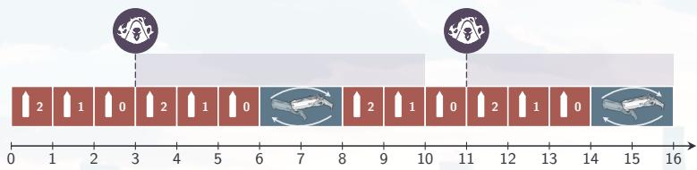
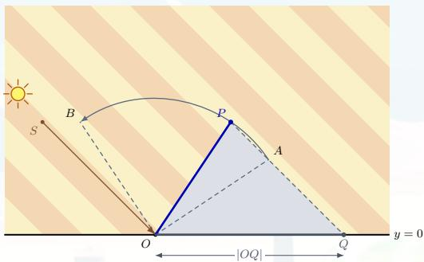
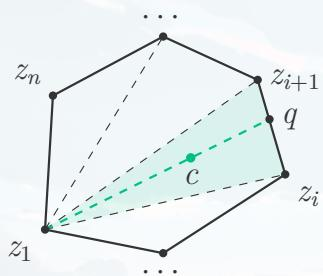

## 2026 牛客 暑期多校训练营 10

Natsuhi Kage ++

## 难度表

\- 入门: L
- 简单: A, K
- 中等--: B, E, I, J
- 中等: C, H, G
- 较难: D, F
- 困难: M

## - Reaper

## 题意

武器容量为 m；射击一发耗时 1 秒，装满弹耗时 r 秒。

■ 技能只能在操作间发动，可瞬间装满弹，初始可用，冷却时间为 c 秒。

求无限时间下的最大平均射速。 $T \leq 100$ ，m, r, $c \leq 100$ 。

## - Reaper

## 题解

注意到发动技能之间构成循环，且把子弹打完再发动技能一定不差。设相邻两次技能间换弹 $q$ 次，则该周期的射速为 $v_{q} = \frac{(q + 1)m}{\max\{c,(q + 1)m + qr\}}$

1 枚举 q，取最大的 $v_{q}$ ，复杂度为 $O(c)$ 。

2 观察到 $v_{q}$ 关于 q 单峰，可以三分，复杂度为 $O(\log c)$ 。

3 阈值 $q_{0} = (c - m) / (m + r)$ 前是在等待冷却，之后是在浪费技能循环；只需检查 $q_{0}$ 前后，复杂度为 $O(1)$ 。

## - Reaper

## 另解

把 (弹匣余量, 技能剩余冷却) 当作状态, 转移有向边记录射击数与耗时。

题意即求出图中经过 $(m, c)$ 的 $\sum$ 射击数/ $\sum$ 耗时最大的环。

分数规划判定最大平均环 $^{1}$ ，复杂度为 $O((mc)^{2}\log(1/\varepsilon))$ 。

■ 删除劣转移和发动技能的回边后，其余转移构成一个 DAG。利用这一结构即可在线性时间内求解最短路，复杂度为 $O(mc \log(1/\varepsilon))$ 。

## Ä - Natsuhikage

## 题意

定长杆始终位于地面上方，从 $\overrightarrow{OA}$ 逆时针旋转到 $\overrightarrow{OB}$ ; 光照方向为 $\overrightarrow{SO}$ 。

■ 求允许范围内影长 $|OQ|$ 的最小值与最大值。

$T \leq 10^{5}$ ，答案误差不超过 $10^{-6}$ 。

## Ä - Natsuhikage

## 题解

■ 令 $R = |OA|$ , $\theta, \theta_S$ 分别为 $\overrightarrow{OP}, \overrightarrow{OS}$ 的极角, 则

$$
| O Q | = \frac {R | O S |}{s _ {y}} | \sin (\theta - \theta_ {S}) |.
$$

在 $[\theta_A, \theta_B]$ 内，极值只可能出现在区间端点、平行方向或垂直方向。枚举区间内的 $\theta_A, \theta_B, \theta_S, \theta_S \pm \pi / 2$ ，代入公式取最小值与最大值。

■ 每组数据只检查常数个候选点，总复杂度为 $O(T)$ 。

## K - Team Formation

## 题意

■ 将 3n 名学生划分为 n 支三人队伍，每名学生恰好属于一支队伍。

学生 $i, j$ 的相容度为整数 $a_{i,j}$ ，可以为负；一支队伍的得分为三对成员的相容度之和。

■ 最大化所有队伍的得分之和。

$1 \leq n \leq 8, |a_{i,j}| \leq 10^{8}$ 。

## K - Team Formation

## 题解

用一个 $3n$ 位集合 $S$ 表示已经组队的学生，令 $f(S)$ 为从当前状态完成其余组队能获得的最大分数。取编号最小的未选学生 $i$ ，枚举未选的 $j < k$ 把三人组成一队：

$$
f (S) = \max _ {j <   k} \left\{a _ {i, j} + a _ {i, k} + a _ {j, k} + f (S \cup \{i, j, k \}) \right\}.
$$

■ 每种组队方案被枚举恰好一次；边界为 $f(2^{3n}-1)=0$ ，答案为 $f(0)$ 。

■ 不要使用 int: 注意答案绝对值范围会达到 $2.4 \times 10^{9} \geq 2^{31}$ 。

## K - Team Formation

## 状态数分析

\- 已经组成 $k$ 支队伍时，集合中共有 $3k$ 个学生。由于每次强制选择最小的未选编号，前 $k$ 个二进制位一定为1。

■ 剩余 $3n - k$ 位中还需要恰好选择 $2k$ 位；反过来删除第 $k$ 位和任意两个后缀中的已选位即可归纳构造，所以第 $k$ 层恰有

$$
\binom{3 n - k}{2 k}
$$

个可达状态。

## K - Team Formation

## 状态数分析（cont'd）

当 $n = 8$ 时，总状态数为

$$
\sum_ {k = 0} ^ {8} \binom {2 4 - k} {2 k} = 2 9 9 4 2 6.
$$

## - 转移数至多为

$$
\sum_ {k = 0} ^ {n - 1} \binom {3 n - k} {2 k} \binom {3 n - 3 k - 1} {2}.
$$

$n = 8$ 时为15682441，可以通过记忆化搜索或只遍历可达状态完成。

## B - Slot Machine

## 题意

有 $n$ 台老虎机，每台机器的奖金独立地在实数区间 $[0, m]$ 上均匀分布。

■ 每次选择当前奖金最大的机器；获得奖金后，该机器重新独立生成奖金。

■ 求恰好进行 k 次游戏时，奖金总和的期望。

$1 \leq n, k \leq 300, 1 \leq m \leq 10^{9}$ ; 答案误差不超过 $10^{-6}$ 。

## B - Slot Machine

## 题解

■ 注意到该题目等价于在 $n + k - 1$ 个随机变量里面选出前 $k$ 大。

归纳可知，k 次操作结束后，未被选择的恰好是 $n + k - 1$ 个随机变量中最小的 n - 1 个，因此被选择的恰好是最大的 k 个。

由概率论 $^{2}$ ： $n+k-1$ 个 $[0,m]$ 之间独立均匀随机变量的第i大是 $\frac{n+k-i}{n+k}\cdot m$ ，对前k大求和即可。

$^{2}$ 或者打表

## C - Slot Machine 2

## 题意

有 n 台老虎机，每台机器的奖金在整数 $0, 1, \ldots, m$ 中独立均匀随机产生。

■ 第 i 次游戏选择当前奖金第 $a_{i}$ 大的机器；获得奖金后，该机器重新独立随机生成奖金。

求恰好进行 $k$ 次游戏时奖金总和的期望，并将精确分数按模 $10^{9} + 7$ 的意义输出。

$1 \leq n, k \leq 300, 1 \leq m \leq 10^{9}, 1 \leq a_{i} \leq n$ 。

## C - Slot Machine 2

## 题解

对每个阈值 $i \in [1, m]$ ，计算每轮选出的奖金至少为 $i$ 的概率。固定 $i$ 后，只需记录当前有多少台机器的奖金至少为 $i$ 。

记 $f_{i,j,c}$ 表示第 $j$ 轮之前，恰有 $c$ 台机器的奖金至少为 $i$ 的概率。

■ 第 $j$ 轮选出的奖金至少为 $i$ ，当且仅当 $c \geq a_j$ ；此时取走后 $c$ 减一，否则不变。随后新奖金以 $\frac{m-i+1}{m+1}$ 的概率至少为 $i$ 。

## C - Slot Machine 2

## 题解 (cont'd)

令 $F(i) = \sum_{j=1}^{k} \sum_{c=a_j}^{n} f_{i,j,c}$ ，则答案为 $\sum_{i=1}^{m} F(i)$ 。

对固定的 $j, c, f_{i,j,c}$ 关于 $i$ 的次数不超过 $n + j - 1$ ，故 $F(i)$ 的次数不超过 $n + k - 1$ 。

■ 令 $G(t) = \sum_{i=1}^{t} F(i)$ ，则 $G(t)$ 的次数不超过 $n + k$ ，且答案为 $G(m)$ 。

## C - Slot Machine 2

## 题解 (cont'd)

计算 $F(1),\ldots ,F(n + k)$ ，由 $G(0) = 0$ 得到

$$
G (0), G (1), \dots , G (n + k).
$$

利用这 $n + k + 1$ 个点进行拉格朗日插值，即可求出 $G(m)$ 。

直接计算前 $n + k$ 个点，时间复杂度为 $O(nk(n + k))$ 。

## E - Splendor

## 题意

有 5 种颜色的宝石，目标是恰好得到第 i 种宝石 $a_{i}$ 颗。

一次操作可以从三种不同颜色中各取一颗，或从同一种颜色中取两颗；每种颜色都不能超过目标数量。

■ 求达到目标的最少操作次数，或者报告无解。

$T \leq 10^{5},\quad 0 \leq a_{i} \leq 10^{9}.$

## E - Splendor

## 题解

■ 我们称取三个不同宝石为 1 操作，取两个相同宝石为 2 操作。

首先发现最小化操作次数等价于最大化 1 操作的次数。因此我们想通过二分来判断最多能做多少次 1 操作。

## Lemma (E.1)

只有 1 操作会改变奇偶性，所以我们可以通过宝石的总和来判断需要做奇数次还是偶数次 1 操作。

## E - Splendor

## 题解 (cont'd)

## Lemma (E.2)

如果存在一种用 $\mathrm{cnt}_1$ 次 1 操作的解，且 $\mathrm{cnt}_1 > \binom{5}{3} = 10$ ，那么存在一种用 $\mathrm{cnt}_1 - 2$ 次 1 操作的解。

考虑每一种不同的 1 操作，一共有 $\binom{5}{3}$ 种。根据鸽巢原理， $\mathrm{cnt}_{1} > 10$ 时，一定有一种 1 操作被做了至少两次，把它们换成三个 2 操作，仍然为一个合法的解。

## E - Splendor

## 题解 (cont'd)

如何判断是否有一个 $\mathrm{cnt}_1 = k$ 的解？

令 $b_{i} = \min (a_{i}, k)$ ， $c_{i} = b_{i} - [b_{i} \text{和 } a_{i} \text{奇偶性不同}]$ 。 $c_{i}$ 即为第 $i$ 种宝石最多能参与到多少个 1 操作，且 $c_{i} \geq 0, \sum c_{i} \geq 3k$ 时存在解。

充分性：注意到 $\sum c_{i}$ 的奇偶性与 $\sum a_{i}$ 相同， $c_{i} \leq k$ ，所以把做 $k$ 个操作想象成填 $3 \cdot k$ 个数，每一列是一个操作，一行行按照顺序填即可，这样是一种合法的操作的构造。因为奇偶性相同，所以最后不会剩下奇偶性和 $a_{i}$ 不同的宝石。

■ 必要性：如果存在一个 $cnt_{1}=k$ 的解，那么根据 $c_{i}$ 定义， $\sum c_{i}\geq3k$ 。

## E - Splendor

## 题解 (cont'd)

■ 枚举 $cnt_{1} \leq 10$ 的情况，然后对 $cnt_{1} > 10$ 的情况在相同奇偶性的操作数上进行二分。总复杂度是 $O(\log \max a_{i})$ 。

■ 本题还存在许多其他做法，例如分类讨论，暴力枚举，或者注意到 2 操作的宝石不会超过两种，实现得当均可在时限内通过。

## - Choose a Name

## 题意

有 $n$ 名用户，第 $i$ 名用户提供两个候选用户名：左候选 $l_{i}$ 与右候选 $r_i$ ；需要为每人恰好选择一个。

■ 任意两个不同用户的用户名都不能互为前缀。

■ 判断是否存在合法选择；若存在，输出一组解。

■ $\sum n \leq 5 \times 10^{5}$ ，所有字符串总长度 S 不超过 $10^{6}$ 。

## - Choose a Name

## 题解

每名用户二选一，天然对应一个布尔变量。若两个候选互为前缀，就加入二者不能同时选择的 2-SAT 限制。

因此只需在线性规模内表示所有前缀冲突，最后求解 2-SAT。

## - Choose a Name

## 题解 - Trie 上优化建图

将所有候选用户名插入 Trie，自底向上处理。对每个节点 $x$ 建立变量 $u_{x}$ ：若 $x$ 的子树中有用户名被选，则 $u_{x}$ 必须为真。

■ 将 $x$ 代表的候选用户名排在一条链上，用排除前缀、后缀的方法保证至多选择一个，并令任意候选都推出 $p$ 为真；注意特殊处理 $l_{i} = r_{i}$ 的情况。

对每个儿子 $v$ ，禁止 $p$ 与 $u_{v}$ 同时为真；再令 $p$ 或任意 $u_{v}$ 为真时 $u_{x}$ 必须为真。不同儿子子树之间无须加入冲突。

每个候选用户名和每条 Trie 边只新建常数个变量和限制，总复杂度为 $O(S)$ 。

## - Choose a Name

## 题解 - 哈希暴力建图

也可以不在 Trie 上建图。先将相同的候选用户名分组；对每个字符串 p 建立变量 $g_{p}$ ，使这一组中任意候选被选时 $g_{p}$ 必须为真。

■ 对每个候选用户名 s，暴力枚举它的所有真前缀 p;

用哈希表查找字符串 $p$ 对应的组，并禁止当前候选与 $g_{p}$ 同时为真；

■ 相同字符串之间的冲突仍然需要处理。

每个串枚举的前缀数不超过其长度，故总枚举次数为 $O(S)$ 。

## - Joyride

## 题意

\- 给定一张无自环重边的无向图。

对每个顶点 $i$ ，求经过 $i$ 的、两两边不相交的简单环的最大数量。

$\sum n, \sum m \leq 2 \times 10^{5}$

## J - Joyride

## 题解

考虑计算第 $i$ 个点的答案，取出和 $i$ 相关的所有点双。

根据点双的定义，经过每个点的环都在点双内，因此每个点双的答案是独立的。

Lemma (J.1)

一个构成点双的图，恰好可以划分出 $\lfloor \deg_i / 2 \rfloor$ 个经过 $i$ 的边不相交的简单环。

## J - Joyride

题解 (cont'd)

## Lemma (J.1)

一个构成点双的图，恰好可以划分出 $\lfloor \deg_i / 2 \rfloor$ 个经过 $i$ 的边不相交的简单环。

上界：每个环会用掉 2 个 i 的度数，所以 $\left\lfloor deg_{i}/2 \right\rfloor$ 是一个上界。

下界：考虑在这个点双里面从 $i$ 出发建立 dfs 树。对于和 $i$ 有连边的点，我们记录它有一条从 $i$ 出发的链。自底向上回溯，未处理的链传给父亲；若一个点收到至少 2 条链，就两两配对成环，至多向上传一条。最终得到 $\lfloor \deg_i / 2 \rfloor$ 个环。

## J - Joyride

## 题解 (cont'd)

根据结论，只需要用 tarjan 求出每条边属于哪个点双即可。时间复杂度为 $O(n)$ 。

■ 不依赖点双性质，使用 dfs 树的性质（从第 i 个点开始 dfs，答案为 i 在每个孩子的子树的里的 $\left\lfloor deg_{i}/2 \right\rfloor$ 求和），可以使用线段树分治和并查集维护联通块，然后计算每个联通块（即 i 的每个孩子的子树）里的度数。时间复杂度为 $O(n \log n)$ 。

## H - Closing the Gap... Approximately

## 题意

给定一张带权有向图。路径的极差为路径上最大边权减去最小边权，记所有 $s \to t$ 路径的最小极差为OPT。

求一条从 $s$ 到 $t$ 的路径，其极差不能超过 $\sqrt{2} \cdot \mathrm{OPT}$ 。

$n \leq 10^{5}, m \leq 2 \times 10^{5}, w_{i} \leq 10^{9}$

## H - Closing the Gap... Approximately 黑盒做法 $^{3}$

取整数参数 $k \geq 1$ 。对给定的 $d$ ，构造如下判定：

判定失败，则一定有 $d < \mathrm{OPT}$

判定成功，则找到一条极差小于 $\frac{k + 1}{k} d$ 的路径。判定虽然不单调，但失败必有 $d < \mathrm{OPT}$ ，仍可二分一个失败点 $d$ 使得 $d + 1$ 成功，且 $d + 1 \leq \mathrm{OPT}$ 。

因而可以得到近似比 $\rho_{k}=1+\frac{1}{k}$ . 取 k=3，则 $\rho_{3}=\frac{4}{3}<\sqrt{2}$ .

## H - Closing the Gap... Approximately

## 黑盒做法 - 判定方法

对 d > 0，把权值为 w 的边放入编号 $\left\lfloor \frac{kw}{d} \right\rfloor$ 的桶中。枚举所有非空的连续 $k + 1$ 个桶 $[x, x + k + 1)$ ，只保留其中的边，调用一次 $s \rightarrow t$ 可达性检查。若检查成功，则其中任意两条边满足 $w_{max} - w_{min} < \frac{k+1}{k} d$ 。假设存在一条极差不超过 d 的路径，所有边至多占据 $k + 1$ 个连续桶，必被某个长度为 $k + 1$ 的桶区间覆盖。

总复杂度为 $O(km\log W) = O(m\log_{\rho}W)$ 。

## H - Closing the Gap... Approximately

## 白盒做法

将相同权值的边作为一组，并按权值从小到大排序；初始令 $L \gets \min w$ .

1 固定左端点 $L$ ，从小到大加边，直到满足 $s \sim t$ ；记此时右端点为 $R$ 。

2 记录可行区间长度 d = R - L。

3 对给定近似比 $\rho > 1$ ，把左端点跳到

$$
L ^ {\prime} = R - \frac {d}{\rho} = L + \left(1 - \frac {1}{\rho}\right) d,
$$

继续从这里开始重复第一步的扫描。

## H - Closing the Gap... Approximately

## 白盒做法 - 正确性分析

设最优区间为 $[A, B]$ ，考虑最后一次满足 $L \leq A$ 。此时

$$
A <   R - \frac {d}{\rho}, \qquad R - A > \frac {d}{\rho}.
$$

若 $B < R$ ，则 $[A, B] \subseteq [L, R)$ 已经可行，与 $R$ 是第一个可行右端点矛盾。因此 $B \geq R$ ，从而

$$
\mathrm{OPT} = B - A \geq R - A > \frac {d}{\rho}.
$$

已记录的答案满足 $d < \rho \mathrm{OPT}$ ，故跳跃不会破坏近似保证。

## H - Closing the Gap... Approximately

## 白盒做法 - 实现与复杂度分析

增量加边时，维护从 s 可达的点集。加入边 $u \rightarrow v$ 时：

若 $u$ 可达而 $v$ 不可达，则激活 $v$ ;

继续扫描新激活顶点已经加入的出边。

每个点只被激活一次，且总激活点数不超过 2 倍边数，所以加边均摊 $O(1)$ 。若权值为 $x$ 的边跳跃后仍在区间内，则 $x - L' \leq \frac{x - L}{\rho}$ 。每条边至多被重新加入 $O(\log_{\rho} W)$ 次，总复杂度为 $O(m \log_{\rho} W)$ 。

## G - Yet Another A Plus B Problem

## 题意

给定两个不保证凸的简单多边形 A, B，均包含内部与边界，也可能退化为线段或点；点的加法为坐标分别相加。

对每个询问点 $c$ ，找出满足 $a \in A$ 、 $b \in B$ 、 $a + b = c$ 的一组 $a, b$ ，或者报告无解。

T, n, m, $q \leq 200$ , $\sum n, \sum m \leq 500$ ; 答案误差不超过 $10^{-6}$ 。

## G - Yet Another A Plus B Problem

## 转化为多边形相交

条件 $a \in A, b \in B, a + b = c$ 等价于 $a \in A \cap (c - B)$ 。如果多边形 $A, (c - B)$ 存在公共点：

若多边形 $A, (c - B)$ 边界相交，则可以枚举 $A$ 的边，若 $[a_i, a_{i+1}]$ 与 $c - B$ 的边相交于 $a$ ，输出 $(a, c - a)$ 。

\- 否则一个多边形包含另一个，分别检查两多边形各一个顶点是否在另一个多边形内即可。

每次询问复杂度为 $O(nm)$ ，总复杂度为 $O(qnm)$ 。

## G - Yet Another A Plus B Problem

## 三角剖分

将两个简单多边形分别剖分为三角形 $\{A_i\}, \{B_j\}$ ，则所有三角形对 $(A_i, B_j)$ 的闵可夫斯基和的并覆盖 $A + B$ 。每个闵和至多有 6 个顶点，预处理所有三角形对的凸包后，每个凸包 $O(1)$ 判断是否在凸包内，询问复杂度仍为 $O(nm)$ 。

该做法渐进复杂度相同，但常数较大，需要精细实现。

## G - Yet Another A Plus B Problem

## 三角剖分 - 凸包内定位

凸包内的点通过极角序可以定位 $c$ 所在的三角形 $z_{1}, z_{i}, z_{i + 1}$ 。从 $z_{1}$ 经过 $c$ 连到对边，交点为 $q$ : $q = (1 - \mu)z_{i} + \mu z_{i + 1}$ . 则可用 $q$ 表达出 $c$ : $c = (1 - \lambda)z_{1} + \lambda q$ . 因而

$$
c = (1 - \lambda) z _ {1} + \lambda (1 - \mu) z _ {i} + \lambda \mu z _ {i + 1}.
$$

记录凸包顶点来源 $z_{r} = a_{r} + b_{r}$ ，即可还原答案。

## D - Strict Majority

## 题意

给定一棵 $n$ 个点的树，部分点已标记小写字母，其余点需要补全。

对任意至少包含 3 个点的简单路径，均不能存在某个字母出现次数严格超过路径点数的一半。

构造任意一种合法标记方案，或者报告无解。

$T \leq 1000, \sum n \leq 5000.$

## D - Strict Majority

## 题解

长度为 3 的路径合法，当且仅当三个字母两两不同，因此距离不超过 2 的点必须异色。反过来，若相同字母之间的距离至少为 3，则它在一条含 $k \geq 3$ 个点的路径上至多出现 $\lceil k/3 \rceil$ 次，不会严格超过一半。

所以原条件等价于：对于树上每个点 $u, u$ 和周围所有点 $v_{1}, \ldots, v_{\deg(u)}$ 满足颜色互不相同。特别地，若某个点的度数至少为26，则无解。

## D - Strict Majority

## 题解 (cont'd)

将树任意定根。记 $f_{u}(p, c)$ 表示父亲颜色为 p、点 u 颜色为 c 时，u 的子树能否合法染色。固定 u, p, c，为孩子与颜色建立二分图：

■ 孩子 v 可以匹配颜色 x，当且仅当 $f_{v}(c, x)$ 为真；

■ 禁止使用父亲颜色 p；不同孩子必须匹配不同颜色。

存在覆盖所有孩子的匹配，当且仅当 $f_{u}(p, c)$ 为真。已经确定的字母只允许对应的 c。

## D - Strict Majority

## 题解 (cont'd)

先不禁止父亲颜色，固定 u, c，求一个覆盖所有孩子的匹配。

若颜色 $p$ 未被匹配，禁止它后原匹配仍然可用；

若 $p$ 已被匹配，则需要沿交错路调整，使 $p$ 变为未匹配颜色。

从所有未匹配颜色出发遍历交错图，即可同时求出哪些颜色能够被空出，从而得到全部 $f_{u}(p, c)$ 。

时间复杂度为 $O(\alpha^{3}n)$ ; 使用 Hopcroft-Karp $O(\alpha^{2.5}n)$ 。

## F - Occurrences

## 题意

\- 给定长度为 $n$ 的小写字符串 $S$ 。记 $\mathrm{occ}(T)$ 为非空串 $T$ 在 $S$ 中的出现次数，出现位置可以重叠。

对每个询问区间 $[l, r]$ ，求

$$
\sum_ {l \leq i \leq j \leq r} \operatorname{occ} (S [ i: j ]).
$$

$1 \leq n, q \leq 2 \times 10^{5}$

## F - Occurrences

## 题解

我们试图用莫队解决问题。

■ 右端点扩展时答案增量为 $\sum_{i=l}^{r}\mathrm{occ}(S[i:r])$ ，即正串 SAM parent 树上到根的一个前缀和贡献，可以提前预处理。

左端点扩展时答案增量为 $\sum_{i=l}^{r}\mathrm{occ}(S[l:i])$ ，即反串SAM parent树上到根的一个前缀和贡献，可以提前预处理。

■ 我们 $O(\log n)$ 的定位 $S[l: r]$ 在正/反串 SAM 上的结点位置可以完成贡献统计，时间复杂度 $O(n\sqrt{q}\log n)$ ，无法通过。

## F - Occurrences

## 题解 (cont'd)

注意到只移动右端点/左端点时，我们都能 $O(1)$ 的在SAM的DAG结构上找到扩展后串的对应结点。

我们将普通莫队改为回滚莫队，右端点单调扩展时同时维护 $S[l:r]$ 在正串上对应结点位置。

左端点回滚时，以一次 $O(\log n)$ 的代价找到对应反串结点，在扩展时 $O(1)$ 确定新结点位置。

总时间复杂度变为 $O(n\sqrt{q} + q\log n)$ 。

## F - Occurrences

## Bonus

■ 使用 DAG 链剖可以做到 $O((n + q) \log n)$ 。

■ 使用更强大的基本子串结构可以做到线性。

## M - Brackets

## 题意

\- 给定两个长度为 $n$ 的合法括号序列 $S, T$ 。括号序列 $P$ 的权值为

$$
\sum_ {P _ {i} = (\text { }} a _ {i} + \sum_ {P _ {i} =)} b _ {i}.
$$

对每个 $k = 0, 1, \ldots, n$ ，恰好选择 k 个位置，并将这些位置的 $S_{i}$ 替换为 $T_{i}$ 。

在结果仍为合法括号序列的方案中最大化权值，或者报告无解。

■ $\sum n \leq 5 \times 10^{5}$ , $1 \leq a_{i}, b_{i} \leq 10^{9}$ .

## M - Brackets

## 权值转化

对括号序列 P，记右括号位置集合为 $R(P)$ ，并令 $c_{i}=b_{i}-a_{i}$ 。于是

$$
w (P) = \sum_ {i = 1} ^ {n} a _ {i} + \sum_ {i \in R (P)} c _ {i}.
$$

第一项与方案无关，所以只需最大化右括号集合中 $c_{i}$ 的总和。

## M - Brackets

## 合法性的集合刻画

长度为 $n$ 的括号序列 $P$ 合法，当且仅当

$$
| R (P) | = \frac {n}{2}, \quad | R (P) \cap [ 1, i ] | \leq \left\lfloor \frac {i}{2} \right\rfloor \quad (1 \leq i \leq n).
$$

第一式保证左右括号总数相同；第二式保证每个前缀中右括号不多于左括号。

## M - Brackets

## 真正修改的位置

定义

$$
D = \{i \mid S _ {i} = (, T _ {i} =) \}, \quad U = \{i \mid S _ {i} =), T _ {i} = (\}.
$$

因为 S, T 都有 n/2 个右括号，所以 $|D| = |U| =: d_{0}$

真正修改 2q 个字符，等价于从 D, U 中各选 q 个位置。一次交换 $R \leftarrow R - \{y\} + \{x\}$ 的收益为 $c_{x} - c_{y}$ 。

## M - Brackets

## 一次交换何时合法

## 定义每个前缀的剩余容量

$$
s _ {i} = \left\lfloor \frac {i}{2} \right\rfloor - | R \cap [ 1, i ] | \geq 0.
$$

若 $x > y$ ，区间 $[y, x - 1]$ 的 $s_i$ 全部加1，一定合法；

若 $x < y$ ，区间 $[x, y - 1]$ 的 $s_i$ 全部减1，需要原区间最小值大于0。

把 $s_i = 0$ 的位置称为墙； $x < y$ 时，交换合法等价于不跨墙。

## M - Brackets

## 逐步取最大合法交换

每一步在尚未使用的 $x \in D, y \in U$ 中选择

$G = \max\{c_x - c_y \mid (x, y) \text{ 当前合法}\},$

执行交换并删除这两个端点。

记 $F_{q}$ 为恰好选 q 个 D 和 q 个 U 时的最优总权值。下面证明 $F_{q+1} = F_{q} + G$ 。

## M - Brackets

## 排序交换引理

设 $A, B$ 是任意两个合法右括号集合，将差集分别升序排列：

$$
A \setminus B = \left\{a _ {1} <   \dots <   a _ {m} \right\}, \quad B \setminus A = \left\{b _ {1} <   \dots <   b _ {m} \right\}.
$$

按下标配对 $a_{j} \leftrightarrow b_{j}$ 。

任取若干下标，同时把对应的 $a_{j}$ 换成 $b_{j}$ ，从 $A$ 出发仍然合法。

## M - Brackets

## 排序交换引理：证明

固定前缀 $[1, i]$ ，设其中含前 $\alpha$ 个 $a_{j}$ 、前 $\beta$ 个 $b_{j}$ 。若只交换下标集合 J，则

$$
\left| B \cap [ 1, i ] \right| - \left| A \cap [ 1, i ] \right| = \beta - \alpha ,
$$

$$
\Delta = | J \cap [ 1, \beta ] | - | J \cap [ 1, \alpha ] |.
$$

若 $\beta < \alpha$ ，则 $\Delta \leq 0$ ；否则 $\Delta \leq \beta - \alpha$ ，故 $\alpha + \Delta \leq \max(\alpha, \beta) \leq \left\lfloor \frac{i}{2} \right\rfloor$ 。因此所有前缀仍合法。

## M - Brackets

## 贪心证明：交换分类

归纳假设当前集合 A 达到 $F_{q}$ ，取达到 $F_{q+1}$ 的集合 B，并使用排序交换引理中的配对方式。

$a_{j} \in U, b_{j} \in D$ : 交换次数加 1，称为前进交换；

$a_{j} \in D, b_{j} \in U$ ：交换次数减 1，称为后退交换；

■ 其余两类不改变交换次数，称为中性交换。

前进交换数 $n_{f}$ 与后退交换数 $n_{b}$ 满足 $n_{f}=n_{b}+1$ 。

## M - Brackets

## 贪心证明：非正收益部分

由排序交换引理:

单独执行任意一个中性交换，仍是合法的 q 次方案；

■ 同时执行任意一对“前进 + 后退”，也仍是合法的 q 次方案。

因为 A 已达到 $F_{q}$ ，所以中性交换的收益不大于 0，每一对“前进 + 后退”的总收益也不大于 0。

## M - Brackets

## 贪心证明：只剩一次前进

取收益最大的前进交换 $f^{*}$ 。其余 $n_{f}-1=n_{b}$ 个前进交换可以与全部后退交换一一配对，因此

$$
F _ {q + 1} - F _ {q} \leq g _ {f ^ {*}} \leq G.
$$

$f^{*}$ 本身合法，故第二个不等式成立；而贪心交换给出合法的 $q+1$ 次方案，所以 $F_{q+1} \geq F_{q} + G$ 。

两边合并得到 $F_{q+1} = F_{q} + G$ ，归纳完成。

## M - Brackets

## 线段树：节点基本信息

对节点区间 $I$ ，令 $m_{I} = \min_{i\in I}s_{i}$ ，达到 $m_{I}$ 的位置称为该节点的局部墙。节点维护：

$mn = m_{I}$ ，并支持区间加懒标记；

■ $m \times D$ : 区间内活跃 $D$ 中最大的 $c_{x}$ ;

■ mnU: 区间内活跃 U 中最小的 $c_{y}$ 。

## M - Brackets

## 线段树：跨墙信息

节点还维护:

■ prefU: 左端到第一堵局部墙（含墙）的最小 U;

■ sufD: 最后一堵局部墙之后（不含墙）的最大 D;

■ best: 不跨局部墙的最大交换收益，并保存端点。

根节点始终有 $s_{n}=0$ ，所以根的局部墙就是真正的墙，根的 best 正是当前最大合法交换。

## M - Brackets

## 子区间相对父节点的视图

设父节点最低值为 m，子节点最低值为 $m_{c}$ 。

若 $m_{c}=m$ ，子节点含父层的墙，直接使用它维护的信息；

若 $m_{c} > m$ ，子区间在父层看来没有墙，整个区间都可自由配对。

## 第二种情况下

$$
p r e f U = m n U,
$$

$$
s u f D = m x D,
$$

$$
b e s t = m x D - m n U.
$$

## M - Brackets

## 线段树合并：最大交换

设左右子区间为 $L, R$ ，并先转换成父层视图。最大交换只有四种来源：

$$
b e s t _ {L}, \qquad b e s t _ {R}, \qquad m x D _ {R} - m n U _ {L}, \qquad s u f D _ {L} - p r e f U _ {R}.
$$

第三项满足 $x > y$ ，天然合法；第四项利用 $sufD_{L},prefU_{R}$ ，保证 $x,y$ 之间不跨墙。四类覆盖所有端点位置。

## M - Brackets

## 线段树修改

mxD, mnU 直接合并；prefU, sufD 根据哪一侧出现父层局部墙合并。选中 $(x, y)$ 后，单点删除两个端点，并执行

$$
\left\{ \begin{array}{l l} {[ x, y - 1 ] \text {加} - 1,} & {x <   y,} \\ {[ y, x - 1 ] \text {加} + 1,} & {x > y.} \end{array} \right.
$$

根查询、两次单点删除和一次区间加均为 $O(\log n)$ 。

## M - Brackets

## 恢复每个 $k$ 的答案

相同位置数为 $free = \# \{i \mid S_i = T_i\} = n - 2d$ 。真实交换 $q$ 次会修改 $2q$ 个位置，因此需要 $0 \leq k - 2q \leq free$ 。

$$
L _ {k} = \max \left(0, \left\lceil \frac {k - f r e e}{2} \right\rceil\right), \quad R _ {k} = \min \left(d, \left\lfloor \frac {k}{2} \right\rfloor\right).
$$

若 $L_{k} > R_{k}$ ，答案为 -1。

## M - Brackets

## 区间最大值与复杂度

若 $L_{k}\leq R_{k}$ ，则

$$
a n s _ {k} = \max _ {L _ {k} \leq q \leq R _ {k}} F _ {q}.
$$

$F_{q}$ 不保证单调。随 $k$ 增大， $L_{k}, R_{k}$ 都只向右移动，用维护 $F_{q}$ 单调递减的双端队列即可得到所有区间最大值。

总复杂度: $O(n \log n)$ 时间, $O(n)$ 空间。

## THANKS!

AC.NOWCODER.COM