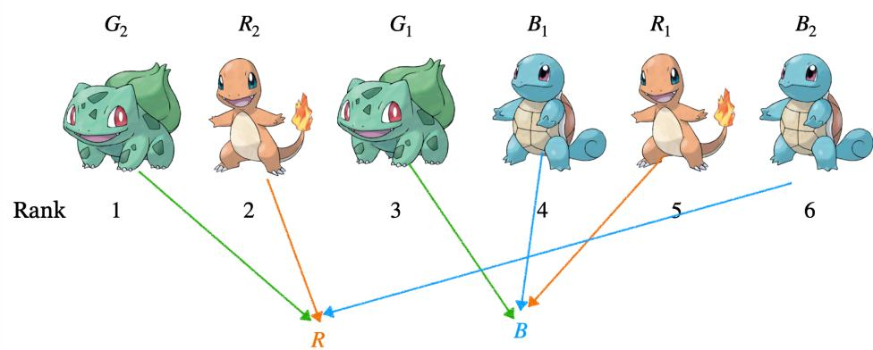
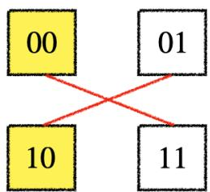
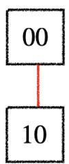
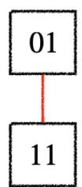

## Problem A. 入侵天使领域行动

Input file: standard input

Output file: standard output

Time limit: 2 seconds

Memory limit: 1024 megabytes

  
天使领域

在"入侵天使领域行动"中，仲村由理正尝试破解立华奏电脑的密码。

立华奏的电脑密码可以表示为一个长度为 $n$ 的非负整数数组 $a$ 。当且仅当最终数组单调不下降时，密码才算被破解。

现在，仲村由理每次可以选择一个非负整数 $k$ ，并花费 $k$ 的时间。随后，她可以任选数组中的若干个元素，将这些元素同时与 $k$ 进行按位异或操作。

与此同时，另一侧的演唱会作战正遭受教师的压制，因此仲村由理必须尽快完成破解。你，作为这个世界的"神"，想要知道在最优策略下，仲村由理最少需要花费多少时间。

## Input

第一行包含一个整数 $t \left(1 \leq t \leq 2 \times 10^{5}\right)$ ，表示测试组数。

对于每组测试数据:

第一行包含一个整数 $n$ （ $1 \leq n \leq 2 \times 10^{5}$ ），表示数组长度。

第二行包含 n 个整数 $a_{1}, a_{2}, \ldots, a_{n}$ （ $0 \leq a_{i} \leq 10^{9}$ ），表示初始数组。

保证所有测试数据中 n 的总和不超过 $2 \times 10^{5}$ 。

## Output

对于每组数据，输出一行一个整数，表示最少花费的总时间。

Example

<table><tr><td>standard input</td><td>standard output</td></tr><tr><td>6</td><td>2</td></tr><tr><td>2</td><td>2</td></tr><tr><td>3 0</td><td>4</td></tr><tr><td>2</td><td>4</td></tr><tr><td>7 4</td><td>0</td></tr><tr><td>2</td><td>2</td></tr><tr><td>6 1</td><td></td></tr><tr><td>3</td><td></td></tr><tr><td>4 6 3</td><td></td></tr><tr><td>3</td><td></td></tr><tr><td>1 2 3</td><td></td></tr><tr><td>4</td><td></td></tr><tr><td>1 0 6 5</td><td></td></tr></table>

## Problem B. 简单数学题 5

```txt
Input file: standard input
Output file: standard output
Time limit: 1 second
Memory limit: 1024 megabytes
```

给定整数 $n$ 、 $m$ 和 $x$ ，求满足以下条件的 $n$ 行 $n$ 列矩阵 $A = (a_{i,j})_{1\leq i,j\leq n}$ 的数量：

\- 对于任意 $1 \leq i, j \leq n$ , $a_{i,j}$ 均为 0 到 $m - 1$ 范围内的整数;

<div class="mineru-algorithm" style="white-space: pre-wrap; font-family:monospace;">
- $\operatorname{det}(A) \equiv x \pmod{m}$
</div>

由于答案可能非常大，请输出答案对 998244353 取模后的结果。

Input

输入仅一行，包含三个整数 $n$ 、 $m$ 和 $x$ （ $1 \leq n \leq 10^9$ ， $0 \leq x < m \leq 10^{18}$ ）。

## Output

输出一个整数，表示答案。

Examples

<table><tr><td>standard input</td><td>standard output</td></tr><tr><td>3 5 1</td><td>372000</td></tr><tr><td>13 17 0</td><td>880311515</td></tr></table>

## Problem C. 我得到神奇宝贝了!

```txt
Input file: standard input
Output file: standard output
Time limit: 1 second
Memory limit: 1024 megabytes
```

一场面向关都地区三种初始伙伴宝可梦的特别赛跑即将举行。红队有 $x$ 只小火龙，绿队有 $y$ 只妙蛙种子，蓝队有 $z$ 只杰尼龟。它们分别记作

$$
R _ {1}, R _ {2}, \ldots , R _ {x}, \qquad G _ {1}, G _ {2}, \ldots , G _ {y}, \qquad B _ {1}, B _ {2}, \ldots , B _ {z}.
$$

每只宝可梦通过终点的时间均不相同。因此，它们的完赛名次构成

$$
1, 2, \ldots , x + y + z
$$

的一个排列，其中名次 1 表示最先完赛。

  
小火龙、妙蛙种子和杰尼龟

颁奖典礼开始前，火箭队企图偷走参赛的宝可梦。虽然他们的计划被及时阻止，但主计时系统遭到了破坏，完整的比赛结果也因此丢失。幸运的是，一台独立的终点摄影判定终端幸存了下来。给定一只小火龙 $R_{i}$ 、一只妙蛙种子 $G_{j}$ 和一只杰尼龟 $B_{k}$ ，该终端会显示三者中完赛名次位于另外两者之间的宝可梦所属队伍的颜色。换言之，它会找出三者中既不是最早完赛、也不是最晚完赛的那只宝可梦。主办方使用终端查询了所有可能的三元组，其中每个三元组均由每支队伍各选出一只宝可梦组成。更准确地说，设 $r_i$ 、 $g_{j}$ 和 $b_{k}$ 分别为 $R_{i}$ 、 $G_{j}$ 和 $B_{k}$ 的完赛名次。对于所有 $1 \leq i \leq x$ 、 $1 \leq j \leq y$ 和 $1 \leq k \leq z$ ，相应字符的含义如下：

\- 若字符为 $\mathbb{R}$ ，则小火龙 $R_{i}$ 的名次位于另外两者之间，即

$$
g _ {j} <   r _ {i} <   b _ {k} \quad {\text {或}} \quad b _ {k} <   r _ {i} <   g _ {j};
$$

\- 若字符为 $\mathsf{G}$ , 则妙蛙种子 $G_{j}$ 的名次位于另外两者之间, 即

$$
r _ {i} <   g _ {j} <   b _ {k} \quad {\text {或}} \quad b _ {k} <   g _ {j} <   r _ {i};
$$

\- 若字符为 B，则杰尼龟 $B_{k}$ 的名次位于另外两者之间，即

$$
r _ {i} <   b _ {k} <   g _ {j} \quad {\text {或}} \quad g _ {j} <   b _ {k} <   r _ {i}.
$$

请重构任意一种与所有留存记录相符的完整完赛顺序。保证至少存在一种合法的完赛顺序。

## Input

第一行包含三个整数 $x$ 、 $y$ 和 $z$ （ $1 \leq x, y, z \leq 150$ ），分别表示小火龙、妙蛙种子和杰尼龟的数量。接下来的输入描述 $x$ 个字符矩阵，每个矩阵均有 $y$ 行、 $z$ 列。对于 $i = 1, 2, \ldots, x$ ，接下来的 $y$ 行描述与小火龙 $R_i$ 对应的矩阵。其中第 $j$ 行包含一个长度为 $z$ 的字符串 $s_{i,j}$ 。对于每个 $1 \leq k \leq z$ ， $s_{i,j}$ 的第 $k$ 个字符为 $\mathbb{R}$ 、 $\mathbb{G}$ 或 $\mathbb{B}$ 之一。该字符表示在 $R_i$ 、 $G_j$ 和 $B_k$ 三只宝可梦中，完赛名次位于另外两者之间的宝可梦所属队伍的颜色。相邻矩阵之间没有分隔符。

## Output

输出三行。第一行应包含 $x$ 个整数 $r_1, r_2, \ldots, r_x$ ，其中 $r_i$ 表示为小火龙 $R_i$ 分配的完赛名次。第二行应包含 $y$ 个整数 $g_1, g_2, \ldots, g_y$ ，其中 $g_j$ 表示为妙蛙种子 $G_j$ 分配的完赛名次。第三行应包含 $z$ 个整数 $b_1, b_2, \ldots, b_z$ ，其中 $b_k$ 表示为杰尼龟 $B_k$ 分配的完赛名次。序列

$$
r _ {1}, r _ {2}, \ldots , r _ {x}, g _ {1}, g _ {2}, \ldots , g _ {y}, b _ {1}, b _ {2}, \ldots , b _ {z}
$$

必须是

$$
1, 2, \ldots , x + y + z
$$

的一个排列。重构出的完赛名次必须满足输入中给出的所有条件。如果存在多种合法的完赛顺序，输出任意一种均可。

## Example

<table><tr><td>standard input</td><td>standard output</td></tr><tr><td>2 2 2</td><td>5 2</td></tr><tr><td>BR</td><td>3 1</td></tr><tr><td>BR</td><td>4 6</td></tr><tr><td>GG</td><td></td></tr><tr><td>RR</td><td></td></tr></table>

## Note

在样例输出中，小火龙 $R_{1}$ 和 $R_{2}$ 的完赛名次分别为 5 和 2，妙蛙种子 $G_{1}$ 和 $G_{2}$ 的完赛名次分别为 3 和 1，杰尼龟 $B_{1}$ 和 $B_{2}$ 的完赛名次分别为 4 和 6。例如，三元组 $(R_{1}, G_{1}, B_{1})$ 的完赛名次为 $(5, 3, 4)$ 。名次为 4 的杰尼龟 $B_{1}$ 位于妙蛙种子 $G_{1}$ 和小火龙 $R_{1}$ 之间。因此，对应的字符为 B。三元组 $(R_{1}, G_{1}, B_{2})$ 的完赛名次为 $(5, 3, 6)$ 。名次为 5 的小火龙 $R_{1}$ 位于妙蛙种子 $G_{1}$ 和杰尼龟 $B_{2}$ 之间。因此，对应的字符为 R。检查全部八种可能的三元组后，得到的结果恰好与输入中的两个矩阵相同。

  
两个示例三元组  
第一组样例的输出，以及其中

## Problem D. 天下第一武道会

```txt
Input file: standard input
Output file: standard output
Time limit: 1 second
Memory limit: 1024 megabytes
```

天下第一武道会汇聚了来自世界各地的 n 名武道家。这些选手的编号依次为 $1,2,\ldots,n$ 。比赛开始前，两位大会工作人员分别提交了一份固定的优先级名单 P 和 Q。每份名单都恰好包含所有选手一次，但选手在两份名单中的排列顺序可能不同。初始时，

$$
P = (p _ {1}, p _ {2}, \dots , p _ {n}), \qquad Q = (q _ {1}, q _ {2}, \dots , q _ {n}),
$$

其中两个序列都是 $1,2,\dots,n$ 的排列。名单提交后，不能再改变其中选手的相对顺序。大会委员会按照以下规则模拟比赛。只要仍有至少两名选手尚未淘汰，就可以进行一场比赛。令 $u$ 和 $v$ 分别为名单 $P$ 和 $Q$ 中第一个尚未淘汰的选手。

\- 如果 $u = v$ ，说明两位工作人员提名了同一名选手。由于一名选手不能与自己交手，并且工作人员不能跳过各自名单中的第一名选手，因此模拟将陷入僵局，无法再举行任何比赛。

\- 否则，选手 $u$ 和 $v$ 将进行对战。在模拟中，选择一名选手 $z \in \{u, v\}$ 作为败者。选手 $z$ 将被淘汰，因此需要从 $P$ 和 $Q$ 中同时删除 $z$ 。两个名单中其余选手的相对顺序保持不变。

在恰好进行了 $n - 1$ 场成功的比赛后，只会剩下一名选手。这名选手将成为天下第一武道会的冠军。你支持编号为 $x$ 的选手。请判断是否存在一种比赛结果，使得模拟过程中从不陷入僵局，并最终让选手 $x$ 成为冠军。如果存在，请输出任意一种合法的选手淘汰顺序。

## Input

第一行包含两个整数 $n$ 和 $x$ ( $2 \leq n \leq 2 \times 10^5, 1 \leq x \leq n$ ), 分别表示参赛选手的数量以及你希望成为冠军的选手编号。

第二行包含 $n$ 个整数 $p_1, p_2, \ldots, p_n$ , 保证 $P = (p_1, p_2, \ldots, p_n)$ 是 $1, 2, \ldots, n$ 的一个排列。第三行包含 $n$ 个整数 $q_1, q_2, \ldots, q_n$ , 保证 $Q = (q_1, q_2, \ldots, q_n)$ 是 $1, 2, \ldots, n$ 的一个排列。

## Output

如果无法在模拟不陷入僵局的前提下让选手 $x$ 成为冠军，在一行中输出NO。

否则，首先在一行中输出YES。第二行输出 $n - 1$ 个整数

$$
z _ {1}, z _ {2}, \ldots , z _ {n - 1},
$$

其中 $z_{i}$ 表示在第 $i$ 场比赛中被淘汰的选手。在第 $i$ 场比赛开始前，令 $u_{i}$ 和 $v_{i}$ 分别为名单 $P$ 和 $Q$ 中第一个尚未淘汰的选手。你的输出必须满足 $u_{i} \neq v_{i}, z_{i} \in \{u_{i}, v_{i}\}$ ，并且依次对所有 $i = 1, 2, \ldots, n - 1$ ，从两个名单中同时删除 $z_{i}$ 后，唯一剩下的选手必须是 $x$ 。如果存在多种合法的淘汰顺序，输出任意一种均可。

## Examples

<table><tr><td>standard input</td><td>standard output</td></tr><tr><td>3 32 3 13 1 2</td><td>NO</td></tr><tr><td>3 12 1 33 2 1</td><td>YES2 3</td></tr><tr><td>5 12 4 3 1 54 3 5 2 1</td><td>YES4 3 2 5</td></tr></table>

Note

以下是第三组样例输出所对应的比赛过程。初始时，名单 $P$ 和 $Q$ 中第一个尚未淘汰的选手分别是2和4。两人进行对战，选手4被淘汰。此时两个名单变为

$$
P = (2, 3, 1, 5), \qquad Q = (3, 5, 2, 1).
$$

下一场比赛在选手2和选手3之间进行。选手3被淘汰，此时

$$
P = (2, 1, 5), \qquad Q = (5, 2, 1).
$$

接下来，选手 2 和选手 5 被提名参赛。选手 2 被淘汰，因此

$$
P = (1, 5), \qquad Q = (5, 1).
$$

最后，选手 1 和选手 5 进行对战，选手 5 被淘汰。此时，两个名单中都只剩下选手 1。因此，整个模拟过程从未陷入僵局，选手 1 最终成为了天下第一武道会的冠军。

Round 1: Krillin (2) vs. Chiaotzu (4)


Round 2: Krillin (2) vs. Bacterian (3)


Round 3: Krillin (2) vs. Piccolo Jr. (5)


Round 4: Goku (1) vs. Piccolo Jr. (5)


## Problem E. 最后的代表

```txt
Input file: standard input
Output file: standard output
Time limit: 1 second
Memory limit: 1024 megabytes
```

银河帝国与自由行星同盟之间的战争给同盟政府带来了巨大的压力。为了更迅速地作出紧急决策，最高评议会提出了一套分层投票程序。杨威利怀疑，这套程序的结果可能取决于如何将代表划分为委员会。因此，他请尤里安·敏兹检验能否通过安排委员会的分组方式，使程序产生指定的最终立场。最初共有 $3^{k}$ 名代表。每名代表对两项议案的立场由一个长度为2的二进制字符串表示，其中1表示支持，0表示反对。因此，共有四种可能的立场类型：

$$
0 = 0 0, \qquad 1 = 0 1, \qquad 2 = 1 0, \qquad 3 = 1 1.
$$

投票过程恰好进行 k 轮。每一轮执行以下操作:

1. 将当前所有代表划分为若干个三人委员会。

2. 每个委员会产生一名进入下一轮的代表。

3. 对于两项议案中的每一项，新代表都采用委员会三名成员中的多数立场。

形式化地，设某个委员会中三名代表的立场分别为

$$
x = x _ {1} x _ {2}, \qquad y = y _ {1} y _ {2}, \qquad z = z _ {1} z _ {2},
$$

其产生的代表的立场为 $w = w_{1}w_{2}$ 。对于每个 $j\in \{1,2\}$ ，有

$$
w _ {j} = \left\{ \begin{array}{l l} 1, & x _ {j} + y _ {j} + z _ {j} \geq 2, \\ 0, & x _ {j} + y _ {j} + z _ {j} <   2. \end{array} \right.
$$

例如，将立场为 11、10 和 01 的三名代表分入同一个委员会，会产生一名立场为 11 的代表。在第 r 轮开始时，共有 $3^{k-r+1}$ 名代表。他们被划分为 $3^{k-r}$ 个委员会；本轮结束后，剩下 $3^{k-r}$ 名进入下一轮的代表。同一轮中的所有委员会同时组成，因此，本轮产生的代表只能从下一轮开始参与委员会。经过 k 轮后，恰好剩下一名代表。

给定每种类型的初始代表人数以及一个目标立场 $t$ ，请判断是否能够安排每一轮的委员会分组，使最后一名代表的立场为 $t$ 。如果可以，还需要输出任意一种合法的委员会分组方案。合法方案的具体输出格式将在输出格式中说明。

## Input

本题包含多组测试数据。第一行包含一个整数 $T$ （ $1 \leq T \leq 100$ ），表示测试数据的组数。接下来依次给出 $T$ 组测试数据。每组测试数据包含两行。第一行包含一个整数 $k$ ( $1 \leq k \leq 35$ ) 和一个长度为 2 的二进制字符串 $t$ ( $t \in \{00, 01, 10, 11\}$ )。第二行包含四个整数 $c_0, c_1, c_2, c_3$ ( $0 \leq c_i \leq 3^k, c_0 + c_1 + c_2 + c_3 = 3^k$ ). 抱证输入中的所有整数以及任意合法输出中的所有整数均小于 $10^{18}$ 。

## Output

对于每组测试数据，如果不存在合法的委员会分组方案，在一行中输出NO.

如果存在合法方案，首先在一行中输出YES, 随后输出恰好 k 行，依次描述第 1,2,…,k 轮的委员会分组方案。如果存在多种合法方案，输出任意一种即可。本题采用特殊评测。

委员会分组方案的表示方法. 四种立场的类型编号为

$$
0 = 0 0, \qquad 1 = 0 1, \qquad 2 = 1 0, \qquad 3 = 1 1.
$$

同一类型的代表彼此不可区分。由于委员会内三名代表的顺序无关紧要，因此每个委员会可以表示为一个三元组

$$
(a, b, c), \quad 0 \leq a \leq b \leq c \leq 3.
$$

共有 20 种可能的委员会类型。它们按照下列固定顺序排列：

$(0,0,0)$ , $(0,0,1)$ , $(0,0,2)$ , $(0,0,3)$ , $(0,1,1)$ , $(0,1,2)$ , $(0,1,3)$ , $(0,2,2)$ , $(0,2,3)$ , $(0,3,3)$ , $(1,1,1)$ , $(1,1,2)$ , $(1,1,3)$ , $(1,2,2)$ , $(1,2,3)$ , $(1,3,3)$ , $(2,2,2)$ , $(2,2,3)$ , $(2,3,3)$ , $(3,3,3)$ .

将上述有序列表记为

$$
\mathcal {P} = (p _ {1}, p _ {2}, \dots , p _ {2 0}).
$$

对于 $x \in \{0,1,2,3\}$ ，定义： $\mathrm{mult}_x(p_j)$ 表示类型 $x$ 在三元组 $p_j$ 中出现的次数； $\mathrm{Maj}(p_j)$ 表示对 $p_j$ 中三个类型的两个二进制位分别取多数后得到的类型。描述第 $r$ 轮的输出行必须包含20个非负整数

$$
g _ {r, 1}, g _ {r, 2}, \dots , g _ {r, 2 0},
$$

其中， $g_{r,j}$ 表示第 r 轮中组成的 $p_{j}$ 型委员会的数量。设 $N_{x}^{(r)}$ 表示经过 r 轮后，类型为 x 的代表人数。初始时

$$
N _ {x} ^ {(0)} = c _ {x}.
$$

对于每个 $r \in \{1, \ldots, k\}$ 和 $x \in \{0, 1, 2, 3\}$ ，输出方案必须满足

$$
\sum_ {j = 1} ^ {2 0} \mathrm{mult} _ {x} (p _ {j}) g _ {r, j} = N _ {x} ^ {(r - 1)}.
$$

该等式表示第 $r$ 轮开始时的每一名代表都被恰好使用一次。此外，还必须满足

$$
N_{x}^{(r)} = \sum_{\substack{1\leq j\leq 20\\ \operatorname{Maj}(p_{j}) = x}}g_{r,j}.
$$

该等式表示第 $r$ 轮产生的代表恰好构成下一轮的全部代表。设 $\tau$ 为目标字符串 $t$ 对应的类型编号。经过 $k$ 轮后，方案必须满足

$$
N _ {x} ^ {(k)} = \left\{ \begin{array}{l l} 1, & x = \tau , \\ 0, & x \neq \tau . \end{array} \right.
$$

Example

<table><tr><td>standard input</td><td>standard output</td></tr><tr><td>3</td><td>YES</td></tr><tr><td>1 00</td><td>0 0 0 0 0 1 0 0 0 0 0 0 0 0 0 0 0 0 0 0 0 0 0 0 0 0 0 0 0 0 0 0 0 0 0 0 0 0 0 0 0 0 0 0 0 0 0 0 0 0 0 0 0 0 0 0 1 0 0 0 0 0 0 0 0 0 0 0 0 0 0 0 0 0 0 0 0 0 0 0 0 0 0 0 0 0 0 0 0 0 0 0 0 0 0 0 0 0 0 0 0</td></tr><tr><td>1 1 1 0</td><td>YES</td></tr><tr><td>1 11</td><td>0 0 0 0 0 0 0 0 0 0 0 0 0 0 0 0 0 0 0 0 0 0 0 0 0 0 0 0 0 0 0 0 0 0 0 0 0 0 0 0 0 0 0 0 0 0 0 0 0 0</td></tr><tr><td>0 1 1 1</td><td>NO</td></tr><tr><td>2 00</td><td></td></tr><tr><td>1 2 2 4</td><td></td></tr></table>

Note

以下是对于样例输入的解释。第一组测试数据. 只有一个委员会，其三名成员的类型为

$(0,1,2)$ ,

对应的立场分别为

(00, 01, 10).

对于第一项议案，三名代表中有两人的立场为 0；对于第二项议案，也有两人的立场为 0。因此，该委员会产生的代表的立场为 00，可以得到目标立场。在固定的 20 种委员会类型中，(0,1,2) 是第 6 种。因此，输出行中的第 6 个整数为 1，其余整数均为 0。第二组测试数据。只有一个委员会，其三名成员的类型为

$(1,2,3)$ ,

对应的立场分别为

(01, 10, 11).

对于两项议案，三名代表中均有两人的立场为 1。因此，该委员会产生的代表的立场为 11，可以得到目标立场。在固定顺序中，(1,2,3) 是第 15 种委员会类型。因此，输出行中的第 15 个整数为 1，其余整数均为 0。第三组测试数据.目标立场为 00，并且需要进行两轮投票。为了使最终立场的最高位为 0，最后一轮委员会的三名代表中，至少需要有两人的最高位为 0。而为了产生这两名代表，他们各自所在的上一轮委员会中都必须至少包含两名最高位为 0 的初始代表。因此，至少需要4名最高位为 0 的初始代表。只有类型 0 和类型 1 的代表的最高位为 0，而他们的总人数为 $c_{0} + c_{1} = 1 + 2 = 3 < 4$ 。因此，不存在合法的委员会分组方案。

## Problem F. Ghost 入侵协议

```txt
Input file: standard input
Output file: standard output
Time limit: 1 second
Memory limit: 1024 megabytes
```

公安九课追踪到"傀儡师"藏身于一个受到严密保护的网络中。为了在不触发网络自毁机制的情况下取得访问权限，草薙素子少佐必须重构出指定的入侵密钥。认证系统包含两个相互隔离的密钥库，分别记为

$$
A = (A _ {1}, A _ {2}, \ldots , A _ {m}) \qquad {\text {和}} \qquad B = (B _ {1}, B _ {2}, \ldots , B _ {m}).
$$

每个密钥库都包含 $m$ 个一次性密钥片段。每个片段都有一个 $d$ 位认证签名，即一个 $d$ 位二进制向量。本题使用区间 $[0,2^d)$ 内的整数表示 $d$ 位签名。整数的每个二进制位对应签名的一个分量。必要时，在整数的二进制表示前补零，使其恰好包含 $d$ 位。每个密钥片段均由它在所属密钥库中的下标区分。即使两个片段的签名相同，只要它们的下标不同，它们仍被视为不同的片段。在草薙素子提交认证响应之前，傀儡师会启动交叉连接防御机制。它首先选择集合 $\{1,2,\dots,m\}$ 的一个排列

$$
\pi = (\pi_ {1}, \pi_ {2}, \dots , \pi_ {m}),
$$

然后将片段 $A_{i}$ 与片段 $B_{\pi_i}$ 接入同一个互斥认证端口。由此得到 $m$ 个端口：

$$
(A _ {1}, B _ {\pi_ {1}}), (A _ {2}, B _ {\pi_ {2}}), \ldots , (A _ {m}, B _ {\pi_ {m}}).
$$

每个密钥片段恰好连接到一个端口。傀儡师完成所有连接后，公安九课的扫描器会显示完整的排列 $\pi$ 。随后，草薙素子必须在每个端口连接的两个片段中恰好激活一个。激活其中一个片段后，该端口将被锁定，因此连接到同一端口的另一个片段不能再被使用。设草薙素子在第 i 个端口激活的片段为 $C_{i}$ ，则

$$
C _ {i} \in \{A _ {i}, B _ {\pi_ {i}} \}.
$$

认证系统会计算所有已激活片段的按位异或和。当且仅当

$$
\bigoplus_ {i = 1} ^ {m} C _ {i} = t
$$

时，草薙素子能够取得访问权限。其中， $t$ 是目标入侵密钥， $\oplus$ 表示按位异或运算。请判断：无论傀儡师如何连接两个密钥库，草薙素子是否都能保证取得访问权限。换言之，对于傀儡师选择的每一种排列 $\pi$ ，草薙素子都可以在看到完整排列后选择激活方案，并且她可以针对不同的排列采用不同的方案。

## Input

第一行包含两个整数 $m$ 和 $d$ ( $1 \leq m \leq 2 \times 10^5$ , $\quad 1 \leq d \leq 20$ ), 分别表示每个密钥库中的片段数量以及每个签名的位数。

第二行包含 $m$ 个整数 $A_{1}, A_{2}, \ldots, A_{m} (0 \leq A_{i} < 2^{d})$ , 其中 $A_{i}$ 表示密钥库 $A$ 中第 $i$ 个片段的签名。第三行包含 $m$ 个整数 $B_{1}, B_{2}, \ldots, B_{m} (0 \leq B_{i} < 2^{d})$ , 其中 $B_{i}$ 表示密钥库 $B$ 中第 $i$ 个片段的签名。第四行包含一个整数 $(0 \leq t < 2^{d})$ , 表示目标入侵密钥。

## Output

如果对于对手选择的每一种排列，你都能够使最终选择的元素的按位异或和等于 t，输出 YES；否则，输出 NO。

## Examples

<table><tr><td>standard input</td><td>standard output</td></tr><tr><td>2 20 31 22</td><td>NO</td></tr><tr><td>2 20 31 23</td><td>YES</td></tr></table>

## Note

对于第一组样例，由于 $m = 2$ ，傀儡师共有两种可能的排列。当

$$
\pi = (1, 2)
$$

时，两个认证端口分别为

$$
(0, 1) \quad {\text {和}} \quad (3, 2).
$$

草薙素子可以在第一个端口激活 0，并在第二个端口激活 2。它们的按位异或结果为

$$
0 \oplus 2 = 2,
$$

恰好等于目标密钥。当

$$
\pi = (2, 1)
$$

时，两个认证端口分别为 (0,2) 和 (3,1).

所有可能的按位异或结果为

$$
0 \oplus 3 = 3, \quad 0 \oplus 1 = 1, \quad 2 \oplus 3 = 1, \quad 2 \oplus 1 = 3.
$$

这些结果均不等于目标密钥 $t = 2$ 。因此，草薙素子无法应对所有可能的排列，所以答案为NO。




$$
t = 1 0
$$

$$
0 0 \oplus 1 0 = 1 0
$$




  
No solution!

第一组样例的示意图  


## Problem G. 瞬、心心相印

```txt
Input file: standard input
Output file: standard output
Time limit: 2 seconds
Memory limit: 1024 megabytes
```

使徒伊斯拉斐尔分裂成了两个个体。为了将其击败，碇真嗣和明日香必须驾驶 EVA 初号机与 EVA 二号机实现完美同步，同时摧毁它的两个核心。作战开始前，NERV 必须对两台 EVA 进行校准。现有 n 个同步模块，编号为 1,2,...,n。模块 i 的相位修正值为正整数 $a_{i}$ 。即使两个模块的相位修正值相同，只要它们的编号不同，就仍被视为不同的模块。所有在模块中出现的相位修正值，其出现次数均为偶数。因此，n 也一定是偶数。为了测试校准流程能否应对所有可能的模块安装顺序，MAGI 将进行一场恰好包含 n/2 轮的对抗性压力测试。最初，所有模块均未被使用。每轮依次进行以下操作：

1. MAGI 选择两个不同且尚未使用的模块。

2. 在看到 MAGI 选择的两个模块后，NERV 操作员必须立即将其中一个安装到 EVA 初号机上，并将另一个安装到 EVA 二号机上。

3. 这两个模块随后被标记为已使用。模块一旦安装，就会锁定在对应的控制系统中，无法移动。操作员也不能更改此前任何一轮的安装结果。

MAGI 在每轮中选择哪两个模块，可以取决于此前测试的全部过程。特别地，MAGI 无须预先确定所有模块的配对方式。同样，操作员可以根据此前的全部测试过程以及当前轮中 MAGI 选择的两个模块，决定如何安装这两个模块。形式化地，假设 MAGI 在第 r 轮选择了模块 $u_{r}$ 和 $v_{r}$ 。操作员必须选择

$$
(x _ {r}, y _ {r}) = (u _ {r}, v _ {r}) \qquad {\text {或}} \qquad (x _ {r}, y _ {r}) = (v _ {r}, u _ {r}),
$$

其中， $x_{r}$ 表示安装到 EVA 初号机上的模块编号， $y_{r}$ 表示安装到 EVA 二号机上的模块编号。恰好经过 $\frac{n}{2}$ 轮后，每个模块都被使用恰好一次。若

$$
\sum_ {j = 1} ^ {n / 2} a _ {x _ {j}} = \sum_ {j = 1} ^ {n / 2} a _ {y _ {j}},
$$

则校准成功。此时，两台 EVA 将实现完美同步，使真嗣和明日香能够同时发动攻击。否则，校准失败。操作员采用的策略必须是确定性的。也就是说，在每一轮中，操作员的决定只能取决于 MAGI 此前选择的所有模块对、操作员此前作出的所有安装决定，以及 MAGI 在当前轮选择的两个模块。操作员不能使用任何随机性。请判断操作员是否存在一种确定性策略，使其面对 MAGI 的任意合法策略时，都能保证校准成功。

## Input

第一行包含一个整数 $n$ （ $2 \leq n \leq 2 \times 10^5$ ，且 $n$ 为偶数），表示同步模块的数量。第二行包含 $n$ 个正整数 $a_1, a_2, \ldots, a_n$ （ $1 \leq a_i \leq 10^9$ ），其中 $a_i$ 表示模块 $i$ 的相位修正值。保证序列中出现的每个数值，其出现次数均为偶数。

## Output

如果操作员存在一种确定性策略，使其面对 MAGI 的任意合法策略时都能保证校准成功，请在一行中输出 YES；否则，请在一行中输出 NO。

## Examples

<table><tr><td>standard input</td><td>standard output</td></tr><tr><td>61 1 2 2 3 3</td><td>YES</td></tr><tr><td>201 1 2 2 3 3 4 4 4 4 5 5 5 6 6 6 6 6 6</td><td>NO</td></tr></table>

Note

下图展示了在第一个样例中，面对 MAGI 的某一种选择方式时，操作员可以采用的一种策略。可以证明，对于第一个样例，操作员存在一种确定性策略，能够面对 MAGI 的任意合法策略保证校准成功。

① 1 2 ② 3 3


1

(1,2)

2


1 ② 3 ③

① ③


3

(2,3)


5


6

(3, 1)

6


## Problem H. Modulo Triples

```txt
Input file: standard input
Output file: standard output
Time limit: 2 seconds
Memory limit: 1024 megabytes
```

给定一个正整数 N。

你需要将集合 $\{0,1,2,\ldots,3N-1\}$ 划分为 N 个有序三元组 $(x_{1},y_{1},z_{1}),(x_{2},y_{2},z_{2}),\ldots,(x_{N},y_{N},z_{N})$ 。这些三元组必须同时满足以下条件。

集合 $\{0,1,2,\dots ,3N - 1\}$ 中的每个整数恰好在所有三元组中出现一次。换言之，序列 $x_{1},y_{1},z_{1},x_{2},y_{2},z_{2},\ldots ,x_{N},y_{N},z_{N}$ 是集合 $\{0,1,2,\dots ,3N - 1\}$ 的一个排列。

对于每个 $i \in \{1, 2, \ldots, N\}$ ，必须满足 $z_i > 0$ 以及 $x_i \bmod z_i = y_i$ 。

其中， $a \bmod b$ 表示非负整数 $a$ 除以正整数 $b$ 所得到的余数。

可以证明，对于数据范围内的每个 $N$ ，至少存在一种合法方案。你只需要输出任意一种合法方案。

## Input

输入仅包含一行，其中包含一个整数 N。保证 $1 \leq N \leq 2 \times 10^{5}$ 。

## Output

输出 N 行。

第 i 行输出三个整数 $x_{i}, y_{i}, z_{i}$ ，表示第 i 个有序三元组。

对于每个 $i \in \{1,2,\dots,N\}$ ，输出必须满足 $0 \leq x_i, y_i, z_i < 3N$ 、 $z_i > 0$ 以及 $x_i \bmod z_i = y_i$ 。此外，序列 $x_1, y_1, z_1, x_2, y_2, z_2, \ldots, x_N, y_N, z_N$ 必须是集合 $\{0,1,2,\ldots,3N-1\}$ 的一个排列。如果存在多种合法方案，输出任意一种均可。

## Example

<table><tr><td>standard input</td><td>standard output</td></tr><tr><td>3</td><td>5 0 18 2 67 3 4</td></tr></table>

## Note

样例输出给出了三个有序三元组 $(5,0,1)$ 、(8,2,6)和(7,3,4)。

它们分别满足 $5 \mod 1 = 0$ 、 $8 \mod 6 = 2$ 和 $7 \mod 4 = 3$ 。

同时，这三个三元组中的所有整数恰好为 0,1,2,3,4,5,6,7,8，也就是集合 $\{0,1,\ldots,3N-1\}$ 中的所有整数。

```txt
Problem I. Leaf Order Reconstruction
Input file: standard input
Output file: standard output
Time limit: 2 seconds
Memory limit: 1024 megabytes
```

给定一棵包含 n 个顶点的树，顶点编号为 $1,2,\ldots,n$ 。这棵树以顶点 1 为根。

$$
\operatorname{depth} (1) = 0
$$

如果一个顶点没有子节点，则称其为叶子。设这棵树的叶子集合为 $\mathcal{L}$ ，且 $|\mathcal{L}| = s$ 。

所有叶子按照某个未知的顺序 $L_{1}, L_{2}, \ldots, L_{s}$ 被依次访问，其中每个叶子恰好出现一次。换言之， $L_{1}, L_{2}, \ldots, L_{s}$ 是集合 $\mathcal{L}$ 的一个排列。

访问过程中，按照以下规则在每个叶子上写下一个整数。

第一个被访问的叶子 $L_{1}$ 上写下 0。

对于每个 $i \in \{2, 3, \ldots, s\}$ ，在此前已经访问过的叶子 $L_{1}, L_{2}, \ldots, L_{i-1}$ 中，首先选择与 $L_{i}$ 的最近公共祖先深度最大的叶子。如果满足该条件的叶子不止一个，则选择其中最早被访问的叶子。

形式化地，对于每个 $i \in \{2, 3, \ldots, s\}$ ，定义

$$
D _ {i} = \max _ {1 \leq j <   i} \operatorname{depth} \bigl (\operatorname{LCA} (L _ {i}, L _ {j}) \bigr),
$$

并定义

$$
p _ {i} = \min \left\{j \mid 1 \leq j <   i, \text { depth } (\mathrm{LCA} (L _ {i}, L _ {j})) = D _ {i} \right\}.
$$

随后，在叶子 $L_{i}$ 上写下所选叶子 $L_{p_i}$ 的顶点编号。

其中， $\mathrm{LCA}(u, v)$ 表示顶点 $u$ 和顶点 $v$ 在以顶点1为根的树上的最近公共祖先。

现在给出每个叶子上写着的整数。设叶子 $u$ 上给出的整数为 $b_{u}$ 。请判断是否存在集合 $\mathcal{L}$ 的一个排列 $L_{1}, L_{2}, \ldots, L_{s}$ ，使得 $b_{L_1} = 0$ ，并且对于每个 $i \in \{2, 3, \ldots, s\}$ ，均有 $b_{L_i} = L_{p_i}$ 。如果存在，请输出任意一种满足条件的叶子访问顺序。

如果存在，请输出任意一种满足条件的叶子访问顺序。

## Input

第一行包含一个整数 n，表示树的顶点数量。保证 $1 \leq n \leq 2 \times 10^{5}$ 。

接下来 $n - 1$ 行，每行包含两个整数 $u$ 和 $v$ ，表示树上存在一条连接顶点 $u$ 和顶点 $v$ 的无向边。保证 $1\leq u,v\leq n$ ，并且输入的所有边构成一棵树。

接下来一行包含一个整数 $s$ ，表示这棵树以顶点1为根时的叶子数量。保证 $1 \leq s \leq n$ 。

接下来 $s$ 行，每行包含两个整数 $u$ 和 $b_{u}$ ，表示顶点 $u$ 是一个叶子，并且该叶子上写着整数 $b_{u}$ 。保证 $1 \leq u \leq n$ 且 $0 \leq b_{u} \leq n$ 。

输入保证给出的 $s$ 个顶点恰好是这棵树以顶点1为根时的所有叶子，并且每个叶子恰好出现一次。

输入不保证在 $b_{u} \neq 0$ 时， $b_{u}$ 一定是某个叶子的编号。你需要自行判断给出的信息是否合法。

## Output

如果不存在任何合法的叶子访问顺序，输出一行‘NO’。

否则，首先输出一行‘YES’，然后在第二行输出 s 个整数 $L_{1}, L_{2}, \ldots, L_{s}$ ，表示一种合法的叶子访问顺序。

每个叶子必须在输出序列中恰好出现一次。

如果存在多种合法顺序，输出任意一种均可。

## Example

<table><tr><td>standard input</td><td>standard output</td></tr><tr><td>7</td><td>YES</td></tr><tr><td>1 2</td><td>4 5 6 7</td></tr><tr><td>1 3</td><td></td></tr><tr><td>2 4</td><td></td></tr><tr><td>2 5</td><td></td></tr><tr><td>3 6</td><td></td></tr><tr><td>3 7</td><td></td></tr><tr><td>4</td><td></td></tr><tr><td>4 0</td><td></td></tr><tr><td>5 4</td><td></td></tr><tr><td>6 4</td><td></td></tr><tr><td>7 6</td><td></td></tr></table>

## Note

以顶点 1 为根后，叶子集合为 $\{4,5,6,7\}$ 。

考虑访问顺序 4,5,6,7。

叶子 4 第一个被访问，因此在叶子 4 上写下 0。

访问叶子 5 时，唯一已经访问过的叶子是 4，因此在叶子 5 上写下 4。

访问叶子 6 时，已经访问过叶子 4 和 5。由于 LCA(6,4) = LCA(6,5) = 1，两个候选叶子对应的最近公共祖先深度相同，因此选择访问时间更早的叶子 4，并在叶子 6 上写下 4。

访问叶子 7 时，有 LCA(7,6) = 3，而 LCA(7,4) = LCA(7,5) = 1。由于 depth(3) > depth(1)，因此选择叶子 6，并在叶子 7 上写下 6。

该访问顺序产生的所有整数均与输入一致，因此它是一种合法的访问顺序。

## Problem J. 寂海余脉

Input file: standard input
Output file: standard output
Time limit: 2 seconds
Memory limit: 1024 megabytes

  
阿戈尔人

阿戈尔人长期研究海嗣的演化方式。

一次观测中，他们将一支海嗣样本群的血脉关系抽象成了一棵有 $n$ 个节点的树，根节点为1。其中，第 $i$ 个节点对应一只海嗣样本，它的适应值为 $a_{i}$ 。树上的父子关系表示血脉上的祖先与后代关系，因此，树上某个节点的祖先，就是这只海嗣在血脉意义上的祖先。

海嗣之间会发生吞并与继承。若节点 $v$ 是节点 $u$ 的儿子，那么可以认为 $v$ 吞并并继承了它的父辈 $u$ ，并接过 $u$ 所在的那条演化脉络继续向下演化。由于继承只能发生在父子之间，所以演化的方向始终与树上从祖先到后代的方向一致。

一套合法的演化方案可以描述为：在树上选择若干条父子连接关系，使所有节点被划分成若干条从祖先到后代的链。等价地说，每个节点在演化方案中都满足以下限制：

\- 每个节点至多被一个儿子吞并并继承;

\- 每个节点至多吞并并继承自己的一个父亲；

\- 每个节点必须且只能属于一条演化链。

因此，所有节点最终会被划分成若干条两两不交的演化链。

形式化地，一条演化链是一个点序列 $v_{1}, v_{2}, \ldots, v_{m}$ ，满足对于每个 $1 \leq j < m$ ，节点 $v_{j+1}$ 都是节点 $v_{j}$ 的儿子。也就是说， $v_{1}$ 是这条链最上方的祖先， $v_{m}$ 是最下方的后代；并且链上每往下走一步，都表示后代吞并并继承了它的父辈。

现在有 q 次观测。每次观测会给出若干只关键海嗣，记其集合为 S。

对于某个关键海嗣 $x \in S$ ，设在当前演化方案中， $x$ 所在的演化链为

$$
v _ {1}, v _ {2}, \ldots , v _ {m},
$$

且 $x = v_{t}$ 。由于 $x$ 继承了这条链上从 $v_{1}$ 到 $v_{t}$ 的全部祖先信息，我们定义它的累计适应值 $\mathrm{pref}(x)$ 为

$$
a _ {v _ {1}} + a _ {v _ {2}} + \dots + a _ {v _ {t}}.
$$

本次观测的价值定义为所有关键海嗣累计适应值之和，即

$$
\sum_ {x \in S} \operatorname{pref} (x).
$$

对于每次观测，你需要求出：在所有合法的演化方案中，该次观测价值的最大值。

## Input

第一行包含一个整数 $t$ （ $1 \leq t \leq 1000$ ），表示测试组数。

对于每组测试数据:

第一行包含两个整数 $n, q$ （ $1 \leq n, q \leq 2 \cdot 10^{5}$ ），表示海嗣数量和观测次数。

第二行包含 n 个整数 $a_{1}, a_{2}, \ldots, a_{n}$ （ $-10^{8} \leq a_{i} \leq 10^{8}$ ），表示每只海嗣的适应值。

接下来 $n - 1$ 行，每行包含两个整数 $x_{i},y_{i}$ （ $1\leq x_{i},y_{i}\leq n$ ， $x_{i}\neq y_{i}$ ），表示血脉树上的一条无向边。

接下来 q 行，每行描述一次观测。

每次观测的第一项是一个整数 $k$ （ $0 \leq k \leq n$ ），表示关键海嗣的数量。

随后跟着 $k$ 个两两不同的整数 $v_{1}, v_{2}, \ldots, v_{k}$ ，表示本次观测中的关键海嗣。

保证所有测试数据中 n 的总和不超过 $2 \cdot 10^{5}$ 。

保证所有测试数据中 q 的总和不超过 $2 \cdot 10^{5}$ 。

保证所有观测中的 $k$ 之和不超过 $2 \cdot 10^{5}$ 。

## Output

对于每次观测，输出一行一个整数，表示该观测的最大价值。

Examples

<table><tr><td>standard input</td><td>standard output</td></tr><tr><td>1</td><td>6</td></tr><tr><td>3 3</td><td>3</td></tr><tr><td>1 2 3</td><td>0</td></tr><tr><td>1 2</td><td></td></tr><tr><td>1 3</td><td></td></tr><tr><td>2 2 3</td><td></td></tr><tr><td>1 2</td><td></td></tr><tr><td>0</td><td></td></tr><tr><td>1</td><td>10</td></tr><tr><td>12 9</td><td>17</td></tr><tr><td>5 -4 3 -2 7 -6 4 -1 8 -3 6 -5</td><td>13</td></tr><tr><td>1 2</td><td>18</td></tr><tr><td>1 3</td><td>2</td></tr><tr><td>1 4</td><td>30</td></tr><tr><td>2 5</td><td>23</td></tr><tr><td>2 6</td><td>11</td></tr><tr><td>3 7</td><td>0</td></tr><tr><td>3 8</td><td></td></tr><tr><td>4 9</td><td></td></tr><tr><td>6 10</td><td></td></tr><tr><td>8 11</td><td></td></tr><tr><td>8 12</td><td></td></tr><tr><td>2 10 11</td><td></td></tr><tr><td>3 5 10 11</td><td></td></tr><tr><td>3 7 11 12</td><td></td></tr><tr><td>3 9 10 11</td><td></td></tr><tr><td>3 2 3 4</td><td></td></tr><tr><td>5 5 7 9 10 11</td><td></td></tr><tr><td>4 5 9 11 12</td><td></td></tr><tr><td>4 6 8 10 11</td><td></td></tr><tr><td>0</td><td></td></tr></table>

## Problem K. D-Mail 机构代号

```txt
Input file: standard input
Output file: standard output
Time limit: 1 second
Memory limit: 1024 megabytes
```

在使用 IBN 5100 解读了 SERN 秘密数据库中的部分内容后，未来道具研究所发现了一份与时间旅行实验有关的研究机构名单。冈部伦太郎想在一封 D-Mail 中提及这些机构。由于 D-Mail 中能够使用的空间有限，桥田至（"桶子"）决定为每个机构分配一个简短且唯一的缩写。

最初，一个机构的缩写由其名称中每个单词的首字母依次连接而成，字母之间不添加空格。随后，桶子会反复细化每个仍与其他机构共用的缩写。第一次细化某个缩写时，他会将对应机构名称中的第一个单词完整写出，而不再只使用它的首字母。第二次细化时，他还会将第二个单词完整写出，依此类推。

例如，Future Gadget Laboratory 的缩写会按照以下过程变化:

## FGL → FutureGL → FutureGadgetL → FutureGadgetLaboratory.

在每一轮中，当前仍与其他机构共用缩写的所有机构都会同时细化其缩写。只有在本轮所有需要细化的缩写都更新完毕后，桶子才会再次检查是否存在冲突。一个缩写一旦变得唯一，就会被永久锁定，此后不再发生变化。

如果本轮完整写出的单词只包含一个字母，那么缩写本身不会发生变化。尽管如此，该单词仍会被视为已经处理。如果之后还需要继续细化，桶子将处理下一个单词。

可以证明，经过有限轮操作后，所有缩写都会两两不同。

请在冈部发送D-Mail之前，求出为每个机构分配的最终缩写。

## Input

第一行包含一个整数 $n \left(1 \leq n \leq 20\right)$ ，表示院校的数量。

接下来 $n$ 行，每行包含一所院校的完整名称。每个名称由1至20个单词组成，相邻单词之间恰有一个空格。

每个单词由1至20个英文字母组成。其首字母为大写英文字母，其余字母均为小写英文字母。

输入保证所有院校的完整名称两两不同。

## Output

输出 $n$ 行。其中第 $i$ $(1\leq i\leq n)$ 行应包含输入中第 $i$ 所院校最终的缩写，缩写中不包含空格。

Example

<table><tr><td>standard input</td><td>standard output</td></tr><tr><td>13</td><td>CMU</td></tr><tr><td>Carnegie Mellon University</td><td>SJTU</td></tr><tr><td>Shanghai Jiao Tong University</td><td>MoscowSU</td></tr><tr><td>Moscow State University</td><td>MississippiSU</td></tr><tr><td>Mississippi State University</td><td>AGoodU</td></tr><tr><td>A Good University</td><td>AGreatU</td></tr><tr><td>A Great University</td><td>AncientGU</td></tr><tr><td>Ancient Greece University</td><td>NowcoderTrainingCenter</td></tr><tr><td>Nowcoder Training Center</td><td>NowcoderTrainingC</td></tr><tr><td>Nowcoder Training C</td><td>NA</td></tr><tr><td>Nowcoder Academy</td><td>Nowcoder</td></tr><tr><td>Nowcoder</td><td>NAU</td></tr><tr><td>Not A University</td><td>Na</td></tr><tr><td>Na</td><td></td></tr></table>

## Problem L. Bobo 的幸运取模

```txt
Input file: standard input
Output file: standard output
Time limit: 1 second
Memory limit: 1024 megabytes
```

Bobo 正在学习取模运算。

对于两个正整数 $a$ 和 $b$ ，他本应计算 $a \bmod (b + 1)$ 。然而，他错误地先进行了取模运算，再加上 1，计算成了 $(a \bmod b) + 1$ 。

令人惊讶的是，对于某些 $a$ 和 $b$ ，Bobo的错误计算仍然能够得到正确结果。

给定一个正整数 $n$ ，请计算满足 $1 \leq a, b \leq n$ 且

$$
(a \bmod b) + 1 = a \bmod (b + 1)
$$

的有序数对 $(a, b)$ 的数量。

其中， $x \mod y$ 表示非负整数 x 除以正整数 y 所得到的余数。

如果两个数对的第一个分量不同或第二个分量不同，则认为它们是不同的数对。

Input

输入仅包含一行，其中包含一个整数 $n$ 。保证 $1 \leq n \leq 10^{12}$ 。

Output

输出一个整数，表示满足要求的有序数对 $(a, b)$ 的数量。

Examples

<table><tr><td>standard input</td><td>standard output</td></tr><tr><td>5</td><td>5</td></tr><tr><td>17</td><td>20</td></tr></table>

Note

五个合法的有序数对为 $(1,1)$ 、 $(3,1)$ 、 $(4,2)$ 、 $(5,1)$ 和 $(5,2)$ 。

例如，对于 $(a,b) = (5,2)$ ，Bobo的错误计算结果为 $(5\mathrm{mod}2) + 1 = 2$ ，而本应进行的计算结果为 $5\mathrm{mod}3 = 2$ 。因此，该数对满足等式。

## Problem M. 毛线小精灵

```txt
Input file: standard input
Output file: standard output
Time limit: 2 seconds
Memory limit: 1024 megabytes
```

一座古老的遗迹由 n 个房间和 m 条双向通道组成。每条通道都是一根连接两个不同房间的中空管道，并具有一定的长度。

你操控着一个由奥术丝线构成的精灵，并引导它穿行于遗迹之中。精灵必须从某个房间出发，并最终回到同一个房间，从而让丝线形成一个闭环。

  
由奥术丝线构成的精灵

每当精灵经过一条长度为 $w$ 的通道时，它就会消耗 $w$ 单位的丝线。同一条通道可以被经过多次。当且仅当以下所有条件均满足时，一条路线是合法的：

1. 遗迹中的每条通道都至少被经过一次。

2. 精灵不能立即沿着刚刚经过的通道原路返回。换句话说，通过一条通道进入某个房间后，它必须通过另一条不同的通道离开。

3. 将丝线拉紧后，每个房间中的所有通道口都必须被系在一起，形成一个连通结构。

第三个条件的形式化定义如下。

对于每个房间 $v$ ，按照以下方式构造无向多重图 $J_{v}$ ，则 $J_{v}$ 必须是连通的：

\- $J_{v}$ 的每个顶点对应一条与 $v$ 相接的通道。

\- 每当路线通过通道 $e$ 进入 $v$ ，并立即通过另一条不同的通道 $f$ 离开 $v$ 时，就在 $J_v$ 中代表 $e$ 和 $f$ 的两个顶点之间加入一条边。

\- 同一条边可以被加入多次。

由于路线是闭合的，因此路线的最后一次经过和第一次经过也被视为连续。如果路线通过通道 e 回到起始房间，并且最初通过通道 f 离开该房间，那么这次转移同样会在对应的局部图中加入一条边。禁止立即原路返回的规则在这里同样适用，因此 $e \neq f$ 。求完成一条合法路线所需的最少奥术丝线数量。

## Input

第一行包含两个整数 $n$ 和 $m$ （ $3 \leq n \leq 150, n \leq m \leq \min\left(150, \frac{n(n-1)}{2}\right)$ ），分别表示房间的数量和通道的数量。

接下来的 $m$ 行，每行包含三个整数 $u_{i}$ 、 $v_{i}$ 和 $w_{i}$ （ $1 \leq u_{i} < v_{i} \leq n, 1 \leq w_{i} \leq 10^{9}$ ），表示房间 $u_{i}$ 和 $v_{i}$ 之间有一条长度为 $w_{i}$ 的双向通道。

设 $\Delta$ 为图的最大度数，输入保证 $m\Delta \leq 300$ 。

保证输入图连通，不存在自环，任意两个房间之间至多有一条通道，每个房间都至少与两条通道相接，并且至少存在一条合法路线。

## Output

输出一行一个整数，表示完成一条合法路线所需的最少奥术丝线数量。保证答案可以用有符号 64 位整数表示。

## Examples

<table><tr><td>standard input</td><td>standard output</td></tr><tr><td>3 3</td><td>10</td></tr><tr><td>1 2 2</td><td></td></tr><tr><td>2 3 3</td><td></td></tr><tr><td>1 3 5</td><td></td></tr><tr><td>5 6</td><td>9</td></tr><tr><td>1 2 1</td><td></td></tr><tr><td>2 3 1</td><td></td></tr><tr><td>1 3 1</td><td></td></tr><tr><td>1 4 1</td><td></td></tr><tr><td>4 5 1</td><td></td></tr><tr><td>1 5 1</td><td></td></tr><tr><td>10 13</td><td>16</td></tr><tr><td>1 2 1</td><td></td></tr><tr><td>1 3 1</td><td></td></tr><tr><td>3 4 1</td><td></td></tr><tr><td>1 4 1</td><td></td></tr><tr><td>1 5 1</td><td></td></tr><tr><td>5 6 1</td><td></td></tr><tr><td>1 6 1</td><td></td></tr><tr><td>2 7 1</td><td></td></tr><tr><td>7 8 1</td><td></td></tr><tr><td>2 8 1</td><td></td></tr><tr><td>2 9 1</td><td></td></tr><tr><td>9 10 1</td><td></td></tr><tr><td>2 10 1</td><td></td></tr></table>

## Note

对于第一组样例，三个房间构成一个环。路线 $1 \rightarrow 2 \rightarrow 3 \rightarrow 1$ 恰好经过每条通道一次，并消耗 $2 + 3 + 5 = 10$ 单位的丝线。任何合法路线都不可能消耗更少的丝线。