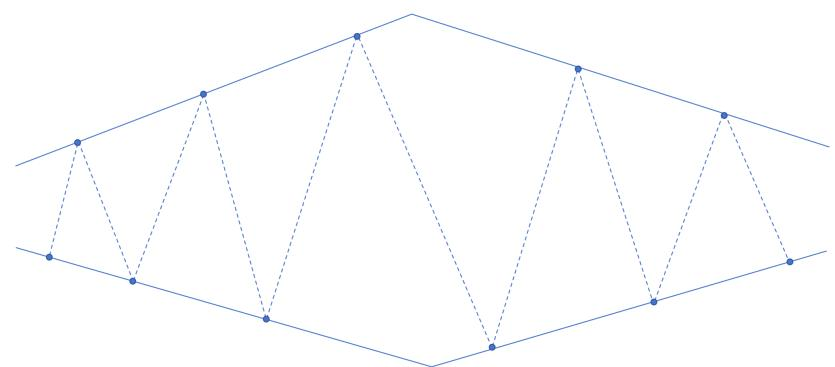

## 2026 牛客 暑期多校训练营

ZJU

## - Rounddog

## 题目大意

定义字符串序列

$$
T _ {1} = \text { Rounddog }, \quad T _ {i} = T _ {i - 1} + \mathsf {g} (i > 1),
$$

给定一个字符串 S 和一个整数 k。考虑 S 的所有循环移位，求其中有多少个循环移位包含 $T_{k}$ 作为连续子串。

$$
1 \leq t \leq 1 0 ^ {5}, 1 \leq | S |, \sum | S | \leq 1 0 ^ {5}, 1 \leq k \leq 1 0 0 。
$$

## 题解

注意到 $T_{k}$ 没有 border，直接判断它在整个串中出现了几次（包括跨越头尾的循环出现）。令出现次数为 $x$ ， $|T_{k}| = m$ 答案即为

$$
\left\{ \begin{array}{l l} 0 & \text {if x = 0} \\ n - m + 1 & \text {if x = 1} \\ n & \text {if x\geq 2} \end{array} \right.
$$

## B - Quadratic Residue

## 题目大意

给定一个正整数 $p$ ，需要寻找三个正整数 $x_{1}, x_{2}, q$ ，满足

$$
1 \leq x _ {1} <   q, \quad 1 \leq x _ {2} <   p,
$$

以及

$$
x _ {1} ^ {2} \equiv p \pmod {q},
$$

$$
x _ {2} ^ {2} \equiv q \pmod {p}.
$$

$1 \leq T \leq 10^{4}, 2 \leq p \leq 10^{9}, 1 \leq q \leq 10^{12}$ 。

## 题解

注意到 $p \mod q = (p + q) \mod q$ ， $q \mod p = (p + q) \mod p$ ，因而只要 $p + q$ 是完全平方数，两者就均为二次剩余。

枚举找到一个完全平方数 $n = x^{2} > p$ 且对应取模的结果不为 0 即可。

## D - The Game

## 题目大意

Alice 和 Bob 轮流构造一个长度为 $n$ 的排列。初始序列为空，Alice 先手。每次当前玩家选择一个尚未出现的 1 到 $n$ 之间的整数，并将其添加到序列末尾。经过恰好 $n$ 次操作后，得到排列 $p$ 。

对于排列 $p$ ，令 $f(p)$ 表示 $p$ 的所有循环移位中字典序最小的一个。Alice 希望让 $f(p)$ 的字典序尽可能小，而 Bob 希望让它的字典序尽可能大。

假设双方都采用最优策略，求最终得到的排列 $f(p)$ 。

$1 \leq T \leq 10^{5}, 1 \leq n, \sum n \leq 5 \cdot 10^{5}$

## 题解

$f(p)$ 一定从 1 开始。若最终排列为 $p=(a_{1},a_{2},\ldots,a_{k},1,b_{1},b_{2},\ldots,b_{t})$ ，则 $f(p)=(1,b_{1},b_{2},\ldots,b_{t},a_{1},a_{2},\ldots,a_{k})$ 。

因此，1 之后写下的数会出现在 $f(p)$ 的最前面。一旦某人写下 1，后面的每一步都会直接决定当前最靠前的未确定位置，所以之后双方都会贪心：Alice 选当前最小值，Bob 选当前最大值。

如果 Alice 写 1，Bob 会接最大数；如果 Bob 写 1，Alice 会接最小数。因此在 1 出现前，Alice 会尽量消掉大数，Bob 会尽量消掉小数。

## 题解

先看偶数 $n = 2m$ 。Alice 若要保证 $f(p)_2 \leq k$ ，需要在 $\{2, \ldots, k\}$ 被 Bob 消完前，消掉所有 $>k$ 的数。

也就是需要 $2m - k \leq k - 1$ ，所以 $k \geq m + 1$ 。因此 Alice 能保证 $f(p)_2 \leq m + 1$ 。

反过来，Bob 若要保证 $f(p)_2 \geq k$ ，需要在 $\{k, \ldots, 2m\}$ 被 Alice 消完前，消掉所有 $< k$ 的数。

也就是需要 $k - 2 \leq 2m - k + 1$ ，所以 $k \leq m + 1$ 。因此 Bob 能保证 $f(p)_2 \geq m + 1$ 。

所以偶数情况下 $f(p)_2 = m + 1$ 。

## 题解

现在继续推导偶数情况下的后续位置。

前面已经证明，双方最优时一定有 $f(p)_{2}=m+1$ 。

在达到这个值的策略中，Alice 会不断消掉大数侧的数，Bob 会不断消掉小数侧的数。若 Alice 提前写 1，Bob 接当前最大值，会使 $f(p)_{2} > m + 1$ ；若 Bob 提前写 1，Alice 接当前最小值，会使 $f(p)_{2} < m + 1$ 。

所以在最优对抗下，1 不会提前出现。由于 $n = 2m$ 且 Alice 先手，最后一手是 Bob，因此最后只剩下 1 由 Bob 写下。

## 题解

因此 Alice 的第一手会成为 $f(p)_{2}$ 。既然她已经能保证 $f(p)_{2} \leq m + 1$ ，而 Bob 又能保证 $f(p)_{2} \geq m + 1$ ，所以第一手的最优结果就是 $m + 1$ 。

接下来，在前缀 $1, m + 1$ 已经确定的前提下，Bob 的下一手会成为 $f(p)_{3}$ 。Bob 要让它尽量大，同时不能破坏前面的结论，所以他取当前小数侧最大值 m。

然后 Alice 取当前大数侧最小值 $m + 2$ ，Bob 取当前小数侧最大值 $m - 1$ ，如此交替。

## 因此1出现前的序列为

$$
m + 1, m, m + 2, m - 1, m + 3, m - 2, \dots , 2, 2 m.
$$

## 题解

最后只剩下 1，且最后一手是 Bob，所以 Bob 写下 1。

于是偶数答案为

$$
(1, m + 1, m, m + 2, m - 1, m + 3, \dots , 2, 2 m)
$$

也就是说，若 $n = 2m$ ，直接输出

$$
(1, m + 1, m, m + 2, m - 1, \dots , 2, 2 m).
$$

## 题解

再看奇数 $n = 2m + 1$ 。Bob 若要保证 $f(p)_2 \geq k$ ，需要在 $\{k, \ldots, 2m + 1\}$ 被 Alice 消完前，消掉所有 $< k$ 的数。

也就是需要 $k - 2 \leq 2m - k + 2$ ，所以 $k \leq m + 2$ 。因此 Bob 能保证 $f(p)_2 \geq m + 2$ 。

另一方面，Alice 可以保证 $f(p)_{2} \leq m + 2$ ：她不断消掉所有 $>m + 2$ 的数；如果 Bob 提前写 1，Alice 就接当前最小值，不会超过 $m + 2$ 。

所以奇数情况下 $f(p)_{2}=m+2$ 。

## 题解

奇数时， $f(p)_{2} = m + 2$ 会由Alice最后一手产生：Bob倒数第二手写1，Alice最后一手写剩下的 $m + 2$ 。

接下来推导 1 前面的前缀。Alice 第一手不能写 1，否则 Bob 接最大数，所以她写最小的非 1 数 2。

之后 Bob 为了让下一位尽量大，从小数侧取最大值 $m+1$ ；Alice 从大数侧取最小值 $m+3$ ；Bob 再取小数侧最大值 m，如此交替。

所以1出现前的前缀为

$$
2, m + 1, m + 3, m, m + 4, m - 1, \ldots , 3, 2 m + 1.
$$

## 题解

此时只剩下 1 和 $m + 2$ ，轮到 Bob。若 Bob 不写 1，Alice 最后一手写 1，则 $f(p)_2$ 会变成前缀第一个数 2，对 Bob 更差。因此 Bob 必须写 1。

## 所以奇数答案为

$$
\left(1, m + 2, 2, m + 1, m + 3, m, m + 4, \dots , 3, 2 m + 1\right).
$$

最后按公式构造即可：

若 n = 2m，输出 $(1, m + 1, m, m + 2, m - 1, \ldots, 2, 2m)$ 。

若 $n = 2m + 1$ ，输出 $(1, m + 2, 2, m + 1, m + 3, \ldots, 3, 2m + 1)$ 。

复杂度为 $O(\sum n)$ 。

## F - 23 Subsequences

## 题目大意

定义序列 $b = (b_{1}, b_{2}, \ldots, b_{m})$ 是合法的，当且仅当对于所有 $2 \leq i \leq m$ ，都有

$$
2 b _ {i - 1} \leq b _ {i} \leq 3 b _ {i - 1}.
$$

特别地，长度为 1 的序列一定合法。

给定一个长度为 $n$ 的正整数序列 $a$ ，需要回答 $q$ 个区间询问。每次给定区间 $[l, r]$ ，求 $a_l, a_{l+1}, \ldots, a_r$ 中最长合法子序列的长度。所选元素不要求连续，但必须保持相对顺序。

$$
1 \leq n, q \leq 2 \cdot 1 0 ^ {5}, 1 \leq a _ {i} \leq 1 0 ^ {1 8}, 1 \leq l \leq r \leq n 。
$$

## 题解

注意到合法的序列长度是 $\log$ 级别的。

考虑设 $f_{i,j}$ 表示以 i 结尾长度为 j 的合法子序列开头的最大位置，f 容易使用线段树/树状数组 $\mathcal{O}(n \log n \log V)$ 处理出来。

一个区间的答案 $[l, r]$ 就是最大的 $j$ 满足 $\max_{i=1}^{r} f_{i,j} \geq l$ ，这个做个前缀最大值就行了。时间复杂度 $O(n \log V \log n)$ 。

## C - Retest Queue

## 题目大意

有 $n$ 个程序需要在相同的 $m$ 个测试点上重新评测，所有程序使用同一个测试点顺序。

程序 i 在测试点 j 上需要运行 $d_{i,j}$ 的时间，并且该程序在该测试点上的结果已经确定为通过或不通过。评测一个程序时，会按照给定顺序依次运行测试点；一旦某个测试点不通过，就在完成该测试点后立即停止评测该程序。若程序通过所有测试点，则会运行完整个测试点序列。

你可以在评测开始前任意重排这 $m$ 个测试点。求完成所有 $n$ 个程序评测所需的最小总时间。

$$
1 \leq n \leq 2 \cdot 1 0 ^ {4}, 1 \leq m \leq 2 0, 1 \leq d _ {i, j} \leq 1 0 ^ {9} 。
$$

## 题解

令 $f_{S}$ 代表已经重排完集合 S 里的测试点的最小总时间，则枚举 S 中的最后一个元素 i， $f_{S} = \min\{f_{S \setminus \{i\}} + T_{S \setminus \{i\}, i}\}$ 。其中 $T_{S,i}$ 代表能通过集合 S 的程序跑第 i 个测试点所需的总时间。

对于一个固定的 i，可以在 $O(2^{m} \cdot m + n)$ 的时间求出对应的 $T_{S,i}$ 。对于固定的程序 x，假设他能通过的测试点集为 $P_{x}$ ，在 i 上的运行时间为 $d_{x,i}$ ，则只需要对 $P_{x}$ 的所有子集加上 $d_{x,i}$ 即可。容易通过高维前缀和求出所有的 $T_{s,i}$ 。总复杂度 $O(m^{2}2^{m} + nm)$ 。

## É - DPRS

## 题目大意

给定一张具有 $n$ 个点和 $m$ 条边的强连通带权有向图。记 $\mathrm{dis}(i,j)$ 为从点 $i$ 到点 $j$ 的最短路长度，并定义图的价值为

$$
\max_{\substack{1\leq i,j\leq n\\ i\neq j}}\frac{\operatorname{dis}(i,j)}{\operatorname{dis}(j,i)}.
$$

每次询问给出一条边的编号 $k$ 和一个小于其原边权的新权值 $x$ 。仅在本次询问中，将第 $k$ 条边的边权临时修改为 $x$ ，并求修改后图的价值。

$1 \leq T \leq 1000, 2 \leq n \leq m \leq 2000, 1 \leq q \leq 2000, \sum n, \sum m, \sum q \leq 2000,$ $1 \leq w_{k} \leq 10^{9}, 1 \leq k \leq m, 1 \leq x < w_{k}$ 。

## 题解

记 $d(u, v)$ 表示原图中从 $u$ 到 $v$ 的最短路长度。

关键结论是：图的价值只需要枚举图中的边。具体地，若 $e = (u, v, w)$ 是一条从 $u$ 到 $v$ 、边权为 $w$ 的边，则图的价值为

$$
M = \max _ {e = (u, v, w)} \frac {d (v , u)}{w}.
$$

因此，不需要枚举全部 $O(n^{2})$ 个有序点对，只需要枚举 m 条边。

## 题解

容易证明答案至少是这个值，下面证明答案不大于这个值。

任取两个不同的点 s, t，考虑一条从 t 到 s 的最短路

$p_{0}=t\rightarrow p_{1}\rightarrow\cdots\rightarrow p_{k}=s$ ，其中第i条边的边权为 $w_{i}$ 。

于是 $d(t,s)=\sum_{i=1}^{k}w_{i}$ 。从 s 返回 t 时，可以依次走每条边对应的反向最短路，因此

$$
d (s, t) \leq \sum_ {i = 1} ^ {k} d \left(p _ {i}, p _ {i - 1}\right) \leq \sum_ {i = 1} ^ {k} M w _ {i} = M d (t, s).
$$

所以 $\frac{d(s,t)}{d(t,s)}\leq M$ ，结论得证。

## 题解

考虑一次询问。设被修改的边为 $a \to b$ ，原边权为 $w$ ，新边权为 $x < w$ 。预处理原图中任意两点之间的最短路 $d(u, v)$ 。修改后，新的最短路记为 $d_x(u, v)$ 。

一条新的最短路要么不经过被修改的边，要么恰好经过一次被修改的边，因此

$$
d _ {x} (u, v) = \min \{d (u, v), d (u, a) + x + d (b, v) \}.
$$

由于所有边权均为正数，最短路不会重复经过同一条边，所以不需要考虑经过被修改边多次的情况。

## 题解

根据前面的结论，询问时仍然只需要枚举每一条边。

对于第 i 条边 $e_{i}=(u_{i},v_{i},w_{i})$ ，令它在当前询问中的边权为

$$
w _ {i} ^ {\prime} = \left\{ \begin{array}{l l} x, & i = k, \\ w _ {i}, & i \neq k. \end{array} \right.
$$

它的贡献为

$$
\frac {d _ {x} (v _ {i} , u _ {i})}{w _ {i} ^ {\prime}} = \frac {\min \{d (v _ {i} , u _ {i}) , d (v _ {i} , a) + x + d (b , u _ {i}) \}}{w _ {i} ^ {\prime}}.
$$

枚举全部 m 条边并取最大值，即得到本次询问的答案。

## 题解

特别地，对于被修改的边 $a \to b$ 本身，它的贡献为 $\frac{d_x(b, a)}{x}$ 。

从 $b$ 到 $a$ 的最短路不可能使用边 $a \to b$ ，否则会包含一个正权环。因此降低这条边的边权不会改变 $d(b, a)$ ，其贡献可以直接写成

$$
\frac {d (b , a)}{x}.
$$

预处理时，从每个点出发运行一次 Dijkstra，求出所有 $d(u,v)$ ；每次询问枚举全部边，并在 $O(1)$ 时间内计算一条边的贡献。

总时间复杂度为 $O(nm \log n + qm)$ ，空间复杂度为 $O(n^{2} + m)$ 。

## H - String

## 题目大意

给定 n 个非空字符串 $s_{1}, s_{2}, \ldots, s_{n}$ ，可以将它们任意排序并依次拼接，得到字符串 S。

对于每个 $k = 0,1,\dots ,L$ ，独立考虑如下问题：先任意排列并拼接这 $n$ 个字符串，然后至多修改拼接结果中的 $k$ 个字符。每次修改可以将一个字符替换为任意小写英文字母。

求对于每个 $k$ ，能够得到的字典序最小字符串。

$1 \leq T \leq 500, 1 \leq n \leq 500, 0 \leq k \leq L, \sum n \leq 500, \sum L \leq 500.$

## 题解

对于一个固定的字符串排列，最优修改方式一定是：从左向右依次将遇到的非 a 字符改成 a。

因此，最终排列中的字符串可以分为三部分：

若干个被完全变成 a 的字符串;

■ 至多一个只将部分前缀变成 a 的字符串；

■ 剩余的完全不修改的字符串。

第二类字符串也允许修改 0 个字符。此时，它原本的最长 a 前缀仍然属于最终答案的全 a 前缀。

所有完全变成 a 的字符串应放在最前面，部分修改的字符串紧随其后。

## 题解

对于剩余的未修改字符串，经典结论是按照 $s_{i} + s_{j} < s_{j} + s_{i}$ 排序后依次拼接最优。

因此，先按照上述比较方式对所有字符串排序。设 $c_{i}$ 为 $s_{i}$ 中非 a 字符的数量。

令 $f_{i,j,b}$ 表示考虑前 $i$ 个字符串，恰好修改 $j$ 个字符时的最优状态，其中：

$b = 0$ 表示还没有选择部分修改的字符串；

$b = 1$ 表示已经选择了部分修改的字符串。

一个状态记录二元组 $(u, v)$ ，表示当前得到的字符串为 $a^{u}v$ 。当 b = 1 时，v 非空且首字符不是 a。

比较两个状态时，先最大化 u；若 u 相同，再最小化 v 的字典序。

## 题解

考虑当前字符串 $s_{i}$ 。

第一种选择是将它完全变成 a，需要修改 $c_{i}$ 个字符。无论是否已经选择部分修改的字符串，都有转移

$$
(u, v) \longrightarrow (u + | s _ {i} |, v).
$$

第二种选择是完全不修改它。只有在已经选定部分修改字符串后，才能把它放到答案尾部：

$$
(u, v) \longrightarrow (u, v + s _ {i}).
$$

## 题解

第三种选择是令 $s_{i}$ 成为唯一的部分修改字符串，此时要求之前尚未选择过这类字符串。

枚举 $0 \leq h < c_{i}$ ，将 $s_{i}$ 中前 $h$ 个非 a 字符修改为 a。设第 $h + 1$ 个非 a 字符的位置为 $p$ ，则修改后的字符串为

$$
a ^ {p - 1} s _ {i} \big [ p \dots | s _ {i} | \big ].
$$

于是可以从 $f_{i - 1,j,0}$ 转移到

$$
f _ {i, j + h, 1} = (u + p - 1, s _ {i} [ p \dots | s _ {i} | ]).
$$

## 题解

状态比较只保留最优的 $(u,v)$ 。

这是正确的，因为当 $b = 1$ 时， $v$ 的首字符不是 a。因此 $u$ 更大的状态一定更优；当 $u$ 相同时，两个 $v$ 的长度也相同，直接比较字典序即可。

对于每个 k，在所有修改次数 $j \leq k$ 的终止状态中，取字典序最小的字符串。若所有字符均已变成 a，则对应 b = 0 的状态。

共有 $O(nL)$ 个状态。直接保存状态对应的字符串并进行比较，时间复杂度为 $O(nL^{2})$ ，空间复杂度为 $O(nL^{2})$ 。

## J - Walk

## 题目大意

给定一张简单连通无向图，以及一个特殊点序列 $x_{1}, x_{2}, \ldots, x_{L}$ 。需要从 $x_{1}$ 出发，按照给定顺序访问这些特殊点，中间可以额外访问其他点。

整个过程由一个栈描述。初始时栈中只有 $x_{1}$ ，并视为已经访问 $x_{1}$ 。每次可以将栈顶的某个邻点压入栈中并访问它，或者弹出当前栈顶；若弹出后栈非空，则访问新的栈顶。

最终栈中的内容没有限制。首先要求操作总数最少，求过程中出现过的最大栈大小的最小值。

$$
1 \leq T \leq 6 0, 2 \leq n \leq 2 0 0, n - 1 \leq m \leq \frac {n (n - 1)}{2}, 1 \leq L \leq 6 0, 1 \leq x _ {i} \leq n,
$$

$$
\sum n \leq 2 0 0, \sum L \leq 6 0.
$$

## 题解

首先合并序列中连续相同的特殊点。之后相邻的特殊点均不相同。

由于要求操作次数最少，从 $x_{i}$ 到 $x_{i + 1}$ 的一系列操作必须构成一条最短路。

使用 BFS 处理出全源最短路 $d(u, v)$ 。对于相邻点 $u, v$ ，定义

$$
\operatorname{on} (a, b; u, v) \iff d (a, u) + 1 + d (v, b) = d (a, b).
$$

它表示从 u 走到 v 这一步可以出现在某条从 a 到 b 的最短路上。

## 题解

令 $f_{u,l,r}$ 表示如下过程中的最小最大相对栈深度：

■ 当前栈顶为 $u$ ，并将 $u$ 所在层的深度记为 1;

■ 不允许弹出 u，即不会访问栈中比 u 更深处的元素；

按顺序访问 $x_{l}, x_{l + 1}, \ldots, x_{r}$ ;

■ 最后栈顶重新回到 u。

该状态只有在 u 同时位于某条 $x_{l-1}$ 到 $x_{l}$ 的最短路，以及某条 $x_{r}$ 到 $x_{r+1}$ 的最短路上时才可能合法。

单点状态的初值为 $f_{x_l,l,l} = 1$ ：当前栈顶已经是 $x_l$ ，不需要进行任何操作。

这里只需要处理 $2 \leq l \leq r \leq L - 1$ 。

## 题解

考虑一个合法过程是否曾在访问完某个 $x_{k}$ 后、访问 $x_{k + 1}$ 前回到栈顶 $u$ 。若存在这样的时刻，就可以将整个过程分成两个独立部分：

$$
f _ {u, l, r} \leftarrow \min _ {l \leq k <   r} \max \{f _ {u, l, k}, f _ {u, k + 1, r} \}.
$$

第一部分访问 $x_{l}$ 到 $x_{k}$ 并回到 $u$ ，第二部分访问 $x_{k + 1}$ 到 $x_{r}$ 并再次回到 $u$ 。两个过程在同一栈深处依次执行，因此最大栈深度取二者的最大值。

## 题解

若整个过程中，在访问 $x_{l}$ 到 $x_{r}$ 期间从未回到 $u$ ，那么第一次操作一定是将某个邻点 $v$ 压入栈中，最后再将 $v$ 弹出并回到 $u$ 。

为了不增加操作总数，需要满足

$$
\mathrm{on} (x _ {l - 1}, x _ {l}; u, v) \& \& \mathrm{on} (x _ {r}, x _ {r + 1}; v, u).
$$

中间的全部过程就是以 v 为栈顶的同类子问题，因此有转移

$$
f _ {u, l, r} \leftarrow 1 + f _ {v, l, r}.
$$

第一类转移对应在中途回到 u，第二类转移对应所有目标点都位于同一次压入 v 后的过程中，两类情况覆盖全部合法方案。

## 题解

最后还需要处理不要求回到初始栈顶的情况。

令 $g_{u,l}$ 表示当前栈顶为 u，接下来按顺序访问 $x_{l}, x_{l+1}, \ldots, x_{L}$ ，且最终栈内容任意时的最小最大相对栈深度。

其中 u 必须位于某条从 $x_{l-1}$ 到 $x_{l}$ 的最短路上。

若先访问 $x_{l}$ 到 $x_{k}$ 并回到 $u$ ，再继续完成剩余过程，则

$$
g _ {u, l} \leftarrow \max \{f _ {u, l, k}, g _ {u, k + 1} \}, \qquad l \leq k <   L.
$$

## 题解

另一种情况是将邻点 v 压入栈后，再也不回到 u。

只要满足 on $(x_{l - 1}, x_l; u, v)$ ，就有

$$
g _ {u, l} \leftarrow 1 + g _ {v, l}.
$$

终止状态为 $g_{x_L,L} = 1$ 。若合并连续相同点后 $L = 1$ ，答案直接为 1；否则最终答案为 $g_{x_1,2}$ 。

计算 f 时按照区间长度递增处理；对于同一区间，按照 $d(u, x_{l})$ 递增处理。计算 g 时按照 l 递减处理，并同样按照 $d(u, x_{l})$ 递增处理。

DP 部分复杂度为 $O(mL^{2} + nL^{3})$ 。

## K - Decomposition Trees

## 题目大意

给定一棵有 n 个点的树 T。递归定义它的一棵点分树如下：对于任意非空连通诱导子图 S，可以任意选择一个点 $c \in S$ 作为当前分治中心，并令 c 成为 S 的点分树的根。随后从 S 中删除 c，对剩余的每个连通块分别递归分治，并将这些连通块的点分树根作为 c 的儿子。

这里选择的分治中心不要求是重心，可以是当前连通块中的任意点。若两棵点分树中至少有一个点的父亲不同，则认为它们不同。

求树 $T$ 一共可以产生多少棵不同的点分树，答案对 $10^{9} + 7$ 取模。

$1 \leq n \leq 3000, 1 \leq u, v \leq n.$

## 题解

固定原树的根为 1。对于任意一棵最终点分树，考虑点分树中从根到点 1 的路径。这条路径上的点，正好对应点 1 被选为点分中心之前，依次被选中的那些仍然和点 1 连通的点。

于是我们转而统计“点分树中通向某个固定点的路径”。

## 题解

设原树已经以 1 为根。对点 v，记 $T_{v}$ 为 v 的子树。

定义 $H_{v}[k]$ 表示如下点分树数量：

只考虑原树中的子树 $T_{v}$ ；

对 $T_{v}$ 做任意点分;

■ 最后得到的点分树中，从点分树根到 v 的路径恰好包含 k 个点；再定义

$$
P _ {v} [ i ] = \sum_ {k \geq i} H _ {v} [ k ].
$$

$P_{v}[i]$ 的含义是：选择一棵 $T_{v}$ 的点分树，且它从根到 $v$ 的路径长度至少为 $i$ 。这样在更大的子问题中， $T_{v}$ 方向就可以先贡献这条路径的前 $i$ 个点。

## 题解

现在考虑如何计算 $H_{v}$ 。设 v 的儿子为 $u_{1}, u_{2}, \ldots, u_{m}$ 。

在 v 被选为点分中心之前，每个儿子子树 $T_{uj}$ 都可能贡献若干个点到点分树中通向 v 的路径上。

设 $T_{u_{j}}$ 贡献了 $i_{j}$ 个点。那么该儿子子树需要选择一棵点分树，使得其中从根到 $u_{j}$ 的路径长度至少为 $i_{j}$ ，方案数为 $P_{u_{j}}[i_{j}]$ 。

若总贡献点数为（减去的 1 代表 v 本身）

$$
s - 1 = i _ {1} + i _ {2} + \dots + i _ {m},
$$

则有

$$
H _ {v} [ s ] = \sum_ {i _ {1} + i _ {2} + \dots + i _ {m} \text {   as   } \text { Decomposition   Trees }} \left(\prod_ {j = 1} ^ {m} P _ {u _ {j}} [ i _ {j} ]\right) \binom{s - 1}{i _ {1}, i _ {2}, \ldots , i _ {m}}.
$$

## 题解

容易发现，我们做的合并本质上是一个 egf 卷积的形式，因而可以直接使用树上背包解决
最后计算答案。

由于没有父亲一侧，所以最终答案就是所有可能的根到点1的路径长度的答案之和：

$$
\text { ans } = \sum_ {k} H _ {1} [ k ] = P _ {1} [ 0 ].
$$

也就是说，只需自底向上计算所有 $H_{v}$ 和 $P_{v}$ ，最后输出 $P_{1}[0]$ 即可。总复杂度 $O(n^{2})$ 。

## A - Sixteen

## 题目大意

给定一个整数 $x$ ，需要构造一个 $n \times n$ 的整数矩阵 $A$ ，满足

$$
1 \leq n \leq 1 6, \quad - 1 6 \leq A _ {i, j} \leq 1 6, \quad \det (A) = x.
$$

对于每个给定的 x，输出任意一个满足条件的矩阵。

$$
1 \leq T \leq 1 0 0, - 2 ^ {7 5} <   x <   2 ^ {7 5}, 1 \leq n \leq 1 6, - 1 6 \leq A _ {i, j} \leq 1 6 。
$$

## 题解

把前 n-1 列固定，只让最后一列为变量 $a_{1}, \ldots, a_{n}$ 。若

$$
\det (A) = \sum_ {i = 1} ^ {n} c _ {i} a _ {i},
$$

则系数序列 $c_{i}$ 是前 $n - 1$ 列的左零空间向量，也就是对每一列都有 $\sum_{i=1}^{n} c_{i} A_{i,j} = 0$ .

因此右侧系数序列和左侧每一列的点积都为 0。考虑按 $|c_i|$ 排序后的相邻两项，由于左侧元素都在 $[-16, 16]$ 内，想让相邻两个系数的比值持续超过 17 是比较困难的：此时 $|c_i|$ 较大的项很难被 $|c_i|$ 较小的项抵消。

同时 $|x| < 2^{75}$ ，最大系数必须很大，所以我们牺牲最小系数的大小，让最大系数很大，然后保证相邻项的比值不太大。此时最小的系数无法做到很小。

## 题解

我们固定输出 $n = 16$ 。前15列构造为

$$
A = \left( \begin{array}{c c c c c c} 1 5 & - 1 6 & 0 & \dots & 0 & a _ {1} \\ 1 6 & 1 5 & - 1 6 & \dots & 0 & a _ {2} \\ 1 6 & 1 6 & 1 5 & \ddots & 0 & a _ {3} \\ \vdots & \vdots & \ddots & \ddots & - 1 6 & \vdots \\ 1 6 & 1 6 & \dots & 1 6 & 1 5 & a _ {1 5} \\ 1 6 & 1 6 & \dots & 1 6 & 1 6 & a _ {1 6} \end{array} \right)
$$

最后一列 $a_{i}$ 稍后用来表示目标值 x。

## 题解

从下到上进行行变换 $R_{i} \leftarrow R_{i} - R_{i-1}$ ，其中 $i = 16, 15, \ldots, 2$ ，行列式保持不变。

最后一列变成 $b_{1}=a_{1}$ ，以及 $b_{i}=a_{i}-a_{i-1}\ (i\geq2)$ 。

令 $D_{0}=1,\ D_{1}=15$ ，并递推 $D_{k}=31D_{k-1}+16D_{k-2}$ 。

沿最后一列展开后， $b_{i}$ 的系数为 $(-1)^{i}D_{i-1}$ ，因此

$$
\det (A) = \sum_ {i = 1} ^ {1 6} (- 1) ^ {i} D _ {i - 1} \left(a _ {i} - a _ {i - 1}\right), \quad a _ {0} = 0.
$$

## 题解

令 $a_{i}=(-1)^{i}u_{i}$ ，其中 $u_{i}\in[-16,16]$ 。

此时 $a_{i}-a_{i-1}=(-1)^{i}(u_{i}+u_{i-1})$ ，代入后整理得到

$$
\det (A) = \sum_ {i = 1} ^ {1 5} \left(D _ {i - 1} + D _ {i}\right) u _ {i} + D _ {1 5} u _ {1 6}.
$$

由递推式可以归纳得到 $D_{k} \equiv (-1)^{k} \pmod{16}$ ，所以每个 $D_{i-1} + D_{i}$ 都能被 16 整除。

定义 $E_{k} = (D_{k} + D_{k + 1}) / 16$ ，则

$$
\det (A) = 1 6 \sum_ {k = 0} ^ {1 4} E _ {k} u _ {k + 1} + D _ {1 5} u _ {1 6}.
$$

## 题解

首先用 $u_{16}$ 处理模 16。

因为 $D_{15} \equiv -1 \pmod{16}$ ，选择唯一的 $u_{16} \in [-8, 7]$ ，满足 $u_{16} \equiv -x \pmod{16}$ 。于是

$$
Q = \frac {x - D _ {1 5} u _ {1 6}}{1 6}
$$

一定是整数。

剩下的问题是找到 $u_{1},\ldots ,u_{15}\in [-16,16]$ ，使得

$$
Q = \sum_ {k = 0} ^ {1 4} E _ {k} u _ {k + 1}.
$$

## 题解

权值序列满足 $E_{0}=1,\ E_{1}=31$ ，以及 $E_{k}=31E_{k-1}+16E_{k-2}$ 。

令 $S_{k} = \sum_{j = 0}^{k}E_{j}$ 。可以归纳证明，使用权值 $E_0,\dots ,E_k$ ，每一位取[-16,16]，可以表示区间

$$
[ - 1 6 S _ {k}, 1 6 S _ {k} ]
$$

中的所有整数。

归纳时，第 $k$ 位取 $d \in [-16, 16]$ ，对应区间为 $dE_{k} + [-16S_{k-1}, 16S_{k-1}]$ 。由于 $E_{k} \leq 32S_{k-1} + 1$ ，相邻两个区间之间没有遗漏整数。

## 题解

计算可得 $16S_{14}=15453918795058662406416$ 。

另一方面，由 $|x| < 2^{75}$ 和 $|u_{16}| \leq 8$ ，可以得到

$$
| Q | <   9 6 1 2 7 5 1 6 9 4 0 5 3 5 2 7 8 1 9 5 1 2 <   1 6 S _ {1 4}.
$$

因此 Q 一定能够被表示。

具体地，从 $k = 14$ 倒序枚举到0。每次枚举 $d\in [-16,16]$ ，找到满足

$$
\left| Q - d E _ {k} \right| \leq 1 6 S _ {k - 1}
$$

的 d，令 $u_{k+1}=d$ ，再更新 $Q\leftarrow Q-dE_{k}$ 。

区间性质保证每一步都存在合法选择。

## 题解

最后令 $A_{i,16} = a_i = (-1)^i u_i$ 。

完整构造过程如下:

1 固定 $n = 16$ ，构造前15列；

2 选择 $u_{16}$ ，使剩余部分能够被 16 整除；

3 从大到小确定 $u_{15}, u_{14}, \ldots, u_1$ ;

4 将 $a_{i} = (-1)^{i}u_{i}$ 填入最后一列。

所有元素都在 $[-16, 16]$ 内，并且最终有 $\operatorname{det}(A) = x$ 。每次只需要枚举 $15 \times 33$ 个候选值，复杂度为常数。

## 题解

对于线性代数不够好的选手，还可以使用一种随机搜索做法。

仍然固定最后一列为变量。从上述矩阵出发，将左下角原本等于 16 的位置随机改成 16 - r，其中 $r \in \{0, 1, 2\}$ 。

计算最后一列的余子式后，可以得到 $\operatorname{det}(A) = \sum_{i=1}^{16} c_i a_i$ 。

于是问题转化为寻找 $a_{i} \in [-16, 16]$ ，满足

$$
\sum_ {i = 1} ^ {1 6} c _ {i} a _ {i} = x.
$$

可以使用meet-in-the-middle，或者按 $|c_i|$ 从大到小进行带区间剪枝的贪心搜索。

## 题解

搜索过程中，假设还未确定的系数集合为 R，则它们最多能够修正 $16 \sum_{i \in R} |c_i|$ 。因此，每次选择 $a_i$ 后，只保留满足

$$
\left| x - \sum_ {\text {已经确定}} c _ {i} a _ {i} \right| \leq 1 6 \sum_ {i \in R} | c _ {i} |
$$

的分支。

若当前矩阵没有解，就重新随机左下角的元素。

实验上，通常只需要随机较少轮，就可以得到一个可行的系数序列并找到最后一列。

## G - Fading Memories

## 题目大意

给定一个序列 $b$ 。定义区间 $[l,r]$ 是合法的，当且仅当其中每个元素都位于两个端点值之间，即对于所有 $l\leq i\leq r$ ，都有 $\min (b_l,b_r)\leq b_i\leq \max (b_l,b_r)$

你可以重复进行如下操作：选择一个合法区间 $[l, r]$ ，删除其中所有下标位于 $l + 1$ 到 $r - 1$ 的元素，使原来的两个端点变为相邻元素。之后的操作均在删除后的新序列上进行。

一个序列经过最优操作后能够达到的最小长度，称为它的消除长度。需要支持单点修改，并回答子数组 $b_{L}, b_{L+1}, \ldots, b_{R}$ 的消除长度。

$$
1 \leq n, q \leq 2 \cdot 1 0 ^ {5}, 1 \leq b _ {i}, y \leq 1 0 ^ {9}, 1 \leq x \leq n, 1 \leq L \leq R \leq n 。
$$

## 题解

首先很容易注意到是个排列的时候，答案形如两组折线拼起来（找到最大值/最小值）。

## 题解

考虑扩展到值一样的时候，其实结构是一样的：设区间 $[L, R]$ 的最小值为 mn，最大值为 mx。

定义:

$$
\alpha = \operatorname{firstMin} (L, R), \beta = \operatorname{lastMax} (L, R)
$$

为区间内第一次出现最小值/最大值的位置，同样的；

$$
\gamma = \operatorname{firstMax} (L, R), \quad \delta = \operatorname{lastMin} (L, R).
$$

## 题解

那么：

$$
F (L, R) = \min \left\{ \begin{array}{l l} F (L, \alpha) + F (\beta , R), & \alpha \leq \beta , \\ F (L, \gamma) + F (\delta , R), & \gamma \leq \delta . \end{array} \right.
$$

于是只需要维护形如 $F(L, \alpha)$ 这样的一组折线就行了，也就是一个区间需要维护 $F(L, \alpha), F(L, \gamma), F(\beta, R), F(\delta, R)$ 。很容易想到用线段树去维护。

## 题解

下文仅介绍 $F(L, \alpha)$ 的维护，其他是类似的。

不妨设 A, B 分别为左右儿子。

如果 $mn_A \leq mn_B$ ，那么 $F(L, \alpha) = F_A(L, \alpha)$ ，否则

$F(L, \alpha) = \text{Merge}(A, F_B(L, \alpha))$ ，也就是需要把整个左区间和 $F_B(L, \alpha)$ 相合并。

设 $F_{B}(L,\alpha)=q_{1},q_{2},\ldots,q_{k}$ ，并称这组折线下面那条线为 LOW，上面的为 HIGH。

## 题解

我们要找到最靠右的 $q_{t}$ ，使得左边整个区间 $A$ 可以替代 $q_{t}$ 前面的那一段。

■ 如果 $q_{t}$ 是 LOW，那么它前面需要一个 HIGH。若 t = 1 或者 $mx_{A} \geq q_{t-1}$ ，那么 A 可以提供一个足够大的最大值端点，于是前面那段可以被 $F_{A}(L, \gamma)$ 替代。

■ 如果 $q_{t}$ 是 HIGH，那么它前面需要一个 LOW。若 t = 1 或者 $mn_{A} \leq q_{t-1}$ ，那么 A 可以提供一个足够小的最小值端点，于是前面那段可以被 $F_{A}(L, \alpha)$ 替代。

考虑将 $F(L, \alpha), F(L, \gamma), F(\beta, R), F(\delta, R)$ 用可持久化平衡树去维护，容易发现其支持找 $t$ ，删掉一个前缀，合并两个序列的操作。

剩余部分是类似的，时间复杂度 $\mathcal{O}((n+q)\log^{2}n)$ 。

## L - Geometry

## 题目大意

给定平面上的一个凸多边形 A，原点 $(0,0)$ 严格位于其内部。另有 m 个带权点，第 i 个点为 $p_{i}=(x_{i},y_{i})$ ，权值为正整数 $a_{i}$ 。

对于实数 $\lambda \geq 0$ ，定义

$$
\lambda A = \{\lambda p \mid p \in A \},
$$

即以原点为中心，将多边形 A 按比例 $\lambda$ 缩放。

需要求最小的 $\lambda \geq 0$ ，使得存在一个闭圆盘 C，满足 $C \subseteq \lambda A$ ，且位于 C 内部或边界上的给定点的权值之和至少为 W。

$$
1 \leq T \leq 1 0 0, 3 \leq n \leq 1 0 0 0, 1 \leq m \leq 1 0 0 0, 1 \leq W \leq \sum_ {i = 1} ^ {m} a _ {i},
$$

$$
\left| X _ {j} \right|, \left| Y _ {j} \right|, \left| x _ {i} \right|, \left| y _ {i} \right| \leq 1 0 ^ {6}, 1 \leq a _ {i} \leq 1 0 ^ {9}, \sum n, \sum m \leq 1 0 0 0 。
$$

## 题解

先考虑如何判断一个固定的 $\lambda$ 是否可行。

把凸多边形 $A$ 的每条边写成半平面 $u_{i} \cdot x \leq h_{i}$ ，其中 $u_{i}$ 是单位外法向量。因为原点严格在 $A$ 内部，所以每个 $h_{i}$ 都是正数。

缩放以后， $\lambda A$ 的边界变成 $u_{i} \cdot x \leq \lambda h_{i}$ 。如果圆心是 $o$ ，那么它在 $\lambda A$ 里面能取到的最大半径就是所有边限制中的最小值，即 $\min_{i} (\lambda h_{i} - u_{i} \cdot o)$ 。

由于所有点的权值都是正的，一个可行圆如果还能变大，就把它变大，覆盖到的分数只会增加，不会减少。所以固定 $\lambda$ 时，我们只需要考虑 $\lambda A$ 里的极大内切圆。

## 题解

凸多边形的极大内切圆有一个很重要的性质：它的圆心一定在多边形的中轴线上。这里的中轴线可以理解成边的 Voronoi 图。对原多边形 A，设点 x 到第 i 条边的距离是 $d_{i}(x) = h_{i} - u_{i} \cdot x$ 。如果某个位置到至少两条边的距离同时最小，那么它就在中轴线上。

所以我们可以先对原多边形 $A$ 求一次边Voronoi图。之后二分 $\lambda$ 时，不需要重新求图，因为 $\lambda A$ 只是把所有坐标关于原点乘上 $\lambda$ ，中轴线和对应半径也会一起乘上 $\lambda$ 。

## 题解

接下来说明怎么构造这个边 Voronoi 图。

对每条边 i，我们求出它的 Voronoi cell，也就是所有满足第 i 条边是最近边之一的位置。

这个区域需要同时满足两类限制。第一类是 x 在多边形内部，即所有 $u_{j} \cdot x \leq h_{j}$ 。第二类是 $d_{i}(x) \leq d_{j}(x)$ 对所有 j 成立。

把 $d_{i}(x) \leq d_{j}(x)$ 展开，可以得到 $(u_{j} - u_{i}) \cdot x \leq h_{j} - h_{i}$ ，它仍然是一个半平面。因此每条边的 Voronoi cell 都可以用一次半平面交求出来。

## 题解

求出第 i 条边的 Voronoi cell 后，观察它的边界。

如果 cell 的某条边来自原多边形边界，那么它不是我们要的中轴线。如果这条边来自条件 $d_{i} = d_{j}$ ，那么它表示当前位置到边 i 和边 j 距离相等，并且它们都是最近边，所以这就是中轴线的一段。

对于得到的一段中轴线，记录它的两个端点 a, b，以及端点处的最大内切圆半径 $r_{a}, r_{b}$ 。在线段内部，圆心和半径都会随参数线性变化。

## 题解

现在回到固定 $\lambda$ 的判定。

假设预处理出了一条中轴线段，端点是 $a, b$ ，端点半径是 $r_a, r_b$ 。用参数 $t \in [0,1]$ 表示这条线段上的位置。

缩放到 $\lambda A$ 之后，圆心是 $o(t)=\lambda(a+t(b-a))$ ，半径是 $r(t)=\lambda(r_{a}+t(r_{b}-r_{a}))$ 。对一个点 p，它被这个圆覆盖，当且仅当 $|o(t)-p|\leq r(t)$ 。把两边平方后，这是一个关于 t 的二次不等式。

因此，对每个点，我们都可以在线段上算出一段覆盖区间，表示哪些 $t$ 会覆盖这个点。

## 题解

对于同一条中轴线段，把所有点的覆盖区间都算出来。

每个区间的左端点表示这个点开始被覆盖，右端点表示这个点不再被覆盖。把这些端点排序后从左到右扫描，维护当前被覆盖点的权值和。

如果扫描过程中某个位置的权值和达到 $W$ ，就说明当前 $\lambda$ 可行。

## 题解

可行性关于 $\lambda$ 是单调的。

因此我们可以二分答案。令 R 是所有给定点到原点距离的最大值，令 $\rho$ 是原点到 A 边界的最小距离。那么当 $\lambda \geq R/\rho$ 时，以原点为圆心、半径 R 的圆一定在 $\lambda A$ 里面，并且能覆盖所有点。

所以二分初始右端点可以取 $\max(1, R/\rho)$ 。

## 题解

复杂度如下。

预处理时，对每条边做一次半平面交。每次半平面数量是 $O(n)$ ，所以这部分复杂度是 $O(n^{2} \log n)$ 。可以使用 Convex cut 等技巧优化到 $O(n^{2})$ ，但不必要。

凸多边形边 Voronoi 图的总边数是 $O(n)$ ，因此中轴线段数量也是 $O(n)$ 。

固定一个 $\lambda$ 检查时，每条中轴线段都要对 m 个点求覆盖区间，并排序扫描事件，复杂度为 $O(nm \log m)$ 。

令二分次数 $K = O(\log \frac{1}{\epsilon})$ ，总复杂度为 $O(n^{2}\log n + Knm\log m)$ 。需要注意一些实现上的精度和常数。

## THANKS!

AC.NOWCODER.COM